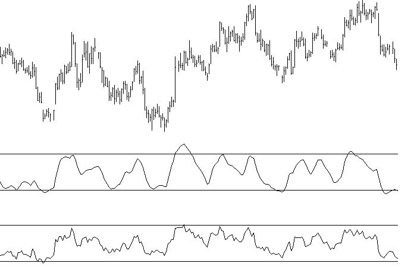

# RSX — Relative Trend Strength Index DLL Module

**For Windows Application Developers**

## BibTeX

```bibtex
@manual{jurik_rsx_dll,
  title        = {RSX: Relative Trend Strength Index DLL Module for Windows Application Developers — User's Guide},
  author       = {{Jurik Research}},
  organization = {Jurik Research \& Consulting},
  address      = {PO 460669, Aurora, CO 80046},
  year         = {1994--2001},
  note         = {From JRS\_DLL distribution}
}
```

## Requirements

- Windows 98, 2000, NT4 or XP
- Application software that can access DLL functions.

## Installation

1. Execute the Installer, `JRS_DLL.EXE`. It will analyze your computer and give you a computer identification number. Write it down.
2. Get your access PASSWORD from Jurik Research Software. Call 323-258-4860 (USA), fax 323-258-0598 (USA), e-mail support@nfsmith.net, or write Jurik Research Software at 686 South Arroyo Parkway, Suite 237, Pasadena, California 91105. Be sure to give your full name, mailing address and computer identification number. You will then be given a password.
3. Rerun the installer `JRS_DLL.EXE`, this time entering the password when asked. Also enter all the Jurik Research modules that you currently are licensed to run. It will copy the latest version of these modules to any directory you specify.

### Important Notices

**About Passwords:** If you upgrade to a new computer, or significantly upgrade your existing computer (such as flash a new BIOS), you should reinstall RSX and all other Jurik tools that are licensed for your computer. The installer will let you know if your current password is no longer valid. For new or replacement passwords, call 323-258-4860.

**About Data Validity:** When RSX encounters a problem (e.g. the password used during installation has become invalid), RSX will continue to run but the data produced will not be valid. To let you know this is the case, RSX will return an appropriate error code, but it will NOT post any warning message on your monitor. Therefore — do not assume RSX results are correct. You must validate RSX's output by CHECKING THE RETURN ERROR CODE immediately after each call to RSX.

---

## Why Use RSX?

### The Popular RSI Indicator is Very Noisy. RSX Eliminates Noise Completely!

There is only one convincing way to illustrate the power of RSX. In the chart below, we see daily bars of U.S. Bonds analyzed by RSX and the classical RSI.

RSX is very smooth. Typically any indicator can be smoothed by a moving average, but the penalty is added lag to the resulting signal. Not only is RSX smoother than RSI, but its smoothness comes without added lag.

RSX permits more accurate analysis, helping you avoid many trades that would have been prematurely triggered by the jagged RSI. Once you begin using RSX, you may never apply the classical RSI again!



---

## Coding Applications

The DLL file contains two versions of RSX:

- **BATCH MODE** — accepts an entire array of input data and returns results into another array of equal size. This version is ideal when an entire array is available for processing with only one call to RSX.
- **REAL TIME** — accepts one input value and returns one value as a result. RSX is called for each successive value in some arbitrary time series. This approach is ideal for processing real time data, whereby the user wants an instant RSX update as each new data value arrives.

## Dynamic Linking

### Load Time Dynamic Linking (Microsoft Compilers)

For load-time dynamic linking, you must use the LIB file `JRS_32.LIB`, located at `C:\JRS_DLL\LIB`. With load-time dynamic linking, the Jurik DLL is loaded into memory when the user's EXE is loaded.

### Load Time Dynamic Linking (non-Microsoft Compilers)

The LIB file provided will only work with the MS Visual C/C++ compiler. You have two choices:

1. Consult your compiler's documentation to determine how to construct a LIB file from a DLL (e.g., Borland's `IMPLIB.EXE`).
2. Use run-time dynamic linking. A LIB file is not required for this method.

### Run Time Dynamic Linking

You may prefer run-time dynamic linking. With run-time, the DLL is loaded only when the user's EXE specifically calls `LoadLibrary`. Sample C files are located in `C:\JRS_DLL\RUNTIME`.

---

## C Programming — Batch Mode

The file `JRS_32.DLL` contains the function `RSX`.

### Declaration

```c
extern _declspec(dllimport) int WINAPI RSX( DWORD iSize,
    double *pdSeries, double *pdOutput, double dSmooth );
```

### Parameters

| Parameter | Type | Description |
|-----------|------|-------------|
| `iSize` | 32-bit unsigned integer | Number of doubles in the input data array |
| `pdSeries` | pointer to double array | Input time series data |
| `pdOutput` | pointer to double array | RSX writes its results here |
| `dSmooth` | double | Controls the smoothness of RSX's curve (2–500; typical 5–20) |

### Notes

- Both input and output arrays must be of the same size.
- `dSmooth` may be any value between 2 and 500 inclusive. Typical smoothness values range from 5–20.
- RSX does not attempt to produce output for the first 29 elements. It outputs the value 50 for this range. True RSX output begins with the 30th element.

### Return Values

| Code | Meaning |
|------|---------|
| 0 | No error |
| −1 | Password / installation error |
| 10010 | Pointer to input data location is NULL |
| 10011 | Pointer to output data location is NULL |
| 10012 | Not enough data rows; must be at least 32 |
| 10014 | Length parameter below 2 |
| 10016 | Length parameter above 500 |
| 10017 | Out of memory |

### Example

```c
iSize    = 2500;
dSmooth  = 10;

pdSeries = (double *) GlobalAllocPtr( GHND, sizeof(double) * iSize);
pdOutput = (double *) GlobalAllocPtr( GHND, sizeof(double) * iSize);

/* At this location in code, fill up your input array */

error_code = RSX( iSize, pdSeries, pdOutput, dSmooth );
```

---

## C Programming — Real Time Mode

The file `JRS_32.DLL` contains the function `RSXRT`.

### Declaration

```c
extern _declspec(dllimport) int WINAPI RSXRT( double dSeries, double
    dSmooth, double *pdOutput, int iDestroy, int *piSeriesID );
```

### Parameters

| Parameter | Type | Description |
|-----------|------|-------------|
| `dSeries` | double | Input data value |
| `dSmooth` | double | Controls smoothness (2–500; typical 5–20) |
| `pdOutput` | pointer to double | Memory location for RSX result |
| `iDestroy` | int (0 or 1) | When 1, releases DLL RAM for the designated series |
| `piSeriesID` | pointer to int | Series identification; set to 0 for first element of new series |

### Notes

- RSX does not attempt to produce output for the first 29 times it is called. It outputs the value 50 for the first 29 calls. True RSX output begins with the 30th call.

### Return Values

| Code | Meaning |
|------|---------|
| 0 | No error |
| −1 | Password / installation error |
| 10011 | Pointer to output data location is NULL |
| 10014 | Length parameter below 2 |
| 10015 | Pointer to series identification variable was NULL |
| 10016 | Length parameter above 500 |
| 10018 | Cannot deallocate DLL RAM when SeriesID = 0 |

### Example

```c
// declare variables
double *pdData, *pdOutput, dSmooth;
int    iDestroy, iSeriesID, *piSeriesID, iErr, i;

// get address of variable iSeriesID
piSeriesID = &iSeriesID;

// assume you want this RSX parameter value
dSmooth = 10;

// allocate RAM for input and output. Assume array size is 100
pdData   = (double *) GlobalAllocPtr(GHND, sizeof(double) * 100);
pdOutput = (double *) GlobalAllocPtr(GHND, sizeof(double) * 100);

// fill pdData array with double precision numbers from disk
// file or other source. (code not shown)

// clear deallocation flag and initialize series identification to 0.
iDestroy = iSeriesID = 0;

// loop through data, calling RSX on each element, and store results
for(i=0;i<100;i++)
{
   iErr = RSXRT( *(pdData+i), dSmooth, (pdOutput+i), iDestroy, piSeriesID);
   if(iErr != 0)
        YourErrHandlerFunc();
}

// done processing. Deallocate DLL RAM, and check for any errors
// When deallocating, it is OK to replace the output pointer with 0.
iDestroy = 1;
iErr = RSXRT( 0,0,0, iDestroy, piSeriesID);
if(iErr != 0)
     YourErrHandlerFunc();

// do something with data and deallocate RAM at pdData and pdOutput
```

---

## Visual Basic — Batch Mode

In your Jurik Research DLL installation directory (e.g., `C:\JRS_DLL`) the workbook `RSX_DLL.XLS` contains a programming example using Excel's VBA to call function RSX. The macro gets the data in column 1 and sends it to the RSX batch mode function in the DLL. The output array produced by RSX is then written back onto column 3 of the worksheet.

### Declaration

```vb
Declare Function RSX Lib "JRS_32.dll" ( _
    ByVal iSize As Long, _
    ByRef dInData As Double, _
    ByRef dOutData As Double, _
    ByVal dLength As Double) As Long
```

### Example

```vb
Sub RSX_test()
    Dim k As Long                       'iteration variable
    Dim iSize As Long                   'size of data array
    Dim iResult As Long                 'returned error code
    Dim dInputData() As Double          'input array
    Dim dOutputData() As Double         'output array
    Dim dLength As Double               'RSX speed (smoothness)
    Dim calctype As Long                'for preserving current Excel calc mode

    'disable automatic calculation
    calctype = Application.Calculation
    Application.Calculation = xlManual

    iSize = 100         ' length of input array
    dLength = 10        ' RSX smoothness factor

    ReDim dInputData(1 To iSize)
    ReDim dOutputData(1 To iSize)

    ' Read Data from spreadsheet into array
    ' Input data is in column 1
    For k = 1 To iSize
        dInputData(k) = Cells(k + 1, 1)
    Next k

    '--- RSX return error codes ---
    '    0        SUCCESS -- no error conditions found
    '   -1        password/installation error. RSX output not valid.
    '10012        not enough data rows, must be at least 32
    '10014        length parameter below 2
    '10016        length parameter above 500
    '10017        out of memory

    'Call RSX. Note that only the first elements of both data arrays are referenced.
    iResult = RSX(iSize, dInputData(1), dOutputData(1), dLength)

    If (iResult <> 0) Then
        Call Error_handler(iResult, calctype)
    Else
        ' Show results in column 3 on spreadsheet
        For k = 1 To iSize
            Cells(1 + k, 3).FormulaR1C1 = dOutputData(k)
        Next k
    End If

    ' Enable automatic calculation
    Application.Calculation = calctype
End Sub

' The following subroutine is a simple way to handle run-time errors that may occur
' It is good practice to handle each error type mentioned in the user manual.
Private Sub Error_handler(ByVal error_code As Long, ByVal calctype As Long)
    Dim result As Long
    result = MsgBox("Error number " & Str(error_code) & _
                    " was returned by RSX.", , "RSX Error")
    Application.Calculation = calctype
    End   ' this END command will halt execution of the VBA code.
End Sub
```

---

## Visual Basic — Real Time Mode

In your Jurik Research DLL installation directory the workbook `RSX_DLL.XLS` contains a programming example using Excel's VBA to call function `RSXRT`. The macro reads one element at a time from column 1, sequentially feeding each through the real time version of RSX and places the results into column 4.

### Declaration

```vb
Declare Function RSXRT Lib "JRS_32.dll" ( _
    ByVal dSeries As Double, _
    ByVal dLength As Double, _
    ByRef dRSXout As Double, _
    ByVal iDestroy As Long, _
    ByRef iSeriesID As Long) As Long
```

### Example

```vb
Sub RSXRT_test()
    Dim k As Long               'iteration variable
    Dim dLength As Double       'RSX speed (smoothness)
    Dim dRSXout As Double       'RSX output
    Dim iResult As Long         'returned error code
    Dim iDestroy As Long        'deallocate DLL RAM switch
    Dim iSeriesID As Long       'Input series ID code
    Dim calctype As Long        'for preserving current Excel calc mode

    '--- RSXRT return error codes ---
    '    0        SUCCESS -- no error conditions found
    '   -1        password/installation error. RSX output not valid
    '10011        dRSXout not declared using ByRef
    '10014        length parameter below 2
    '10015        iSeriesID not declared using ByRef
    '10016        length parameter above 500
    '10018        Cannot deallocate DLL RAM when SeriesID=0

    iSize = 100           ' length of input array
    dLength = 10          ' RSX smoothness factor
    iSeriesID = 0         ' MUST initialize series identification to zero
    iDestroy = 0          ' MUST clear "deallocate DLL RAM" flag

    'disable automatic calculation
    calctype = Application.Calculation
    Application.Calculation = xlManual

    For k = 1 To iSize
        iResult = RSXRT(Cells(k + 1, 1), dLength, dRSXout, iDestroy, iSeriesID)
        If (iResult <> 0) Then
            ' Post Error Message and HALT
            Call Error_handler(iResult, calctype)
        Else
            Cells(1 + k, 4).FormulaR1C1 = dRSXout
        End If
    Next k

    'deallocate DLL RAM. Check for errors.
    'iSeriesId should contain a non-zero identification value
    iDestroy = 1
    iResult = RSXRT(0, 0, 0, iDestroy, iSeriesID)
    If (iResult <> 0) Then
        ' Post Error Message and HALT
        Call Error_handler(iResult, calctype)
    End If

    're-enable automatic calculation
    Application.Calculation = xlAutomatic
End Sub

' The following subroutine is a simple way to handle run-time errors that may occur
' It's good practice to handle each error type mentioned in the user manual.
Private Sub Error_handler(ByVal error_code As Long, ByVal calctype As Long)
    Dim result As Long
    result = MsgBox("Error number " & Str(error_code) & _
                    " was returned by RSX.", , "RSX Error")
    Application.Calculation = calctype
    End   ' this END command will halt execution of the VBA code.
End Sub
```
