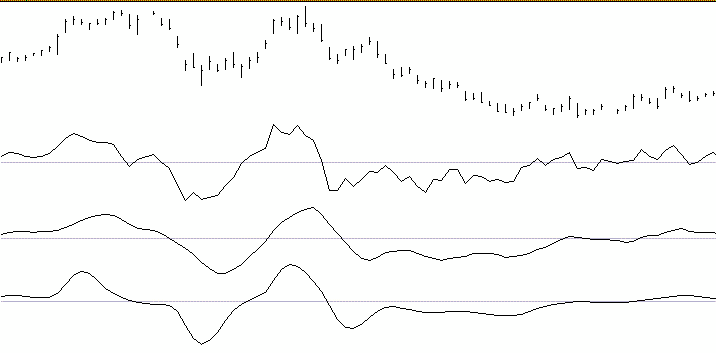

# VEL — Zero-Lag Velocity DLL Module

User's Guide for Windows Application Developers

© 1994–2002 Jurik Research & Consulting

## BibTeX

```bibtex
@manual{jurik_vel_dll,
  title        = {VEL: Zero-Lag Velocity DLL Module for Windows Application Developers — User's Guide},
  author       = {{Jurik Research}},
  year         = {2002},
  organization = {Jurik Research & Consulting},
  address      = {PO 460669, Aurora, CO 80046},
}
```

## Requirements

- Windows 98, 2000, NT4, XP
- Application software that can access DLL functions

## Installing the 32-bit DLL Module

1. Execute the Installer, `JRS_DLL.EXE`. It will analyze your computer and give you a computer identification number. Write it down.
2. Get your access PASSWORD from Jurik Research Software. You can do so by calling 323-258-4860 (USA), faxing 323-258-0598 (USA), e-mailing support@nfsmith.net, or writing Jurik Research Software at 686 South Arroyo Parkway, Suite 237, Pasadena, California 91105. Be sure to give your full name, mailing address and computer identification number. You will then be given a password.
3. Rerun the installer `JRS_DLL.EXE`, this time entering the password when asked. Also enter all the Jurik Research modules that you currently are licensed to run. It will copy the latest version of these modules to any directory you specify.

You may now code your software to access the DLL as described on the following pages.

### About Passwords

If you upgrade to a new computer, or significantly upgrade your existing computer (such as flash a new BIOS), you should reinstall VEL and all other Jurik tools that are licensed for your computer. The installer will let you know if your current password is no longer valid. Also, if you want to run VEL on additional computers, you will need additional passwords. For new or replacement passwords, call 323-258-4860.

### About Data Validity

When VEL encounters a problem (e.g. the password used during installation has become invalid), VEL will continue to run but the data produced will not be valid. To let you know this is the case, VEL will return an appropriate error code, but it will NOT post any warning message on your monitor. Therefore:

**Do not assume VEL results are correct. You must validate VEL's output by CHECKING THE RETURN ERROR CODE immediately after each call to VEL.**

## Why Use VEL?

To obtain lag-free smoothing of the standard momentum indicator!

### Brief Description

VEL (Zero-Lag Velocity) is a super smooth version of the technical indicator "momentum" with the special feature that the smoothing process has added no additional lag to the original momentum indicator. Less lag means better timing and a smoother curve has less noise that causes false signals. All in all, VEL provides the perfect momentum oscillator.

### Background

One of the simplest ways to play the market is to buy when prices are rising and sell otherwise. If the trends are long enough, this strategy does very well. The momentum indicator (i.e. today's price minus that of N bars ago) is an effective indication of market direction. As N increases, more evidence is considered and the indicator becomes more accurate. However, the estimate's delay of N/2 bars also increases, delaying trades by a few critical bars, possibly making them too late to be profitable. It is the classic tradeoff: accuracy versus timing. You cannot have both... or can you?

You can with a new momentum oscillator from Jurik Research. By using sophisticated matrix algebra, it improves both accuracy and timing.

In the chart below, the first graph is the H-L-C daily price bars of D-Mark futures, from 8/92 to 12/92. Line A is the ordinary 7-day momentum oscillator. N=7 is fast enough to capture the cyclic motion and not too fast to be extra jittery.

The classic method for reducing jitter is to use a M-bar wide moving average of the indicator. Note how often the plain oscillator (line A) crosses the zero-threshold line in the right-half of the graph and how the 6-bar averaged version (line B) is smoother and crosses the zero-line much less frequently.

This improvement comes with a penalty. Note the tops and bottoms of line B lag behind those of line A by (6/2 = 3) bars, on average. There is also a corresponding lag at all locations where line B crosses the zero-threshold line.

Line C was produced by our momentum oscillator, called "JRC Velocity" (VEL). This truly amazing indicator has the best of both worlds, smooth lines and no lag! Line C's tops, bottoms and zero-crossings all coincide with those of line A. We refer to this amazing feat as ZERO-LAG FILTERING.

VEL has one input parameter: **DEPTH**. Depth controls how many bars are simultaneously examined by the proprietary algorithm.



In the chart above, line A is a 7-bar momentum of the time series shown by the high-low-close bars. Line B is the result of smoothing line A using a 6 bar moving average. Line C is a smoothed momentum obtained by using VEL.

## Coding Applications

The DLL file contains two versions of VEL:

- **BATCH MODE** — accepts an entire array of input data and returns results into another array of equal size. This method requires the user provide the DLL function with pointers to two arrays. This version is ideal when an entire array is available for processing with only one call to VEL.
- **REAL TIME** — accepts one input value and returns one value as a result. VEL is called for each successive value in some arbitrary time series. This approach is ideal for processing real time data, whereby the user wants an instant VEL update as each new data value arrives.

## Dynamic Linking

### Load Time Dynamic Linking (Microsoft Compilers)

For load-time dynamic linking, you must use the LIB file `JRS_32.LIB`, located at `C:\JRS_DLL\LIB` (or on whichever drive you specified during installation). With load-time dynamic linking, the Jurik DLL is loaded into memory when the user's EXE is loaded.

### Load Time Dynamic Linking (non-Microsoft Compilers)

The LIB file we provide will only work with the MS Visual C/C++ compiler. For C/C++ users with non-Microsoft compilers, you will probably not be able to use the LIB file we have provided. You have two choices:

1. Consult your compiler's documentation to determine how to construct a LIB file from a DLL. For instance, Borland's compiler includes the `IMPLIB.EXE` utility to accomplish this.
2. Use run-time dynamic linking (described below). A LIB file is not required for this method.

### Run Time Dynamic Linking

You may prefer to use run-time dynamic linking instead of load-time. For example, users of Microsoft Visual C may wish to prevent the Jurik DLL from automatically loading along with the user's EXE. With run-time, the DLL is loaded only when the user's EXE specifically calls for it to be loaded with the `LoadLibrary` function. Another reason for preferring run-time is that the user has a non-Microsoft compiler, and therefore, cannot use the LIB file provided.

For new C/C++ users, we provide sample C files which demonstrate how to accomplish run-time dynamic linking. The sample files are located in the folder `C:\JRS_DLL\RUNTIME` (or on whichever drive you specified during installation).

## C Programming — Batch Mode

The file `JRS_32.DLL` contains the function `VEL`. In your C code, you should declare VEL as externally defined and, if using MS VC++, use the `_declspec(dllimport)` keywords. The function is exported as a C function, so if you are using C++, you should insert `"C"` between the words `extern` and `_declspec`. Also, you should link with `JRS_32.LIB`, which we provide.

```c
extern _declspec(dllimport) int WINAPI VEL( double *pdSeries, double
*pdOutput, DWORD dwDepth, DWORD dwSize );
```

### Parameters

| Parameter | Description |
|-----------|-------------|
| `pdSeries` | A pointer to an array of doubles that contain your input time series data for VEL. |
| `pdOutput` | A pointer to an array of doubles that VEL will write its results to. |
| `dwDepth` | A 32-bit unsigned integer that specifies the moving window size of VEL. |
| `dwSize` | A 32-bit unsigned integer equal to the number of doubles in the input data array. |

### Notes

- The input and output arrays must be the same size, as specified by the calling parameter `dwSize`.
- `dwSize` must be no less than max(32, `dwDepth`).
- `dwDepth` may range from 1 to 500. Typical values range from 5–20.
- The first N = min(30, `dwDepth`) elements of VEL's output will be zero.

### Return Values

| Code | Meaning |
|------|---------|
| 0 | NO ERROR |
| -1 | PASSWORD / INSTALLATION ERROR |
| 11001 | POINTER TO INPUT DATA LOCATION IS NULL |
| 11002 | POINTER TO OUTPUT DATA LOCATION IS NULL |
| 11003 | NOT ENOUGH DATA ROWS; MUST BE AT LEAST 32 |
| 11004 | OUT OF MEMORY CONDITION |
| 11005 | DEPTH IS GREATER THAN DATA ROWS |
| 11006 | DEPTH VALUE NOT BETWEEN 1 AND 500 |

### Example

```c
dwSize = 2500;
dwDepth = 10;

pdSeries = (double *) GlobalAllocPtr( GHND, (DWORD) sizeof(double) * dwSize);
pdOutput = (double *) GlobalAllocPtr( GHND, (DWORD) sizeof(double) * dwSize);

/* At this location, check that memory was actually allocated, and put your time
series data into the input array. */

error_code = VEL(pdSeries, pdOutput, dwDepth, dwSize);
```

## C Programming — Real Time Mode

The file `JRS_32.DLL` contains the function `VELRT`. In your C code, you should declare VELRT as externally defined and, if using MS VC++, use the `_declspec(dllimport)` keywords. The function is exported as a C function, so if you are using C++, you should insert `"C"` between the words `extern` and `_declspec`. Also, you should link with `JRS_32.LIB`, which we provide.

```c
extern _declspec(dllimport) int WINAPI VELRT( double dSeries, DWORD
dwDepth, double *pdOutput, int iDestroy, int *piSeriesID );
```

### Parameters

| Parameter | Description |
|-----------|-------------|
| `dSeries` | A double precision floating point number equal to the input data value. |
| `dwDepth` | A 32-bit unsigned integer that specifies the moving window size of VEL. |
| `pdOutput` | A pointer to the memory location of a double which contains the result from VEL. |
| `iDestroy` | A 32-bit signed integer, with a value = 0 or 1. When value = 1, the RAM in the DLL used for a particular VEL time series is released. The desired time series is designated by `piSeriesID`. This event does not release the memory containing the output of VEL. Control of that memory is the user's responsibility. |
| `piSeriesID` | A pointer to the memory location of a 32-bit signed integer (`iSeriesID`). When processing the first element of any new time series, set `iSeriesID = 0`. VEL will store a unique identification number of the series into that integer pointed to by `piSeriesID`. |

### Notes

- `dwDepth` may be any integer, from 1 to 500. Typical values range from 5–20.
- The first N = min(30, `dwDepth`) elements of VEL's output will be zero.
- The value of `dwDepth` is obtained by VEL on the first call to it (i.e. when `iSeriesID = 0`).

### Return Values

| Code | Meaning |
|------|---------|
| 0 | NO ERROR |
| -1 | PASSWORD / INSTALLATION ERROR |
| 11002 | POINTER TO OUTPUT DATA LOCATION IS NULL |
| 11004 | OUT OF MEMORY CONDITION |
| 11006 | DEPTH VALUE NOT BETWEEN 1 AND 500 |
| 11007 | POINTER TO SERIES IDENTIFICATION VARIABLE WAS NULL |
| 11008 | CANNOT DEALLOCATE DLL RAM WHEN SERIESID = 0 |

### Example

```c
// declare variables
double *pdData, *pdOutput ;
int    iDestroy, iSeriesID, *piSeriesID, iErr, i ;
DWORD  dwDepth ;

// get address of variable iSeriesID
piSeriesID = &iSeriesID ;

// assume you want this VEL parameter value
dwDepth = 10 ;

// allocate RAM for input and output. Assume array size is 100
pdData   = (double *) GlobalAllocPtr(GHND, (DWORD) sizeof(double) * 100) ;
pdOutput = (double *) GlobalAllocPtr(GHND, (DWORD) sizeof(double) * 100) ;

// fill pdData array with double precision numbers from disk
// file or other source. (code not shown)

// clear deallocation flag and initialize series identification to 0.
iDestroy = iSeriesID = 0 ;

// loop through data, calling VEL on each element, and store results
for(i=0;i<100;i++)
{
   iErr = VELRT( *(pdData+i), dwDepth, (pdOutput+i), iDestroy, piSeriesID) ;
   if(iErr != 0)
        YourErrHandlerFunc() ;
}

// done processing. Deallocate DLL RAM, and check for any errors.
// When deallocating, it is OK to replace the output pointer with 0.
iDestroy = 1 ;
iErr = VELRT( 0,0,0, iDestroy, piSeriesID) ;
if(iErr != 0)
     YourErrHandlerFunc() ;

// do something with data and deallocate RAM at pdData and pdOutput
```

## Visual Basic — Batch Mode

### Introduction

In your Jurik Research DLL installation directory (e.g., `C:\JRS_DLL`) the workbook `VEL_DLL.XLS` contains a programming example using Excel's VBA to call function VEL. The workbook includes a worksheet where you can run the macro `VEL_Test` to run VEL in batch mode.

The macro gets the data in column 1 and sends it to the VEL batch mode function in the DLL. The output array produced by VEL is then written back onto column 3 of the worksheet.

### Declaration

```vb
Declare Function VEL Lib "JRS_32.dll" ( _
                        ByRef dInData As Double, _
                        ByRef dOutData As Double, _
                        ByVal depth As Long, _
                        ByVal length As Long)
```

Note that the input and output arrays (`dInData` and `dOutData`) are called by reference using `ByRef`. This enables the calling statement to send to VEL a pointer to the first element of each data array.

### Example

```vb
Sub VEL_test()
    Dim k As Long                       'iteration variable
    Dim iSize As Long                   'size of data array
    Dim iResult As Long                 'returned error code
    Dim dInputData() As Double          'input array
    Dim dOutputData() As Double         'output array
    Dim iDepth As Long                  'VEL window size (smoothness)
    Dim calctype As Long                'for preserving current Excel calc mode

    'disable automatic calculation
    calctype = Application.Calculation
    Application.Calculation = xlManual

    iSize = 100         ' length of input array
    iDepth = 10         ' VEL window size (smoothness)

    ReDim dInputData(1 To iSize)
    ReDim dOutputData(1 To iSize)

    ' Read Data from spreadsheet into array
    ' Input data is in column 1
    For k = 1 To iSize
        dInputData(k) = Cells(k + 1, 1)
    Next k

    'Call VEL. Note that only the first elements of both data arrays are referenced.
    iResult = VEL(dInputData(1), dOutputData(1), iDepth, iSize)

    If (iResult <> 0) Then
        Call Error_handler(iResult, calctype)
    Else
        ' Show results in column 3 on spreadsheet
        For k = 1 To iSize
            Cells(1 + k, 3).FormulaR1C1 = dOutputData(k)
        Next k
    End If

    ' Enable automatic calculation
    Application.Calculation = calctype
End Sub

Private Sub Error_handler(ByVal error_code As Long, ByVal calctype As Long)
    Dim result As Long
    result = MsgBox("Error number " & Str(error_code) & " was returned by VEL.", , "VEL Error")
    Application.Calculation = calctype
    End
End Sub
```

## Visual Basic — Real Time Mode

### Introduction

In your Jurik Research DLL installation directory (e.g., `C:\JRS_DLL`) the workbook `VEL_DLL.XLS` contains a programming example using Excel's VBA to call function VELRT. The macro reads one element at a time from column 1, sequentially feeding each one through the real time version of VEL and places the results sequentially into column 4.

### Declaration

```vb
Declare Function VELRT Lib "JRS_32.dll" ( _
                        ByVal dSeries As Double, _
                        ByVal iDepth As Long, _
                        ByRef dVELout As Double, _
                        ByVal iDestroy As Long, _
                        ByRef iSeriesID As Long) As Long
```

Note that the output and series identification variables (`dOutput` and `iSeriesID`) are called by reference using `ByRef`. The user initializes the series identification variable (`iSeriesID`) to zero and during the first call to VELRT, the function will replace zero with an integer that uniquely identifies the time series.

If you have several separate data time series that you want VEL to process simultaneously in real time, each time series must be given its own series identification variable.

### Example

```vb
Sub VELRT_test()
    Dim k As Long               'iteration variable
    Dim iDepth As Long          'VEL window size (smoothness)
    Dim dVELout As Double       'VEL output
    Dim iResult As Long         'returned error code
    Dim iDestroy As Long        'deallocate DLL RAM switch
    Dim iSeriesID As Long       'Input series ID code
    Dim calctype As Long        'for preserving current Excel calc mode

    iSize = 100           ' length of input array
    iDepth = 10           ' VEL window size
    iSeriesID = 0         ' MUST initialize series identification to zero
    iDestroy = 0          ' MUST clear "deallocate DLL RAM" flag

    'disable automatic calculation
    calctype = Application.Calculation
    Application.Calculation = xlManual

    For k = 1 To iSize
        iResult = VELRT(Cells(k + 1, 1), iDepth, dVELout, iDestroy, iSeriesID)
        If (iResult <> 0) Then
            Call Error_handler(iResult, calctype)
        Else
            Cells(1 + k, 4).FormulaR1C1 = dVELout
        End If
    Next k

    'deallocate DLL RAM. Check for errors.
    'iSeriesId should contain a non-zero identification value
    iDestroy = 1
    iResult = VELRT(0, 0, 0, iDestroy, iSeriesID)
    If (iResult <> 0) Then
        Call Error_handler(iResult, calctype)
    End If

    're-enable automatic calculation
    Application.Calculation = calctype
End Sub

Private Sub Error_handler(ByVal error_code As Long, ByVal calctype As Long)
    Dim result As Long
    result = MsgBox("Error number " & Str(error_code) & " was returned by VEL.", , "VEL Error")
    Application.Calculation = calctype
    End
End Sub
```
