# Demonstration Strategy Code for TradeStation 9

Source: `http://jurikres.com/products/TS_demo_code.htm`

## BibTeX

```bibtex
@online{jurikres_ts_demo_code,
  author       = {{Jurik Research}},
  title        = {Demonstration Strategy Code for {TradeStation} 9},
  year         = {2012},
  url          = {http://jurikres.com/products/TS_demo_code.htm},
  note         = {Archived at Wayback Machine}
}
```

---

In response to a large demand for sample trading strategies for TradeStation, Jurik Research now offers a collection of 13 strategies in Easy Language that run in TradeStation. These demonstration studies are intended as tutorials to illustrate different ways to apply Jurik Tools (JMA, VEL, RSX, DMX and CFB) which you may choose to include in your own strategies. Each study is complete with a detailed explanation of its trading logic, chart and parameter settings we used for validation, and Easy Language code you can open up, read and modify.

Shown below are screenshots of these strategies, as applied to specific markets. Note that some screenshots also show indicators. These indicators are NOT included with the collection of strategies. However, these custom indicators are included free of charge with your purchase of Jurik Tools for TradeStation.

---

> **Important Disclaimers:**
>
> - Different time frames on a chart may produce different results.
> - Please do not ask us for indicator parameter settings. Every market is different.
> - Past performance of any trading system is never a guarantee of future performance.
> - All trading strategies have risk and commodities/futures trading leverages that risk.
> - This demonstration strategy tutorial set is not designed to be traded without additional modification by the user. For example, the code is missing various important elements such as alternative confirming signals and risk management. It is strictly for tutorial purposes only.

---

## Strategy Screenshots

### AMA-AMA crossover

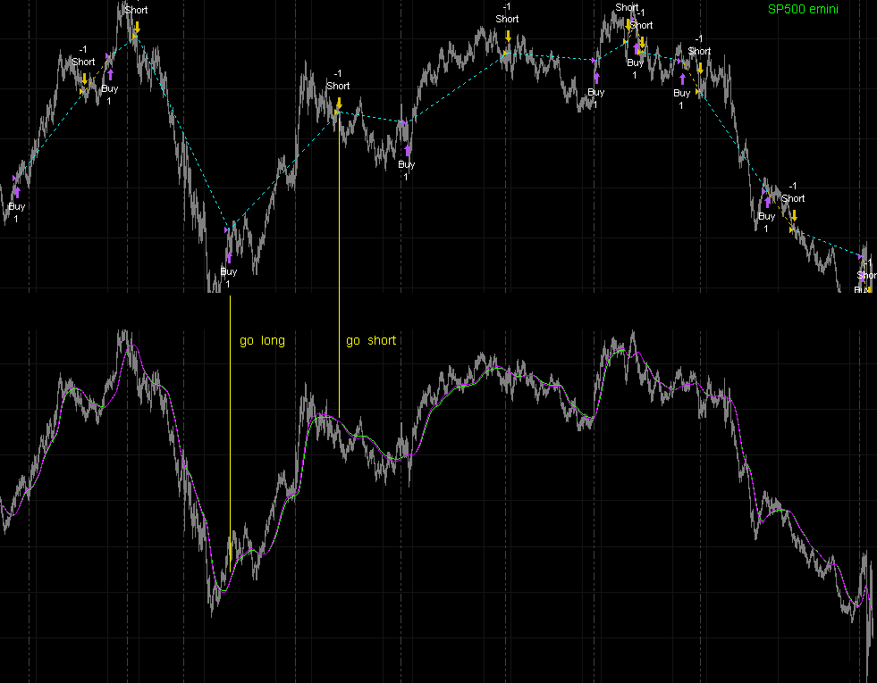

### JMA up-down

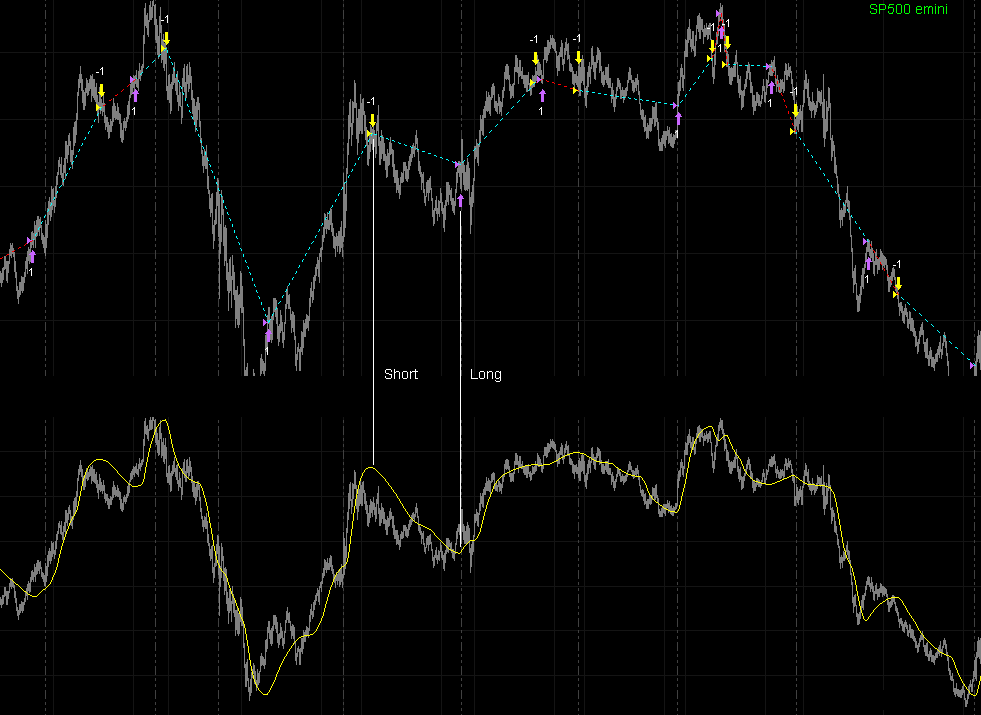

### JMA fast-K stochastic

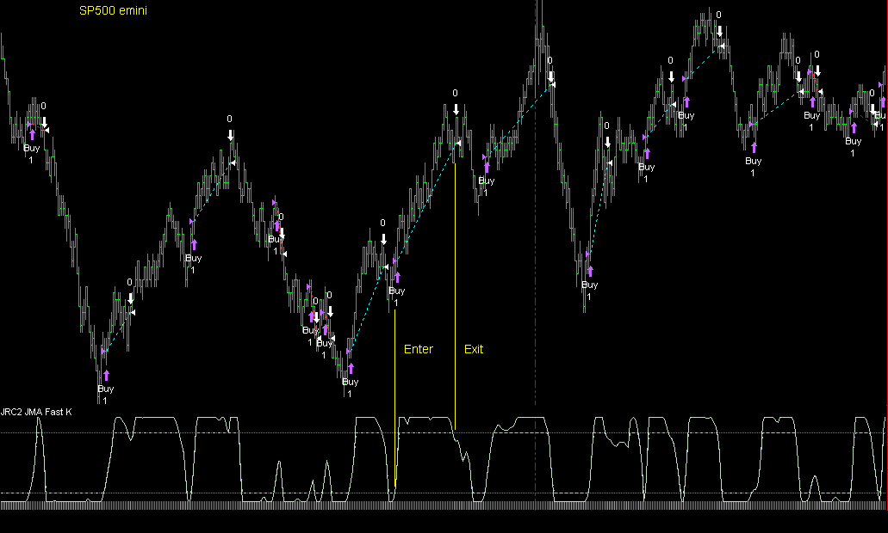

### JMA double stochastic

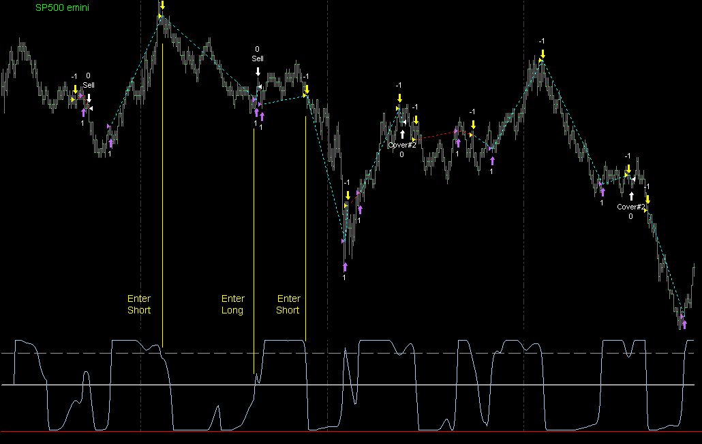

### JMA CCX

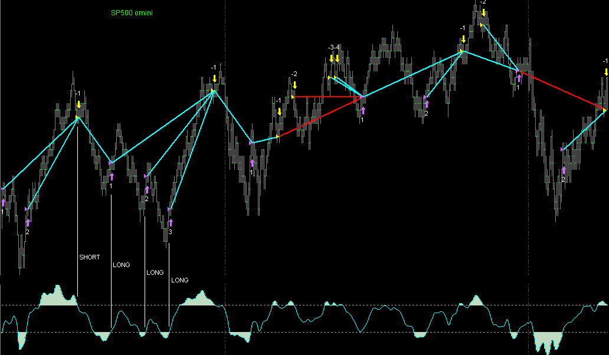

### JMA-EMA crossover

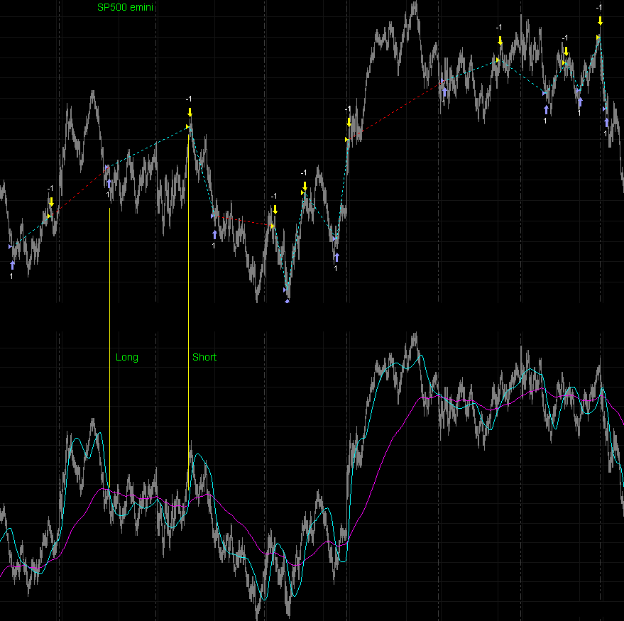

### DMX

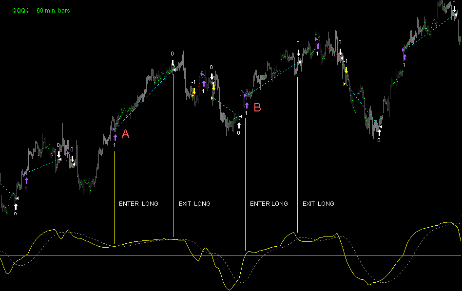

### RSX double

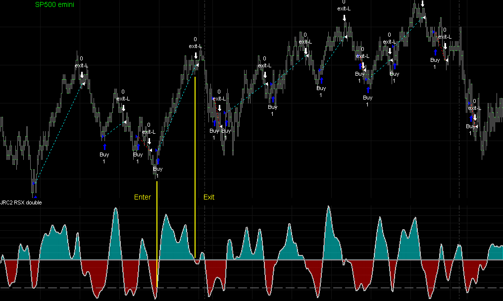

### RSX-on-RSX

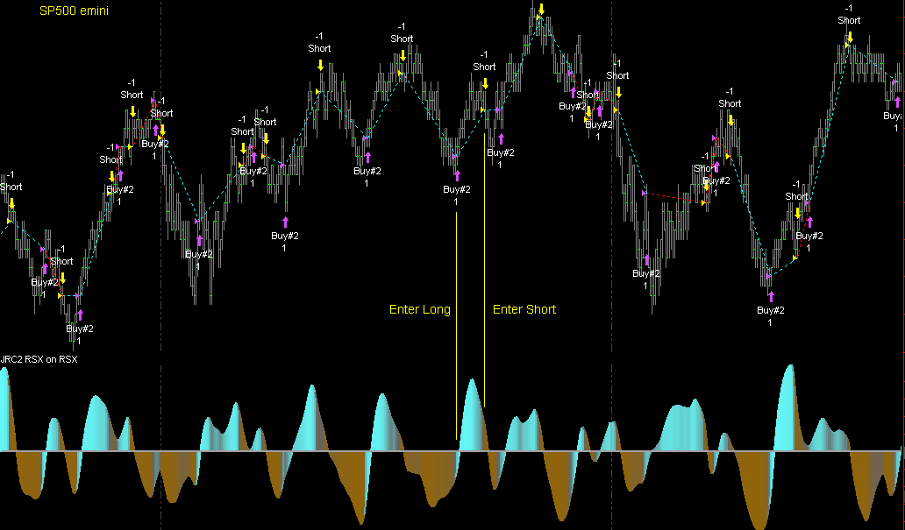

### RSX-on-JMA

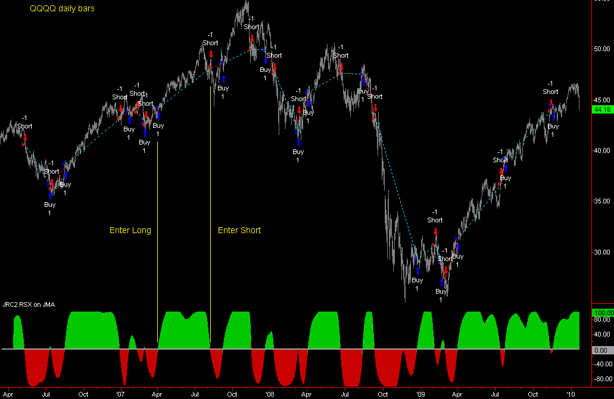

### VEL double

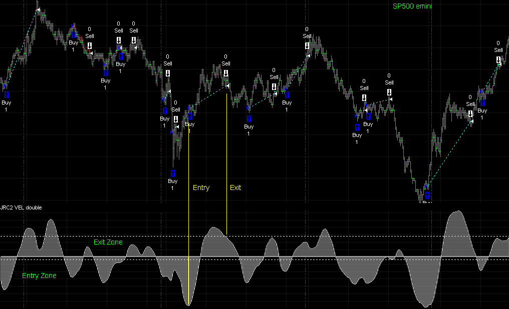

### VEL-on-VEL

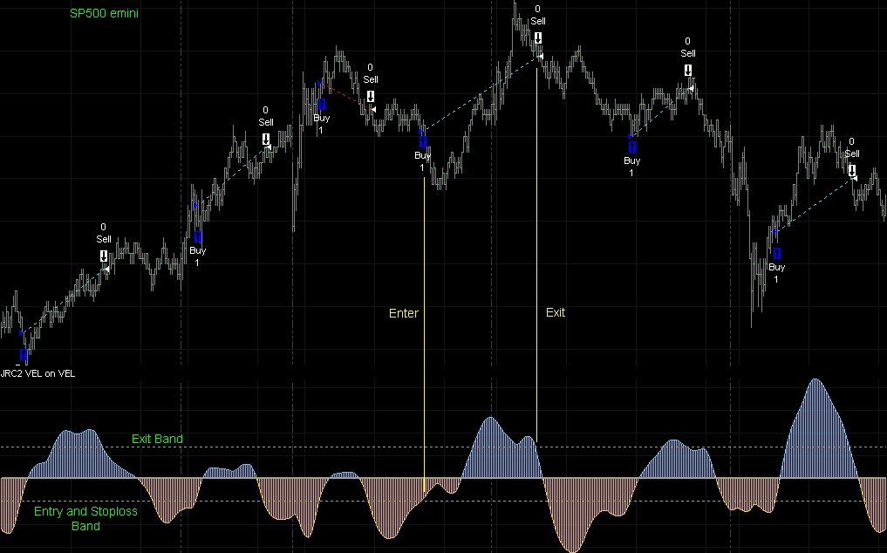

### CFB dynamic oscillator

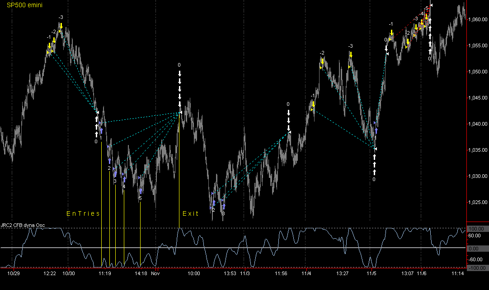

---

## How To Order

The price for the complete collection of demonstration strategies is $50.

Because many of these studies utilize a combination of Jurik Tools, the collection is only available to customers who have a valid license to ALL FOUR basic Jurik Tools: JMA + VEL + RSX + CFB. Also, your Jurik Toolset for TradeStation must be up-to-date.

Select one of the following conditions that best describes your situation:

### PLAN A — Purchase Strategy Collection and Missing Tools

To purchase our strategy collection and missing Jurik Tools, follow these steps:

1. Enter the shopping cart area.
2. Click the down arrow next to "All Departments" and select the item "Jurik Tools, TS format", as illustrated below.
3. Select the product item labelled "Part ID: TS-Demo" and add to cart.
4. Review the product list and select one of these options: TS-1, TS-2, TS-3 or TS-4. They designate that you want to order 1, 2, 3 or 4 Jurik Tools for TradeStation. Add to cart.
5. After proceeding to "checkout", type in the names of the Jurik Tools you are ordering in the "Special Instructions" box. Here is an example:


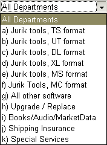

*This graphic is only an illustration. It is not active.*

---

### PLAN B — Purchase Strategy Collection and Upgrade Jurik Toolset

To upgrade your current set of the four basic Jurik Tools for TradeStation, and order our strategy collection, follow these steps:

1. Enter the shopping cart area.
2. Click the down arrow next to "All Departments" and select the item "Jurik Tools, TS format".
3. Select the item labelled "Part ID: TS-Demo" and add to cart.
4. Go back to the departments menu in the upper left hand of your screen, click the down arrow and select "Upgrade / Replace".
5. Scroll down the product list and select the product item labelled "Part ID: UP-TS-100".
6. Proceed to checkout.

---

### PLAN C — Purchase Strategy Collection Only

To order only the strategy collection, follow these steps:

1. Enter the shopping cart area.
2. Click the down arrow next to "All Departments" and select the item "Jurik Tools, TS format".
3. Select the item labelled "Part ID: TS-Demo" and add to cart.
4. Proceed to checkout.
