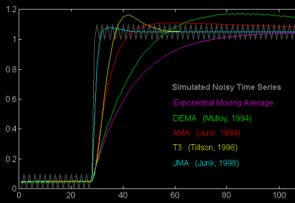

# Evolution of Moving Averages

**Mark Jurik**

© 1999 Jurik Research — [www.jurikres.com](http://www.jurikres.com)

## BibTeX

```bibtex
@techreport{jurik1999evolution,
  author       = {Jurik, Mark},
  title        = {Evolution of Moving Averages},
  year         = {1999},
  institution  = {Jurik Research},
  url          = {http://jurikres.com/catalog1/ms_ama.htm},
  note         = {PDF: ma\_evolv.pdf}
}
```

---

This is a brief review of the evolution of moving average filters published, one time or another, in TASC or made commercially available.

## Part 1

In 1997 I posted a message on the omega-list forum that detailed desirable characteristics of a moving average (MA). Summarizing, the four features are:

1. Minimum lag between signal and price, otherwise triggers come late.
2. Minimum overshoot, otherwise MA produces false price levels.
3. Minimum undershoot, otherwise time is lost waiting for convergence.
4. Maximum smoothness, except when price gaps to a new level.

**In the beginning...** Price action is noisy and its erratic motion obscures the underlying mean price and momentum (MP&M). Access to a market's MP&M gives the investor better estimation of trend, market acceleration, deceleration, more stable price triggers, etc. To see the MP&M, technicians employ noise reduction techniques, such as moving averages (MA), and depending on the task at hand, some MA's work better than others.

The most popular MA's rest on the assumption that high frequency activity is noise, and so they are designed to have specified low-pass frequency characteristics.

TradeStation and SuperCharts comes with several basic MA filters:

- **#1 Simple Moving Average (SMA)** — very smooth, never overshoots, high lag
- **#2 Weighted Moving Average (WMA)** — smooth, never overshoots, medium high lag
- **#3 Exponential Moving Average (EMA)** — not smooth, never overshoots, medium lag

Although these three filters never overshoot, they notoriously undershoot. That is, they fail to rapidly converge toward new price levels that have gapped either upward or downward. The reason is that large gaps contain high frequency energy, exactly what low-pass filters don't output. Efforts to improve convergence by speeding up the filter only makes it noisier.

To compensate for this, more advanced filters reduce undershoot by utilizing some predictive aspect of either the signal or itself. This creates smoother signals with less lag. For example, the popular Butterworth filter is extremely smooth which allows it to be run at faster speeds, providing less lag. DEMA (Mulloy, *Technical Analysis of Stocks and Commodities*, Feb. 1994) can track trending signals with zero lag, but is much more noisy than a Butterworth. Although TEMA (simply DEMA filtered by an exponential moving average) has less noise than DEMA, it also has more lag. T3 (Tillson, *Technical Analysis of Stocks and Commodities*, Jan. 1998) is a significant improvement in that it is smoother and less lagging than TEMA.

Although the Kalman filter has found excellent application in tracking objects (e.g. missiles, satellites), this method has a drawback relevant to financial data smoothing because price activity has little physical inertia. Prices can stop on a dime and do a U-turn immediately. Missiles don't. The same problem goes for Savitzky-Golay class filters which tend to fit a polynomial to the data.

The above predictive filters share a common problem: they overshoot gapped price levels. This is not good for mechanical trading systems, as overshoots may produce price levels that were never attained in the real world. This may cause a trading system to enter a bad trade or exit prematurely.

The question remains: how well can a filter have all four ideal features enumerated above? Is it even possible?

## Part 2

The next stage of filter design came with "adaptive" moving averages (AMA). The idea here is to alter a filter's low-pass characteristics on an as-needed basis. So when price action is trending rapidly, the filter speeds itself up momentarily to reduce both undershooting and overshooting, then slows down again to reduce noise during sideways price action.

**Chande's AMA (VIDYA)** is an EMA whose speed is governed by the signal's recent volatility. More volatility produces faster speed. Unfortunately, volatility measurements lag a lot, and so the filter's speed changes are delayed, causing inappropriate behavior.

**Kaufman's AMA** — the EMA's speed is governed by price trend efficiency, a signal with less lag than volatility measurements. Although this filter never overshoots and has medium-low undershoot, it is still basically an EMA and thereby has only low smoothness.

**Jurik's AMA** is a predictive EMA whose speed and inertia are both independently governed by the filter's predicted error. This produces very smooth curves and very low undershoot, but unfortunately, overshoots during price gaps.

Attempts to make T3 adaptive results in "jittery" curves. Apparently, that design does not lend itself well to auto-speed changes.

At this point it should be clear that the four ideal features of a MA are somewhat mutually exclusive. As you tighten one feature, one or more of the others loosen up. There is a fundamental reason for this inverse relationship.

Basically, when price jumps to a new level, we are asking the moving average to rapidly estimate the new MP&M hidden within the noise. In short, we want precise location (in space) right now (in time). With this we can deduce momentum. In doing so, we come up against a limitation, something analogous to what physicists refer as the **Heisenberg uncertainty principle** when measuring sub-atomic particles: there is a theoretical limit regarding the amount of error you can have when simultaneously measuring the location and momentum of a wave (particle), and the two errors are inversely related.

In a down-to-earth example for us technical analysts, I experience this inverse relationship when trying to perform real-time frequency analysis of a time series. Ideally, we would like high frequency resolution at each instant of time, but we cannot have it. High resolution in the frequency domain requires a large sampling window, and that means you are averaging the information over a large period of time, blowing away any hope for knowing instantaneous frequency measurements for this precise moment. Shrinking the window size narrows the time frame, making the time estimate more accurate, but doing so destroys your frequency resolution. You simply can't have it both ways. Wavelet analysis mitigates this problem somewhat, but it's still there.

We see there is a limit to how well a filter can estimate a signal's MP&M in space and time. Can we push back that limit? Are the filters mentioned above as close as we are ever going to get?

The key to getting beyond the capabilities of these popular filters is to break away from the limitations of "linear" filter design. Linear filters have the nice property that the filtering process can be decomposed into smaller components in the following way. With two signals, A and B, you can get identical results using either `Filter(A+B)` or `Filter(A) + Filter(B)`. This equivalence provides alternative ways to getting the same answer, which can sometimes be a lifesaver. For example, Tillson's T3 is based on the following equivalence:

```
EMA(filter's error) = EMA(signal - EMA(signal)) = EMA(signal) - EMA(EMA(signal))
```

all of which take an average of an EMA's error.

On the other hand, nonlinear filters generally do not have this nice property. However, in exchange for what is lost, much can be gained. They can be designed to eliminate certain types of noise more efficiently than linear filters. For example, N-bar "median" filters are pretty darn good for eliminating unwanted spikes. These moving averages simply output the median of N price values. I find N=3 pretty handy as it lags by only one bar.

Linear or nonlinear, eliminating certain types of noise is key to the problem here. This is because tracking fast changes requires good response to high frequency components, but the noise we want to eliminate usually has the same frequency components, so we have a fundamental conflict. Is wavelets the answer? Maybe.

## Part 3

In the brochure for the *International Conference on Noisy Time Series*, 1995, the organizers wrote the following:

> "Noisy time series is an application domain that presents unique challenges to neural networks and other learning techniques. Even without the noise as a factor, a practical time series suffers from non-stationarity, alternating between different regimes, and behaving differently at different time scales. The high level of noise in many time series complicates matters further by impeding learning and by amplifying the problems of overfitting and local minima. ...
>
> "Fractional Brownian Motion (fBm) has long been considered a plausible model for financial asset markets. A fractal structure of the market, indicating the presence of correlations across time, hints at the possibility of some predictability. Recent advances in time/frequency localized transforms by the applied mathematics and electrical engineering communities provide us with new methods for the analysis of this type of process. In fact, it has been proven by Wornell that the wavelet transform with a Daubechies basis is an optimal transform for fBm processes. ...
>
> "With this result we consider using the wavelet transform/multiresolution decomposition to analyze financial time series. Specifically, the discrete wavelet transform can be used to decompose a signal into several scales, while maintaining time localization of events in each scale. In terms of financial time series, we can conceptually think of each of these scales as the dynamics associated with information and traders of each investment time horizon. For instance, long term traders, such as institutional investors, basing their trades on long term information, form the low-frequency component of the market. Once we have extracted out these scales we can view each as a stationary time series, which can be modeled, analyzed and predicted individually, either independently, or in conjunction with other scales and data that is relevant to that scale."

For you pioneers out there, a great database of downloadable postscript files on wavelet research is located at http://www.ee.nus.sg/~hejun/wavepaper.html.

Rather than discuss signal decomposition, let's return to the four characteristics of a good noise filter:

1. Minimum lag between signal and price, otherwise triggers come late.
2. Minimum overshoot, otherwise MA produces false price levels.
3. Minimum undershoot, otherwise time is lost waiting for convergence.
4. Maximum smoothness, except when price gaps to a new level.

Regarding the above four features, wavelets could be used as a running moving average. Unfortunately, the results are not very good. Although wavelet de-noising of a windowed time series produces nice values inside the window, it suffers from aliasing effects at the ends. The algorithm assumes the series inside the window is periodic, just as does the Fast Fourier Transform (FFT). Padding with zeroes alleviates but does not solve the problem. When forecasting and smoothing financial time series data, the last point in the window (i.e. the most recent point) is precisely what we want from the filter, but it is the least reliable, due to aliasing!

## Part 4

The evolution of filter design in the past 5 years is quickly approaching theoretical limits.

The chart below simulates a noisy time series containing downward gaps followed by upward trends. It reveals the amount of lag and overshoot performed by several popular filters, all tuned to have approximately the same smoothness. Embedded within the noisy trend is a diagonal line indicating the underlying noise-free trend. The sooner a filter can locate this line, the better, because the investor does not need to wait as long for the filter's output to once again become meaningful. In this arena, every edge increases your chances of having a profitable trade.


The chart below simulates price action that has jumped to a new price level devoid of trend. We see several filters all tuned to produce the same amount of smoothness. Actually, EMA and DEMA were tuned faster because if they were made as smooth as the other filters, they would be so slow as to be off the chart.

Note how each succeeding major improvement gets closer to the ideal goal of jumping to a new price level without overshoot and stabilizing in only one bar. This performance is important when trying to rapidly estimate the true underlying price level after large gaps. This goal will never be achieved because one bar just does not provide enough information to determine the proper stabilizing level. Will the ultimate moving average need only 2 bars? From the looks of this chart, the ultimate moving average may be available in just a few more years.



— Mark Jurik
