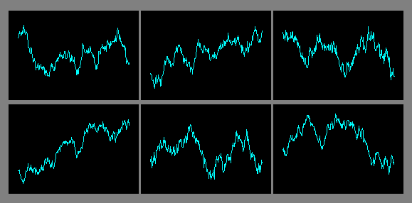

# FAQs on CFB

© 2012 Jurik Research — [www.jurikres.com](http://www.jurikres.com)

## BibTeX

```bibtex
@online{jurikres_faq_cfb,
  author       = {{Jurik Research}},
  title        = {{FAQs} on {CFB}},
  year         = {2012},
  url          = {http://jurikres.com/faq1/faq_cfb.htm},
  note         = {Archived at Wayback Machine}
}
```

---

## Table of Contents

### FAQs on CFB

- [What is the Theory Behind CFB?](#what-is-the-theory-behind-cfb)
- [Does CFB find the Dominant Cycle?](#does-cfb-find-the-dominant-cycle)
- [How would I use CFB's results?](#how-would-i-use-cfbs-results)
- [Do I need to supply anything special to CFB?](#do-i-need-to-supply-anything-special-to-cfb)
- [Do I specify a "period length" for CFB?](#do-i-specify-a-period-length-for-cfb)
- [Will prior CFB values, already plotted, change as new data arrives?](#will-prior-cfb-values-change-as-new-data-arrives)

### General Topics on Jurik Tools

- [Can the tools plot many curves on each of many charts?](#can-the-tools-plot-many-curves-on-each-of-many-charts)
- [Can the tools process any type of data?](#can-the-tools-process-any-type-of-data)
- [Can the tools work in real-time?](#can-the-tools-work-in-real-time)
- [Are the algorithms disclosed or black-boxed?](#are-the-algorithms-disclosed-or-black-boxed)
- [Do Jurik tools need to look into the future of a time series?](#do-jurik-tools-need-to-look-into-the-future-of-a-time-series)
- [Do the tools produce similar values across all platforms?](#do-the-tools-produce-similar-values-across-all-platforms)
- [Do Jurik's tools come with a guarantee?](#do-juriks-tools-come-with-a-guarantee)
- [How many installation passwords do I get?](#how-many-installation-passwords-do-i-get)

---

## FAQs on CFB

### What is the Theory Behind CFB?

CFB tells you how long the market has been in a quality trend. This value can be used to adjust the period length of other indicators, especially stochastic bands.

In order to quantify the overall duration of a market's trend, we replaced classical cycle analysis methods (FFT, MEM, MESA) with a form of analysis that works even when no cycles exist. We accomplished this by examining a time series for specific fractal patterns of any size. We then gather all the patterns found and combine them into one overall index, CFB (Composite Fractal Behavior) Index.

For good reason, CFB does not analyze time series data for dominant cycles. Classical cycle analysis examines data points (e.g. prices) and estimates the average presence of a cycle in the window. Now suppose a cycle with a period length of 9 days was strong for 50 days and then disappeared for the next 14 days. Because the cycle was present for 50 out of the last (50+14=64) days, the *average* presence of that cycle would be measured as "strong" even though it does not exist anymore!

---

### Does CFB find the Dominant Cycle?

No! Consider the following discussion about the MYTH of exploiting dominant cycles.

It is true that the market does have predictable cycles due to its "structural" or physical nature. For example, quarterly earning cycles, triple witching cycles, Federal Reserve meetings, weekly cycles, political election year cycles, the annual end-of-year stock dumping cycle, sunspot cycles, and the slow Kitchin (3–5 years), Juglar (7–11 years), Kuznet (15–25 years) and Kondratieff (45–60 years) cycles. They are very predictable and the markets readily discount their presence as far ahead in time as is reasonable. So there's not much left with regard to those cycles for you to exploit.

What traders see as cycles on an hourly chart, for example, is a different matter. The big, obvious cycles you see on price charts are actually the result of a combination of many weak cyclic forces that sometimes line up in phase to produce APPARENT dominant cycles that suggest the presence of a strong structural cycle that, in fact, does not exist. The slightest shifting in phase of any one component (due to crowd psychology, unscheduled events, etc.) will significantly alter the structure of the apparent dominant wave. This may drive the cycle into a "null" or random period, then reappear, completely out of phase. Now you see it... and now you don't.

The transitory nature of these apparent dominant cycles makes their automated detection difficult and forecast unreliable. Sometimes cycle forecasting tools appear accurate and other times they are totally off mark. The reason is that tools designed to spot dominant cycles will announce whatever they find, even if they are only apparent (not structural) and transitory. For example, such tools would have no problem detecting cycles in the six charts below. But there is just one problem — the slow cyclic price action in the six charts below is *impossible* to project into the future with any reasonable accuracy!



Why? Because we produced these six charts by simply adding consecutive random price changes. That's right! These charts are nothing more than RANDOM WALKS. And by definition, they cannot be forecasted, no matter how impressive their apparent cyclic behavior may be!

The chart above does not "prove" market cycles are non-existent. Indeed, discretionary traders can learn to spot and use periodic price events, and take time to "understand" their causes, in order to verify whether the relevant triggers have actually occurred.

This demonstration does show, however, that cycle-finding tools like FFT, MESA and periodograms, which have no understanding of market cause-effect relationships, can be easily fooled into seeing ghosts. In contrast, our CFB tool was designed to measure market trending action without assuming the existence of cycles. This makes CFB more reliable.

---

### How would I use CFB's results?

CFB produces a value proportional to a time series' trend duration. This value is in units of TIME, as measured in bars on a chart. Because CFB's output is in units of time and not price, CFB offers a unique window into a new dimension for representing signal behavior.

Investors have discovered many profitable ways to apply CFB:

- To auto-adjust the lookback of classical indicators, such as RSI
- To auto-adjust the lookback depth of breakout channels in trending markets
- To auto-adjust the minimum amount of retracement needed to reverse position

Making a profit in the market requires your finding a unique niche that very few other people are exploiting. CFB offers this unique perspective.

---

### Do I need to supply anything special to CFB?

CFB will process any time series that wanders, like a random walk or financial time series.

---

### Do I specify a "period length" for CFB?

In CFB, period length determines how many bars (time slices) are examined for specific fractal patterns. Due to the complexity of the algorithm, CFB permits only four period lengths: 24, 48, 96, 192. The 24-bar version can see trend fractals up to 24 bars wide, and so on. You get all four versions when ordering CFB.

---

### Will prior CFB values change as new data arrives?

No. For any point on a CFB plot, only historical and current data is used in the formula. Consequently, as new price data arrives on later time slots, those values of CFB already plotted are not affected and NEVER change.

Also consider the case when the most recent bar on a chart is updated in real time as each new tick arrives. Since the closing price of the most recent bar is likely to change, CFB is automatically re-evaluated to reflect the new closing price. However, historical values of CFB (on all prior bars) remain unaffected and do not change.

One can create impressive looking indicators on historical data when it analyzes both past and future values surrounding each data point being processed. However, any formula that needs to see future values in a time series cannot be applied in real world trading. This is because when calculating today's value of an indicator, future values don't exist. All Jurik indicators use only current and previous time-series data in its calculations. This allows all Jurik indicators to work in all real time conditions.

---

## General Topics on Jurik Tools

### Can the tools plot many curves on each of many charts?

Yes. You can create and chart as many indicators as you like.

---

### Can the tools process any type of data?

Jurik Tools can be applied to any time-series data that WANDERS, like a random walk. For example, daily prices of IBM securities, monthly readings of a person's body weight are two examples of wandering values. Although our tools are not designed to process a purely random time series, they can be used to process the cumulative sum of the same series. This is because the cumulative sum would plot as a random walk.

Types of time frames include tick, volume or range bars; minute, hourly, end-of-day, weekly or monthly bars.

Jurik Tools run on any number of time series simultaneously, and on multiple charts.

---

### Can the tools work in real-time?

Yes. All Jurik tools are designed to operate as fast as possible in real-time.

---

### Are the algorithms disclosed or black-boxed?

Because Jurik Research has spent years perfecting these algorithms, disclosed versions of our formulas are available to U.S.A. firms only with special agreements, for a price of $5,000 per tool. The black-boxed version of our tools cost significantly less.

---

### Do Jurik tools need to look into the future of a time series?

One can create impressive looking indicators on historical data when it analyzes both past and future values surrounding each data point being processed. However, any formula that needs to see future values in a time series cannot be applied in real world trading. This is because when calculating today's value of an indicator, future values don't exist.

All Jurik indicators use only current and previous time-series data in its calculations. This allows all Jurik indicators to work in real time conditions, including live trading.

---

### Do the tools produce similar values across all platforms?

Yes. Although the tools are activated differently within each platform, the values produced by our core functions (JMA, VEL, RSX, CFB) are as similar as can be, within the constraints of each charting platform.

If you have already licensed one or more tools, you can get the same tool(s) for a different platform at a discount.

---

### Do Jurik's tools come with a guarantee?

**What we DO guarantee** (Effective 9 Feb 98):

We guarantee that our software performs as advertised. Of course, proper application and common sense is required on your part. If you can demonstrate a "bug" in our software, we will make every effort to fix it in reasonable time. If not, we will refund your purchased user license for that specific tool.

**What we do NOT guarantee:**

We cannot guarantee that our tools will improve the profitability of every trading system, as some systems are flat out losers and quick remedial efforts would be fruitless. Our tools are powerful functions, but even the best workshop tool cannot save a burning house.

---

### How many installation passwords do I get?

For licensed TradeStation users, one password is good for all copies of TradeStation having the same "TradeStation Customer Number" or TCN. A different TCN will require a different password. For licensed MultiCharts users, one password is good for all copies of MultiCharts having the same assigned "User Name".

For all other users (i.e. not TradeStation), a password permits you to install onto only one computer. If you want to install onto a second computer, you need a second password. We will provide you a second password for free, provided you meet certain requirements.

Should you replace your computer with a new one, a replacement password is available, provided you meet certain requirements.
