# FAQs on JMA

© 2012 Jurik Research — [www.jurikres.com](http://www.jurikres.com)

## BibTeX

```bibtex
@online{jurikres_faq_jma,
  author       = {{Jurik Research}},
  title        = {{FAQs} on {JMA}},
  year         = {2012},
  url          = {http://jurikres.com/faq1/faq_jma.htm},
  note         = {Archived at Wayback Machine}
}
```

---

## Table of Contents

### FAQs on JMA

- [What is the Theory Behind JMA?](#what-is-the-theory-behind-jma)
- [Why does JMA have a PHASE parameter?](#why-does-jma-have-a-phase-parameter)
- [Does JMA forecast a time-series?](#does-jma-forecast-a-time-series)
- [Will prior JMA values, already plotted, change as new data arrives?](#will-prior-jma-values-change-as-new-data-arrives)
- [Can I improve other indicators using JMA?](#can-i-improve-other-indicators-using-jma)
- [Does JMA have any special guarantee?](#does-jma-have-any-special-guarantee)
- [How does JMA compare to other filters?](#how-does-jma-compare-to-other-filters)

### General Topics on Jurik Tools

- [Can the tools plot many curves on each of many charts?](#can-the-tools-plot-many-curves-on-each-of-many-charts)
- [Can the tools process any type of data?](#can-the-tools-process-any-type-of-data)
- [Can the tools work in real-time?](#can-the-tools-work-in-real-time)
- [Are the algorithms disclosed or black-boxed?](#are-the-algorithms-disclosed-or-black-boxed)
- [Do Jurik tools need to look into the future of a time series?](#do-jurik-tools-need-to-look-into-the-future-of-a-time-series)
- [Do the tools produce similar values across all platforms?](#do-the-tools-produce-similar-values-across-all-platforms)
- [Do Jurik's tools come with a guarantee?](#do-juriks-tools-come-with-a-guarantee)
- [How many installation passwords do I get?](#how-many-installation-passwords-do-i-get)

---

## FAQs on JMA

### What is the Theory Behind JMA?

**Part 1: Price Gaps**

Smoothing time series data, such as daily stock prices, in order to remove unwanted noise will inevitably produce a graph (indicator) that moves slower than the original time series. This "slowness" will cause the plot to lag somewhat behind the original series. For example, a 31 day simple moving average will lag the price time series by 15 days.

Lag is very undesirable because a trading system using that information will have its trading delayed. Late trades can many times be worse than no trades at all, as you might buy or sell on the wrong side of the market's cycle. Consequently, many attempts were made to minimize lag, each with their own failings.

Conquering lag while making no simplifying assumptions (e.g., that data consists of superimposed cycles, daily price changes having a Gaussian distribution, all prices are equally important, etc.) is not a trivial task. In the end, JMA had to be based on the same technology the military uses to track moving objects in the air using nothing more than their noisy radar. JMA sees the price time series as a noisy image of a moving target (the underlying smooth price) and tries to estimate the location of the real target (smooth price). The proprietary mathematics is modified to take into consideration the special properties of a financial time series.

The result is a silky smooth curve that makes no assumptions about the data having any cyclic components whatsoever. Consequently JMA can turn "on a dime" if the market (moving target) decides to turn direction or gap up/down by any amount. No price gap is too large.

**Part 2: Everything Else**

After several years of research, Jurik Research determined that the perfect noise reduction filter for financial data has the following requirements:

1. Minimum lag between signal and price, otherwise trade triggers come late.
2. Minimum overshoot, otherwise signal produces false price levels.
3. Minimum undershoot, otherwise time is lost waiting for convergence after price gaps.
4. Maximum smoothness, except at the moment when price gaps to a new level.

When measured up to these four requirements, all popular filters (except JMA) perform poorly. Here is a summary of the more popular filters:

- **Weighted Moving Average** — not responsive to gaps
- **Exponential Moving Average** — excessive undershoot; noisy
- **Adaptive Moving Averages** — (not ours) typically based on oversimplified assumptions about market activity; easily fooled
- **Regression Line** — not responsive to gaps; excessive overshoot
- **FFT filters** — easily distorted by non-Gaussian noise in data; window is typically too small to accurately determine true cycles
- **FIR filters** — has lag known as "group delay". No way around it unless you want to cut some corners. See "Band-Pass" filters.
- **Band-Pass filters** — no lag only at center of frequency band; tends to oscillate and overshoot actual prices
- **Maximum Entropy filters** — easily distorted by non-Gaussian noise in data; window is typically too small to accurately determine true cycles
- **Polynomial Filters** — not responsive to gaps; excessive overshoot

In contrast, JMA integrates information theory and adaptive non-linear filtering in a unique way. By combining an assessment of the information content in a time series with the power of adaptive nonlinear transformation, the result pushes the theoretical "envelope" on financial time series filtering almost as far as it can go. Any more and we'd be up against Heisenberg's Uncertainty Principle (something no one has overcome, or ever will).

As far as we know, JMA is the best. We invite anyone to show us otherwise.

For more comparative analysis of the failings of popular filters, download the report "The Evolution of Moving Averages" from the Special Reports department.

---

### Why does JMA have a PHASE parameter?

There are two ways to decrease noise in a time series using JMA. Increasing the LENGTH parameter will make JMA move slower and thereby reduce noise at the expense of added lag.

Alternatively, you can change the amount of "inertia" contained within JMA. Inertia is like physical mass, the more you have, the more difficult it is to turn direction. So a filter with lots of inertia will require more time to reverse direction and thereby reduce noise at the expense of overshooting during reversals in the time series.

All strong noise filters have lag and overshoot, and JMA is no exception. However, JMA's adjustable parameters PHASE and LENGTH offer you a way to select the optimal tradeoff between lag and overshoot. This gives you the opportunity to fine-tune various technical indicators.

For example, the chart below shows a fast JMA line crossing over a slower JMA line. To make the fast JMA line turn "on a dime" whenever the market reverses, it was set to have no inertia. In contrast, the slow JMA was set to have large inertia, thereby slowing down its ability to turn during market reversals. This arrangement causes the faster line to cross over the slower line as quickly as possible, thereby producing low lag crossover signals. Clearly, user control of a filter's inertia offers considerable power over filters lacking this capability.

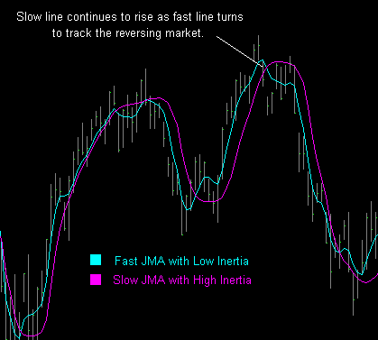

---

### Does JMA forecast a time-series?

It does not forecast into the future. JMA reduces noise pretty much the same way as an exponential moving average, but many times better.

---

### Will prior JMA values change as new data arrives?

No. For any point on a JMA plot, only historical and current data is used in the formula. Consequently, as new price data arrives on later time slots, those values of JMA already plotted are not affected and NEVER change.

Also consider the case when the most recent bar on a chart is updated in real time as each new tick arrives. Since the closing price of the most recent bar is likely to change, JMA is automatically re-evaluated to reflect the new closing price. However, historical values of JMA (on all prior bars) remain unaffected and do not change.

One can create impressive looking indicators on historical data when it analyzes both past and future values surrounding each data point being processed. However, any formula that needs to see future values in a time series cannot be applied in real world trading. This is because when calculating today's value of an indicator, future values don't exist. All Jurik indicators use only current and previous time-series data in its calculations. This allows all Jurik indicators to work in all real time conditions.

---

### Can I improve other indicators using JMA?

Yes. We typically replace most moving average calculations in classical technical indicators with JMA. This produces smoother and more timely results. For example, by simply inserting JMA into the standard DMI technical indicator, we produced the DMX indicator, which comes free with your order of JMA.

---

### Does JMA have any special guarantee?

If you show us a non-proprietary algorithm for a moving average that, when coded to run in either TradeStation, Matlab or Excel VBA, it performs "better" than our moving average in short, medium and long time frames of a random walk, we'll refund your purchased user license for JMA.

What we mean by "better" is that it must be, on average, smoother with no greater average lag than ours, no greater average overshoot and no greater average undershoot than ours. What we mean by "short, medium and long time frames" is that the comparisons must include three separate JMA lengths: 7 (short), 35 (medium), 175 (long). What we mean by a random walk is a time series produced by a cumulative sum of 5000 zero-mean, Cauchy distributed random numbers.

This limited guarantee is good for only the first month of your having purchased a user license for JMA from us or one of our worldwide distributors.

---

### How does JMA compare to other filters?

#### JMA vs. Kalman Filter

The Kalman filter is similar to JMA in that both are powerful algorithms used for estimating the behavior of a noisy dynamical system when all you have to work with is noisy data measurements. The Kalman filter creates smooth forecasts of the time series, and this method is not entirely appropriate for financial time series as the markets are prone to produce violent gyrations and price gaps, behaviors not typical of smoothly operating dynamical systems. Consequently, Kalman filter smoothing frequently lags behind or overshoots market price time series. In contrast, JMA tracks market prices closely and smoothly, adapting to gaps while avoiding unwanted overshoots.

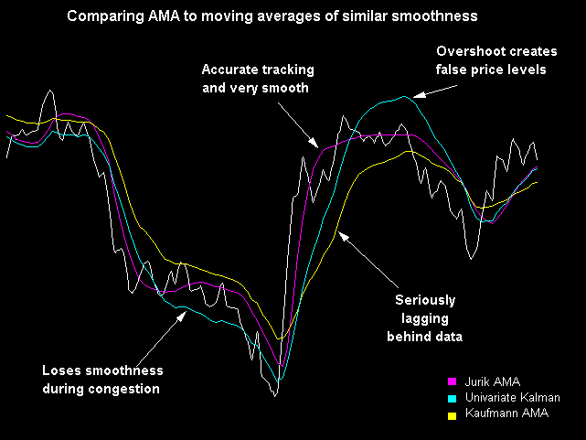

#### JMA vs. Kaufman Moving Average

A filter described in popular magazines is the Kaufmann moving average. It is an exponential moving average whose speed varies according to price action efficiency. In other words, when price action is in a clear trend with little retracement, the Kaufmann filter speeds up and when the action is congesting, the filter slows down. Although its adaptive nature helps it overcome some of the lag typical of exponential moving averages, it still lags significantly behind JMA. Lag is a fundamental issue to all traders. Remember, every bar of lag may delay your trades and deny you profit.

#### JMA vs. Chande's VIDYA

Another moving average described in popular magazines is Chande's VIDYA (Variable Index Dynamic Average). The index used most often inside VIDYA to govern its speed is price volatility. As short-term volatility increases, VIDYA's exponential moving average is designed to move faster, and as volatility decreases, VIDYA slows down.

On the surface this makes sense. Unfortunately, this design has an obvious flaw. Although sideways congestion should be thoroughly smoothed out regardless of its volatility, a highly volatile period of congestion would be closely tracked (not smoothed) by VIDYA. Consequently, VIDYA may fail to remove unwanted noise.

For example, the chart compares JMA with VIDYA, both set to track a downward trend equally well. However, during the ensuing congestion, VIDYA fails to smooth out the price spikes while JMA successfully glides through the chatter.

In another comparison where both VIDYA and Jurik's JMA were set to have the same smoothness, we see that VIDYA lags behind. As mentioned earlier, late timing can easily steal away your profits in any trade.

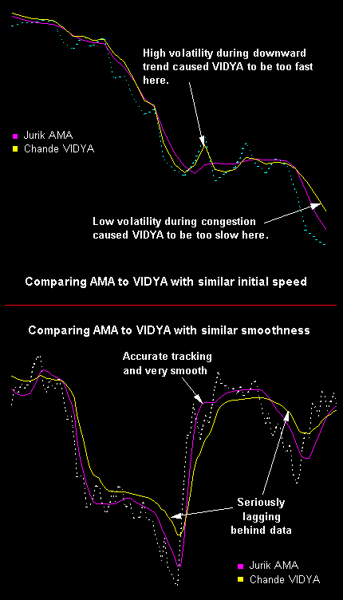

#### JMA vs. T3 and TEMA

Two other popular indicators are T3 and TEMA. They are smooth and have little lag. T3 is the better of the two. Nonetheless, T3 can exhibit a serious overshoot problem, as seen in the chart below. Depending on your application, you may not want an indicator showing a price level the real market never attained, as this may inadvertently initiate unwanted trades.

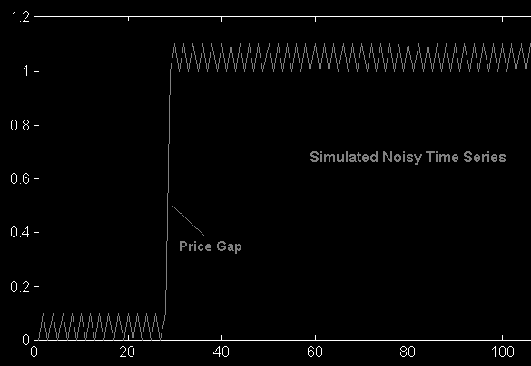

Here are two comments found posted on relevant Internet forums:

> "The T3 indicator is very good (and I've sung its praises before, on this list). However, I've had the opportunity to derive some alternate market measurements and I smooth them. They're pretty badly behaved at times. When smoothing them, T3 becomes unstable and overshoots badly, whereas JMA sails right through them." — Allan Kaminsky

> "My own view of JMA is consistent with what other people have written (I've spent a good deal of time visually comparing JMA to TEMA; I wouldn't think now of using TEMA instead of JMA)." — Steven Buss

#### JMA vs. Modified Moving Average (MMA / Robert Brown)

An article in the Jan. 2000 issue of TASC describes a moving average designed in the 1950's to have low lag. Its inventor, Robert Brown, designed the "Modified Moving Average" (MMA) to reduce lag in estimating inventories. In his formula, linear regression estimated the curve's current momentum, which in turn is used to estimate vertical lag. The formula then subtracts estimated lag from the moving average to get low lag results. This technique works OK on well behaved (smoothly transitioning) price charts, but then again, so do most other advanced filters. The problem is that the real market is anything but well behaved.

A true measure of fitness is how well any filter works on real-world financial data. These tests reveal that MMA overshoots price charts. In comparison, the user can set a parameter in JMA to adjust the amount of overshoot, even completely eliminating it. The choice is yours. Remember, the last thing you want is an indicator showing a price level the real market never attained, as this may inadvertently initiate unwanted trades. With MMA, you have no choice and must put up with overshoot whether you like it or not.

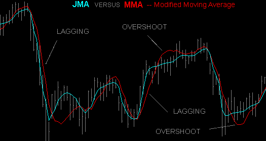

#### JMA vs. Modified Optimal Elliptical Filter (MEF / Ehlers)

The July 2000 issue of TASC contained an article by John Ehlers describing a "Modified Optimal Elliptical Filter" (abbreviated here as "MEF"). This is a superb example of classical signal analysis. The chart below compares MEF to JMA whose parameters (JMA length=7, phase=50) were set to make JMA be as similar to MEF as possible.

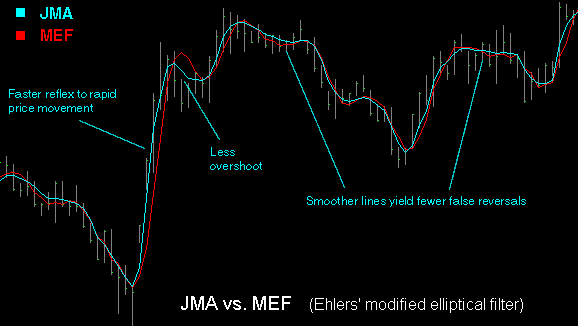

The comparison reveals these advantages when using JMA:

- JMA responds to extreme price swings more quickly. Consequently, any threshold values used to trigger signals will be executed sooner by JMA.
- JMA has almost no overshoot, permitting the signal line to more accurately track price action right after large price movement.
- JMA glides through small market movements. This permits you to focus on real price action and not small market activity that has no real consequence.

#### JMA vs. Savitzky-Golay Filter

A favorite method among engineers for smoothing time series data is to fit the data points with a polynomial (e.g., a parabolic or cubic spline). An efficient design of this type is a class known as Savitzky-Golay filters. The chart below compares JMA to a cubic-spline (3rd order) Savitzky-Golay filter, whose parameter settings were chosen to make it perform as close to JMA as possible. Note how smoothly JMA glides through regions of trading congestion. In contrast, the S-G filter is quite jagged.

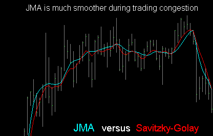

#### JMA vs. FIR Filter with Momentum

Another technique used to reduce lag in a moving average filter is to add some momentum (slope) of the signal to the filter. This reduces lag, but with two penalties: more noise and more overshoot at price pivot points. To compensate for noise, one can employ a symmetrically weighted FIR filter, which is smoother than a simple moving average, whose weights might be:

```
1-2-3-4-3-2-1
```

and then adjust these weights to add some lag reducing momentum.

The effectiveness of this approach is shown in the figure below (red line). Although the FIR filter tracks price closely, it still lags behind JMA as well as exhibit greater overshoot. In addition, the FIR filter has fixed smoothness and needs to be redesigned for each different desired smoothness. In comparison, the user only needs to change one "smoothness" parameter of JMA to get any desired effect.

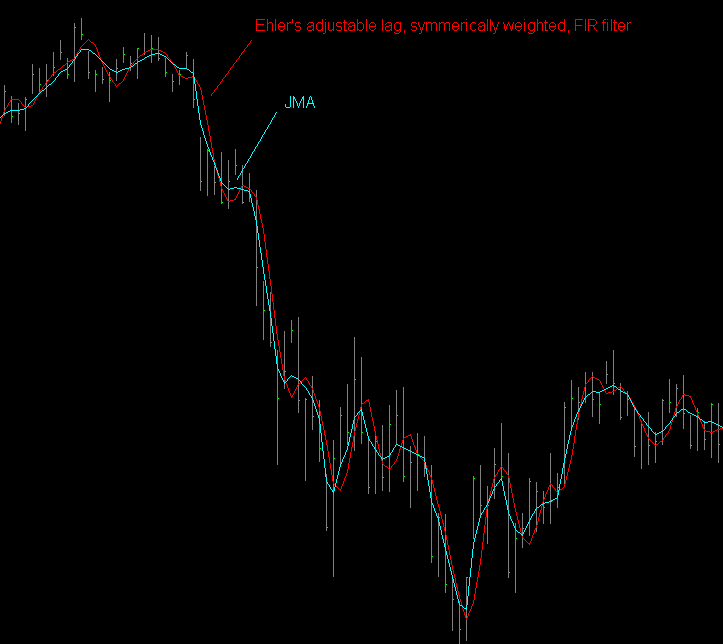

#### JMA-enhanced MACD

Not only does JMA produce better price chart plots, but it can improve other classical indicators, as well. For example, consider the classical MACD indicator, which is a comparison of two moving averages. Their convergence (moving closer) and divergence (moving apart) provide signals that a market trend is changing direction. It is critical that you have as little delay as possible with these signals or your trades will be late. In comparison, a MACD created with JMA has significantly less lag than a MACD using exponential moving averages.

To illustrate this claim, the figure below is a hypothetical price chart simplified to enhance the salient issues. We see equal-sized bars in a rising trend, interrupted by a sudden downward gap. The two colored lines are exponential moving averages that make up a MACD. Note that crossover occurs a long time after the gap, causing a trading strategy to wait and trade late, if at all.

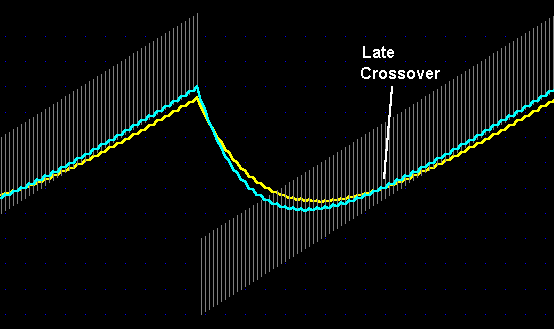

If you tried to speed up the timing of this indicator by making the moving averages faster, the lines would become noisier and more jagged. This tends to create false triggers and bad trades. On the other hand, the chart below shows the blue JMA adjusting rapidly to the new price level, permitting earlier crossovers and earlier designation of an uptrend in progress. Now you can enter the market earlier and ride a larger portion of the trend.

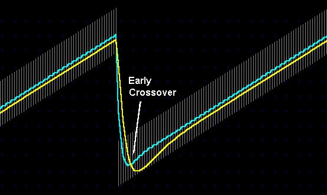

Unlike the exponential moving average, JMA has an additional parameter (PHASE) that lets the user adjust the extent of overshoot. In the chart above, the JMA yellow line was permitted to overshoot more than the blue. This gives ideal crossovers.

#### JMA vs. Hull Moving Average (HMA)

One of the most difficult features to design into a smoothing filter is an adaptive response to price gaps without overshooting the new price level. This is especially true for filter designs that employ the filter's own momentum as a way to reduce lag. The following chart compares overshoot by JMA and the Hull moving average (HMA). The parameter settings for the two filters were set so that their steady state performance were almost identical.

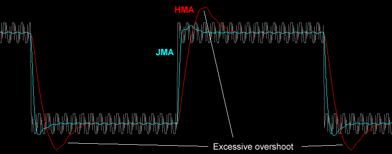

Another design issue is whether or not the filter can retain the same apparent smoothness during reversals as during trends. The chart below shows how JMA retains near constant smoothness throughout the entire cycle, whereas HMA oscillates at reversals. This would pose problems for strategies that trigger trades based on whether the filter is moving up or down.

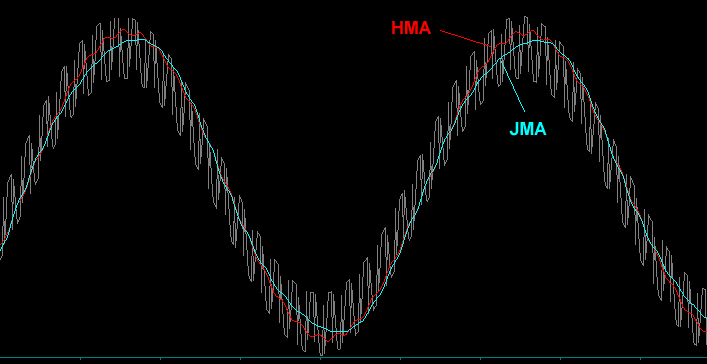

Lastly, there is the case when price gaps up and then retreats in a downward trend. This is especially difficult to track at the moment of retreat. Fortunately, adaptive filters have a much easier time indicating when a reversal occurred than fixed filters, as shown in the chart below.

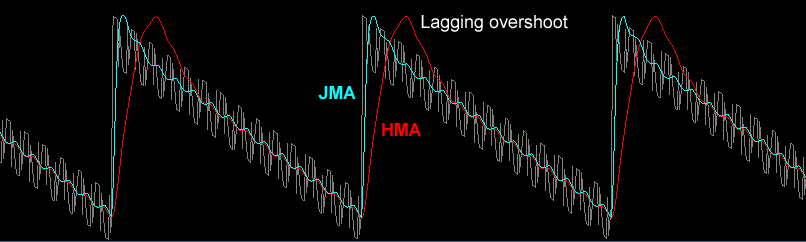

Of course there are better filters than JMA, mostly used by the military. But if you are in the business of tracking down good trades and not enemy aircraft, JMA is the best **affordable** noise reducing filter available for financial market data.

---

## General Topics on Jurik Tools

### Can the tools plot many curves on each of many charts?

Yes. You can create and chart as many indicators as you like.

---

### Can the tools process any type of data?

Jurik Tools can be applied to any time-series data that WANDERS, like a random walk. For example, daily prices of IBM securities, monthly readings of a person's body weight are two examples of wandering values. Although our tools are not designed to process a purely random time series, they can be used to process the cumulative sum of the same series. This is because the cumulative sum would plot as a random walk.

Types of time frames include tick, volume or range bars; minute, hourly, end-of-day, weekly or monthly bars.

Jurik Tools run on any number of time series simultaneously, and on multiple charts.

---

### Can the tools work in real-time?

Yes. All Jurik tools are designed to operate as fast as possible in real-time.

---

### Are the algorithms disclosed or black-boxed?

Because Jurik Research has spent years perfecting these algorithms, disclosed versions of our formulas are available to U.S.A. firms only with special agreements, for a price of $5,000 per tool. The black-boxed version of our tools cost significantly less.

---

### Do Jurik tools need to look into the future of a time series?

One can create impressive looking indicators on historical data when it analyzes both past and future values surrounding each data point being processed. However, any formula that needs to see future values in a time series cannot be applied in real world trading. This is because when calculating today's value of an indicator, future values don't exist.

All Jurik indicators use only current and previous time-series data in its calculations. This allows all Jurik indicators to work in real time conditions, including live trading.

---

### Do the tools produce similar values across all platforms?

Yes. Although the tools are activated differently within each platform, the values produced by our core functions (JMA, VEL, RSX, CFB) are as similar as can be, within the constraints of each charting platform.

If you have already licensed one or more tools, you can get the same tool(s) for a different platform at a discount.

---

### Do Jurik's tools come with a guarantee?

**What we DO guarantee** (Effective 9 Feb 98):

We guarantee that our software performs as advertised. Of course, proper application and common sense is required on your part. If you can demonstrate a "bug" in our software, we will make every effort to fix it in reasonable time. If not, we will refund your purchased user license for that specific tool.

**What we do NOT guarantee:**

We cannot guarantee that our tools will improve the profitability of every trading system, as some systems are flat out losers and quick remedial efforts would be fruitless. Our tools are powerful functions, but even the best workshop tool cannot save a burning house.

---

### How many installation passwords do I get?

For licensed TradeStation users, one password is good for all copies of TradeStation having the same "TradeStation Customer Number" or TCN. A different TCN will require a different password. For licensed MultiCharts users, one password is good for all copies of MultiCharts having the same assigned "User Name".

For all other users (i.e. not TradeStation), a password permits you to install onto only one computer. If you want to install onto a second computer, you need a second password. We will provide you a second password for free, provided you meet certain requirements.

Should you replace your computer with a new one, a replacement password is available, provided you meet certain requirements.
