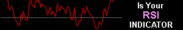

# FAQs on RSX

© 2012 Jurik Research — [www.jurikres.com](http://www.jurikres.com)

## BibTeX

```bibtex
@online{jurikres_faq_rsx,
  author       = {{Jurik Research}},
  title        = {{FAQs} on {RSX}},
  year         = {2012},
  url          = {http://jurikres.com/faq1/faq_rsx.htm},
  note         = {Archived at Wayback Machine}
}
```

---

## Table of Contents

### FAQs on RSX

- [What is the Theory Behind RSX?](#what-is-the-theory-behind-rsx)
- [How does RSX compare to VEL?](#how-does-rsx-compare-to-vel)
- [Will prior RSX values, already plotted, change as new data arrives?](#will-prior-rsx-values-change-as-new-data-arrives)

### General Topics on Jurik Tools

- [Can the tools plot many curves on each of many charts?](#can-the-tools-plot-many-curves-on-each-of-many-charts)
- [Can the tools process any type of data?](#can-the-tools-process-any-type-of-data)
- [Can the tools work in real-time?](#can-the-tools-work-in-real-time)
- [Are the algorithms disclosed or black-boxed?](#are-the-algorithms-disclosed-or-black-boxed)
- [Do Jurik tools need to look into the future of a time series?](#do-jurik-tools-need-to-look-into-the-future-of-a-time-series)
- [Do the tools produce similar values across all platforms?](#do-the-tools-produce-similar-values-across-all-platforms)
- [Do Jurik's tools come with a guarantee?](#do-juriks-tools-come-with-a-guarantee)
- [How many installation passwords do I get?](#how-many-installation-passwords-do-i-get)

---

## FAQs on RSX

### What is the Theory Behind RSX?

In the classical RSI, trend strength is measured by taking separate moving averages of the up changes and down changes in price. The original formulation called for a simple moving average, however, more contemporary implementations use an exponential moving average. Either way, these averaging techniques introduce significant lag and noise into the signal action, thereby degrading its quality.

In contrast, RSX uses filtration with very low lag and superior smoothness. As shown in the chart below, the difference is striking!



The chart shows a noisy line and a smooth one. The noisy line was generated by the classical RSI and the smooth one was by RSX. With cleaner signals you can set tighter stops and more accurate thresholds. You can also afford to let RSX run a little faster without fear of degradation from excessive noise. This permits you to get even earlier signals!

---

### How does RSX compare to VEL?

Both VEL and RSX measure market momentum.

**VEL** measures momentum direction and speed accurately to scale. If bar-to-bar price changes double in size, VEL's chart will double in size. In other words, VEL provides true momentum.

This makes VEL not useful for thresholding, such as when you want to trigger a BUY/SELL when VEL crosses over/under a (non-zero) threshold value. The reason is because the threshold will require almost continuous readjustment as the magnitude of price changes grows/shrinks over time. However, this property is very useful in divergence analysis, where you want to accurately compare price turning point values to momentum turning point values.

**RSX**, in contrast, measures momentum direction and **quality**, not speed. If trend quality is pure (i.e. having tiny reversals) then RSX signal is strong. If quality is weak, such as when a trend is congesting into a trading range, then RSX signal becomes weak. This makes RSX ideal for showing market reversals and the demise of trends weakened by excess volatility.

RSX is also bounded between the range of 0 to 100. In contrast, VEL is unbounded and can have any value. This scale-invariant nature of RSX makes it suitable for thresholding, as the threshold level does not need to change over time, as it would for VEL. Consequently, you can define BUY and SELL zones with RSX, whereby a SELL order is never executed when RSX is above the BUY ZONE threshold level, and a BUY order is never executed when RSX is below the SELL ZONE threshold level.

---

### Will prior RSX values change as new data arrives?

No. For any point on a RSX plot, only historical and current data is used in the formula. Consequently, as new price data arrives on later time slots, those values of RSX already plotted are not affected and NEVER change.

Also consider the case when the most recent bar on a chart is updated in real time as each new tick arrives. Since the closing price of the most recent bar is likely to change, RSX is automatically re-evaluated to reflect the new closing price. However, historical values of RSX (on all prior bars) remain unaffected and do not change.

One can create impressive looking indicators on historical data when it analyzes both past and future values surrounding each data point being processed. However, any formula that needs to see future values in a time series cannot be applied in real world trading. This is because when calculating today's value of an indicator, future values don't exist. All Jurik indicators use only current and previous time-series data in its calculations. This allows all Jurik indicators to work in all real time conditions.

---

## General Topics on Jurik Tools

### Can the tools plot many curves on each of many charts?

Yes. You can create and chart as many indicators as you like.

---

### Can the tools process any type of data?

Jurik Tools can be applied to any time-series data that WANDERS, like a random walk. For example, daily prices of IBM securities, monthly readings of a person's body weight are two examples of wandering values. Although our tools are not designed to process a purely random time series, they can be used to process the cumulative sum of the same series. This is because the cumulative sum would plot as a random walk.

Types of time frames include tick, volume or range bars; minute, hourly, end-of-day, weekly or monthly bars.

Jurik Tools run on any number of time series simultaneously, and on multiple charts.

---

### Can the tools work in real-time?

Yes. All Jurik tools are designed to operate as fast as possible in real-time.

---

### Are the algorithms disclosed or black-boxed?

Because Jurik Research has spent years perfecting these algorithms, disclosed versions of our formulas are available to U.S.A. firms only with special agreements, for a price of $5,000 per tool. The black-boxed version of our tools cost significantly less.

---

### Do Jurik tools need to look into the future of a time series?

One can create impressive looking indicators on historical data when it analyzes both past and future values surrounding each data point being processed. However, any formula that needs to see future values in a time series cannot be applied in real world trading. This is because when calculating today's value of an indicator, future values don't exist.

All Jurik indicators use only current and previous time-series data in its calculations. This allows all Jurik indicators to work in real time conditions, including live trading.

---

### Do the tools produce similar values across all platforms?

Yes. Although the tools are activated differently within each platform, the values produced by our core functions (JMA, VEL, RSX, CFB) are as similar as can be, within the constraints of each charting platform.

If you have already licensed one or more tools, you can get the same tool(s) for a different platform at a discount.

---

### Do Jurik's tools come with a guarantee?

**What we DO guarantee** (Effective 9 Feb 98):

We guarantee that our software performs as advertised. Of course, proper application and common sense is required on your part. If you can demonstrate a "bug" in our software, we will make every effort to fix it in reasonable time. If not, we will refund your purchased user license for that specific tool.

**What we do NOT guarantee:**

We cannot guarantee that our tools will improve the profitability of every trading system, as some systems are flat out losers and quick remedial efforts would be fruitless. Our tools are powerful functions, but even the best workshop tool cannot save a burning house.

---

### How many installation passwords do I get?

For licensed TradeStation users, one password is good for all copies of TradeStation having the same "TradeStation Customer Number" or TCN. A different TCN will require a different password. For licensed MultiCharts users, one password is good for all copies of MultiCharts having the same assigned "User Name".

For all other users (i.e. not TradeStation), a password permits you to install onto only one computer. If you want to install onto a second computer, you need a second password. We will provide you a second password for free, provided you meet certain requirements.

Should you replace your computer with a new one, a replacement password is available, provided you meet certain requirements.
