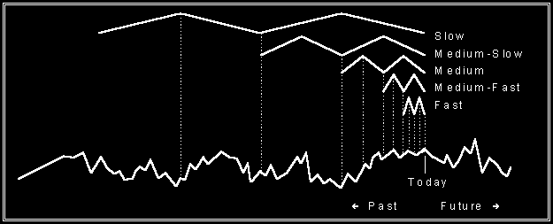

# FAQs on WAV

© 2012 Jurik Research — [www.jurikres.com](http://www.jurikres.com)

## BibTeX

```bibtex
@online{jurikres_faq_wav,
  author       = {{Jurik Research}},
  title        = {{FAQs} on {WAV}},
  year         = {2012},
  url          = {http://jurikres.com/faq1/faq_wav.htm},
  note         = {Archived at Wayback Machine}
}
```

---

## Table of Contents

### FAQs on WAV

- [What is the Theory Behind WAV?](#what-is-the-theory-behind-wav)
- [Does WAV Detrend and Normalize Data?](#does-wav-detrend-and-normalize-data)
- [Are WAV and WAVESAMP the same algorithm?](#are-wav-and-wavesamp-the-same-algorithm)
- [Can the outputs of WAV be used as indicators in their own right?](#can-the-outputs-of-wav-be-used-as-indicators-in-their-own-right)
- [Can I export WAV's output values to a text file?](#can-i-export-wavs-output-values-to-a-text-file)

### General Topics on Jurik Tools

- [Can the tools plot many curves on each of many charts?](#can-the-tools-plot-many-curves-on-each-of-many-charts)
- [Can the tools process any type of data?](#can-the-tools-process-any-type-of-data)
- [Can the tools work in real-time?](#can-the-tools-work-in-real-time)
- [Are the algorithms disclosed or black-boxed?](#are-the-algorithms-disclosed-or-black-boxed)
- [Do Jurik tools need to look into the future of a time series?](#do-jurik-tools-need-to-look-into-the-future-of-a-time-series)
- [Do the tools produce similar values across all platforms?](#do-the-tools-produce-similar-values-across-all-platforms)
- [Do Jurik's tools come with a guarantee?](#do-juriks-tools-come-with-a-guarantee)
- [How many installation passwords do I get?](#how-many-installation-passwords-do-i-get)

---

## FAQs on WAV

### What is the Theory Behind WAV?

Because all markets have different degrees of weak-form efficiency, prior and current market action have varying utility in forecasting future action. When this utility is high, it makes sense to feed a trading system indicators that summarize aspects of past market activity. To not do so would be tantamount to pouring vital information down the drain.

For example, suppose your SP500 forecast/trading system requires knowledge spanning the last 200 price-bars of each of five markets: S&P, Bonds, Yen, CRB, and DM. If this system were given only today's prices and no historical data, performance would be seriously impaired.

A problem arises when attempting to feed your system all 200 historical price samples from each market. Each forecast would require 1000 (5x200) input values. Professional traders realize this is too many and one must be very selective when choosing historical data for a model. So which samples do you use? Uniformly spaced sampling of historical prices, such as selecting every tenth day, is seductively appealing in its simplicity, yet very wasteful and can miss important price action.

It is shocking that most traders have no idea which historical samples to use: should the trading system include yesterday's ADX value and of the day before, the week before, every other day, week, month, etc.?

**THE KEY ISSUE**

Markets oscillate from being overbought and oversold. It's due, in part, to a kind of psychological momentum that tends to persist despite changes in market conditions. Each market has its own time-varying momentum (TVM), each with different cycle lengths. These TVM influence each other. Their cumulative effect contributes to the market's complex price waveform.



So for a trading system to work properly, it must receive the historical samples required for detecting all possible TVMs affecting the market you wish to trade. Although slow TVMs may be sampled slowly (once per month), fast TVMs must be sampled quickly (once per bar). So the big question is: what is the best spread of samples in a financial time series when you do not have a clue which TVMs are driving the market?

**BREAKTHROUGH: WAVELET-LIKE SAMPLING**

The breakthrough is this: optimal sampling requires getting just enough samples to detect the presence of slow moving TVMs, just enough for detecting the medium-slow TVMs, and so on. Our product, WAV, achieves this so efficiently that WAV uses only 17 samples to effectively capture information from 200 historical bars of a financial time-series! Imagine how much time you will save developing trading systems that require only 17 instead of 200 input variables!

The astute reader may argue that you cannot just sample individual prices spaced far apart in time, because you will be ignoring all the price activity occurring between those samples. WAV handles this. It considers all price action by applying a scientific method of detrending, wavelet-like sampling and signal filtering. The result: information from hundreds of price points compressed into just a handful of numbers for your forecast model!

WAV is a unique hybrid of my own design between Wavelet filtering and Nyquist filtered sub-sampling. It's a great way to achieve time compression. That is, WAV gives you the ability to represent a lot of historical information about any time series with a small set of feature variables.

WAV compresses time by representing a large amount of historical price action with a significantly smaller number of values. For example, when using daily price data, you can input to a forecasting model information about the last 139 days using only 15 numbers from WAV. That's a compression ratio of more than 9:1.

Here's a brief description of how the user views WAV:

- As with all technical indicators, WAV stops at every bar and updates its calculations. Data is gathered by examining the most recent N bars of a time series. The user specifies both the lookback value N and the time series to be processed.

- Unlike other technical indicators, when WAV stops at each bar, it produces not one but several output values. These few values efficiently represent the activity of the time series over the past N bars. What makes WAV so valuable is that the typical number of values produced by WAV is very small relative to N.

- The user typically feeds WAV's output values to a forecasting model or other kind of leading indicator. In Microsoft Excel, WAV arranges each set of values row-by-row. In TradeStation, a user function can ask WAV to produce all the values in the set.

---

### Does WAV Detrend and Normalize Data?

You have the option to let WAV preprocess your time series data before WAV begins its smoothing and sampling stage. There are two types of preprocessing: DETREND and NORMALIZE.

- **DETREND** — Use this option when your price data tends to wander in value over time. With DETREND you are feeding WAV time series data that is always centered around zero. This makes some modeling and forecasting tasks much easier.

- **NORMALIZE** — Use this option when the volatility of your data tends to wander in value over time. With NORMALIZE you are feeding WAV time series data whose volatility (as measured by standard deviation) is relatively constant. This makes some modeling and forecasting tasks much easier.

---

### Are WAV and WAVESAMP the same algorithm?

In 1992, Jurik Research developed techniques to preprocess prior values of financial time series. Two simplified formulas were published in the article "The Care and Feeding of a Neural Network", in *Futures*, October 1992. We advise you to not use either formula because they contain flawed assumptions that we discovered in 1994.

In 1994, we improved and merged the two techniques into a second generation formula, giving it the name "WaveSamp" and more recently "WAV". WaveSamp was mentioned by Murray Ruggiero on CNBC's "Tech Talk" with John Murphy.

WAV is superior to the older version in many ways:

- The new formula combines the power of both separate older formulas. This cuts down the amount of manual work and data processing by 50%.
- Detrending is now a separate, more accurate operation. It is also a user selectable option because sometimes it is appropriate to keep trend in the time series.
- Normalization now considers a more appropriate set of data points, giving better performance. It is also a user selectable option because sometimes it is appropriate to keep volatility in the time series.

---

### Can the outputs of WAV be used as indicators in their own right?

Yes. You might try feeding WAV's values directly to trading rules, but realize that WAV's outputs are lagged and specifically designed to feed forecasting modules.

---

### Can I export WAV's output values to a text file?

You can export any alphanumeric data on Excel's spreadsheets to text files.

---

## General Topics on Jurik Tools

### Can the tools plot many curves on each of many charts?

Yes. You can create and chart as many indicators as you like.

---

### Can the tools process any type of data?

Our functions process any time series of numerical values, and any number of time series simultaneously, on one or more charts.

On a market data chart, price bars may be of any type: tick, volume or range bars; minute, hourly, end-of-day, weekly or monthly bars.

---

### Can the tools work in real-time?

Yes. All Jurik tools are designed to operate as fast as possible in real-time.

---

### Are the algorithms disclosed or black-boxed?

Because Jurik Research has spent years perfecting these algorithms, disclosed versions of our formulas are available to U.S.A. firms only with special agreements, for a price of $5,000 per tool. The black-boxed version of our tools cost significantly less.

---

### Do Jurik tools need to look into the future of a time series?

One can create impressive looking indicators on historical data when it analyzes both past and future values surrounding each data point being processed. However, any formula that needs to see future values in a time series cannot be applied in real world trading. This is because when calculating today's value of an indicator, future values don't exist.

All Jurik indicators use only current and previous time-series data in its calculations. This allows all Jurik indicators to work in real time conditions, including live trading.

---

### Do the tools produce similar values across all platforms?

Yes. Although the tools are activated differently within each platform, the values produced by our core functions (JMA, VEL, RSX, CFB) are as similar as can be, within the constraints of each charting platform.

If you have already licensed one or more tools, you can get the same tool(s) for a different platform at a discount.

---

### Do Jurik's tools come with a guarantee?

**What we DO guarantee** (Effective 9 Feb 98):

We guarantee that our software performs as advertised. Of course, proper application and common sense is required on your part. If you can demonstrate a "bug" in our software, we will make every effort to fix it in reasonable time. If not, we will refund your purchased user license for that specific tool.

**What we do NOT guarantee:**

We cannot guarantee that our tools will improve the profitability of every trading system, as some systems are flat out losers and quick remedial efforts would be fruitless. Our tools are powerful functions, but even the best workshop tool cannot save a burning house.

---

### How many installation passwords do I get?

For licensed TradeStation users, one password is good for all copies of TradeStation having the same "TradeStation Customer Number" or TCN. A different TCN will require a different password.

For all other users (i.e. not TradeStation), a password permits you to install onto only one computer. If you want to install onto a second computer, you need a second password. We will provide you a second password for free, provided you meet certain requirements.

Should you replace your computer with a new one, a replacement password is available, provided you meet certain requirements.
