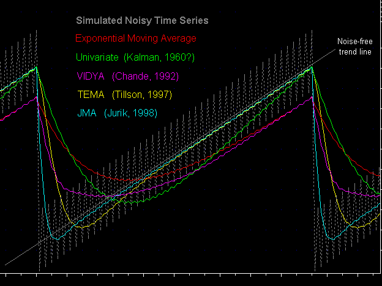
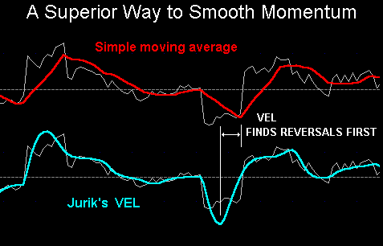
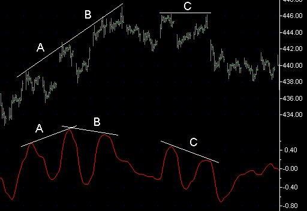
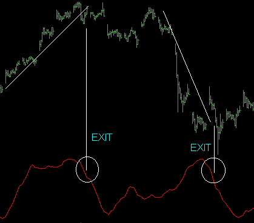
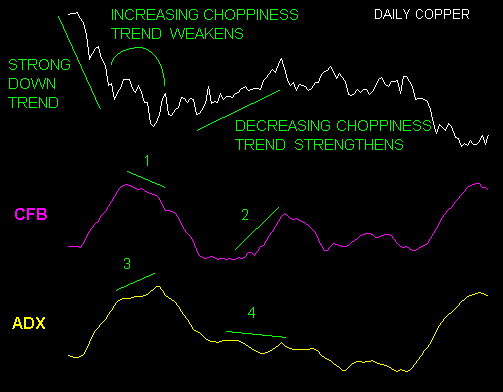
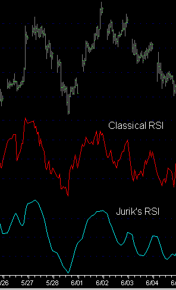
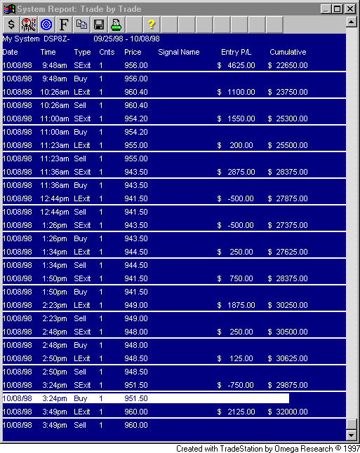

# OVERVIEW

**Mark Jurik**

© 1999 Jurik Research, www.jurikres.com

## BibTeX

```bibtex
@techreport{jurik1999overview,
  author       = {Jurik, Mark},
  title        = {Overview},
  year         = {1999},
  institution  = {Jurik Research},
  url          = {http://jurikres.com/catalog1/ms_over.htm},
  note         = {PDF: overview.pdf, 44-page product overview}
}
```

---

## INTRODUCTION

Jurik Research provides software "building blocks" for creating basic and advanced technical indicators within the popular platforms of Omega Research TradeStation, SuperCharts and MS Excel. We also have versions in DLL format for software developers.

## THE BASIC INDICATORS

The basic indicators are JMA, VEL and CFB. All are designed to provide smooth curves with low lag because lag produces late trading signals that typically rob one of potential profits. We discovered that customers typically need to spend time unlearning common pre-conceived notions about the limitations of our technical indicators, limitations inherent in classical indicators due to excessive lag. After getting over this hurdle, users become very creative with our modules.

### JMA

JMA (Jurik Moving Average) is the latest version of our popular low-lag adaptive moving average. JMA is designed to remove noise from any time series; however, unlike non-adaptive filters, JMA can distinguish between background noise and price gaps, filtering out the former but not the latter. This is extremely important in trading systems that run intra-day, as EOD price gaps can be huge.

The chart below compares JMA against other non-adaptive moving averages, and shows how JMA converges to the new price level the fastest. T3 takes twice as long to converge, and it overshoots price data. Eliminating these shortcomings can make all the difference in a trade.


Unlike most other filters that filter noise poorly, JMA remains smooth. The chart below compares several filters on a simulated noisy, gapping and trending time series. All filters are producing the same amount of jittery response to the noisy signal, but only JMA and TEMA can track close to the noise-free trend line (shown in gray). Again, JMA converges to the true trend line sooner than all the others, and for some trades this makes all the difference.



Appendix A contains feedback we have received from users of our original moving average (AMA) and its latest incarnation, JMA.

### VEL

A measure of true (noise free) price velocity (momentum) can be extremely useful. However, the classic Momentum indicator is plagued with noise. Attempts to reduce this noise by either running it through a moving average or by taking the slope of a regression line through the time series reduces noise but creates significant lag at critical price turning points. In contrast, VEL measures the velocity of a time series smoothly, accurately and without lagging behind the raw momentum signal.

In the chart below, we see the classical momentum line (gray) smoothed by a simple moving average (red) and by VEL (cyan). Note how VEL smoothes the time series without adding any additional lag in the process. Consequently, VEL finds reversals sooner.



Many users also exploit VEL's accuracy in another way. Although price may still be rising, its divergence with VEL signifies a trend is losing energy and is likely to reverse. For example, in the chart below, the divergence between lines B in the price and VEL charts signifies deceleration and eventual price trend reversal. The continued divergence at lines C suggested continued price reduction. This is very difficult to attain with the classical momentum indicator because its inherent noise obscures the true value of price velocity.



Appendix B contains feedback we have received from users of VEL.

### CFB

CFB (Composite Fractal Behavior) is an indicator whose application is subtle, yet once users have figured it out, they have used CFB to create the most clever applications that I've seen of all our tools. It simultaneously measures trend duration and trend quality. The longer a quality trend plays out, the larger CFB's index value. When trend speed slows down, or volatility picks up (thereby degrading trend quality), the CFB index rapidly declines. Note that it declines at the end of upward or downward trends.

Because CFB is very sensitive to trend degradation, it has been used successfully as a trend exit signal. In the chart below, each time CFB falls off its peak, the overall trend in the price time series terminates.



CFB was originally intended to serve as a means to dynamically adjust other indicators "on the fly" as a function of trend duration and quality. For example, many users have discovered that letting CFB's output modulate the length of RSI on a bar-by-bar basis almost always produces results superior to an RSI whose length parameter is fixed for the entire duration of the time series. This result confirms similar results published by Murray Ruggiero, regarding the use of MESA for the same purpose. With MESA, estimates of dominant cycle lengths were used to modify the length of other indicators. Unlike MESA, CFB does not rely on getting the correct a-priori model, nor is it as susceptible to signal noise. This is because CFB does not assume there are any cycles in the time series. Instead CFB looks for numerous fractal like patterns, a process more resilient to noise. The latest version of CFB will search for fractals up to 192 bars in length.

CFB has some resemblance to the commonly used technical indicator ADX. However, it is superior to ADX in its ability to assess strengthening and weakening trends. For example, in the chart below, a strong downward trend begins to breakdown as increasing retracement and volatility develop. Although CFB reveals this weakening strength (1), ADX continues to indicate a growing trend (3). Next, CFB picks up a growing trend (2) but ADX completely misses it (4).



Appendix C contains feedback we have received from users of CFB.

### RSX

RSI is very popular and falls in the same class of indicators as does RWI (random walk index) and KER (Kaufman's Efficiency Ratio). Unfortunately, RSI, as formulated in almost all software apps is very noisy. Attempts to smooth it out using classical moving averages degrade the signal by adding lag and distorting the RSI's true amplitude.

Jurik Research has reformulated RSI so that it is smooth and has very little lag. Consequently, users say they exclusively use our version of RSI, called RSX. The chart compares our RSX with that provided by Omega Research TradeStation®.



Many users have expressed thanks for providing demonstration trading systems that use JMA and RSX that, with a few adjustments on their part, becomes profitable in real time trading.

For example, here's a message I received from one very happy user...

> Mark,
>
> I just purchased your Jurik Moving Average. It has 3 systems that came with it and would you believe it is the one of the best systems I have ever used for daytrading the S&P? For $395 this is the best investment I have ever spent.
>
> Mark, I am enclosing the real-time trades for today. It made $9,350 real-time. This is amazing! Please do not reveal the time frame.
>
> Cory Romero
> Tue 10/20/98

Next page is the screen shot of her day's trades using TradeStation.



---

## ADVANCED INDICATORS

After pushing JMA, VEL, CFB and RSX as far as they can go, the advanced user asks us to take his system to the next performance level. This involves implementing leading indicators of the user's own design. Profitable leading indicators are not trivial algorithms, as they are required to "see" what the market has not yet already discounted. Various versions of neural nets are the modeling paradigms typically used to create leading indicators. Nonetheless, for any model type employed, the data used to create models needs to be pre-processed for several reasons:

1. Models may need to be fed a short or long history of one or more input variables.
2. Simpler models usually have more reliable performance.
3. Simpler models are easier to create and test.

The two modules we have that serve the above two objectives are WAV and DDR.

### Neural Networks and Financial Forecasting

The very first step toward making a leading indicator requires the developer to decide how far into the future the leading indicator is to forecast. Our book, *Neural Networks and Financial Forecasting*, provides a formula for determining the optimal forecast horizon of any time series. The book also provides a heuristic for estimating the maximum amount of history required of each input (independent) variable for the model to make such a forecast. For example, we determined that the optimal horizon using daily 30 Yr. T-bonds as the target time series is 5.5 days, and that to "see" that far into the future, a model needs to "see" 22 days of history. I published this finding into what is now called the Journal of Computational Finance. It was one of the first published works that combined chaos theory and information theory into a formula with a very practical application in the financial arena. (For a brief outline on my theory of an optimal forecast horizon, see Appendix F.)

After determining the optimal forecast horizon, and the consequent maximum history that may be required of all independent time series feeding the leading indicator, the next step for the developer is to transform each input time series into a set of numbers that span the requisite history. Please refer to the diagram below.

```
                        S&P Fast K
                        S&P Velocity
                        DOW velocity       ─┐
                        DOW MACD            │  48 variables
                        TRIN               ─┘  per group

                                    ┌──────────────────────┐
                                    │  Leading Indicator   │
                                    │  Forecast Model      │
                                    └──────────────────────┘
```

For example, suppose a user has chosen to feed his leading indicator five time series (S&P Fast K, S&P velocity, DOW velocity, DOW MACD, TRIN). Also suppose he decided that, at most, 48 bars of history is needed from each of the five input time series for the indicator to make a forecast. He could simply take the last 48 bars of each time series and feed them into the leading indicator, as shown in the diagram. This would produce 5×48 or 240 independent variables for the forecasting model. For reasons I outlined in both the book "Virtual Trading" and in an article in "Artificial Intelligence in Finance", 240 variables is way too many. We need a method for capturing the same amount of history with significantly fewer variables, so as to approach the goal of creating the smallest model possible.

This goal is accomplished with our modules WAV and DDR.

### WAV

At any point in time, WAV will efficiently capture historical information of a time series relative to that point and express that information with significantly fewer samples than that produced by the example given above. WAV does this by filtering and sub-sampling the data in a unique way so as to retain relevant short, medium and long cycle length behavior. In the example above, WAV would produce only 12 variables for each input time series, producing a total of 5×12 or 60 variables. Compared to the method described earlier, WAV delivers a 75% reduction in the degrees of freedom for the model, a significant improvement.

```
                        S&P Fast K
                        S&P Velocity
                        DOW velocity       ─┐
                        DOW MACD            │  WAV → 12 variables
                        TRIN               ─┘  per group

                                    ┌──────────────────────┐
                                    │  Leading Indicator   │
                                    │  Forecast Model      │
                                    └──────────────────────┘
```

### DDR

By reducing the number of samples required to span history, WAV is performing "temporal compression". More compression can be attained another way. For example, when three values are used to fully describe a "state" of a system, (e.g. the local weather), we can say that the model is representing the weather in 3 dimensions of feature space. Now, in the above example, the leading indicator is being fed data that might occupy 60 dimensions. But because many economic indicators are redundant, they collectively describe the state of a dynamic system (the market) that is probably spanning much fewer dimensions, maybe as little as 6. What is needed is a way to compress the 60 input variables into a smaller collection, such that the smaller set still faithfully describes the market's dynamics. We call this "spatial compression".

DDR (Decorrelator and Dimension Reducer) performs spatial compression, using a powerful algorithm based on principle component analysis. Luckily, the user does not need to know anything about how DDR works in order to employ it. In the example above, DDR may discover that the 60 input variables were highly redundant and actually span only 15 dimensions of feature space. Consequently, DDR will create 15 new time series for the forecasting model.

```
                        S&P Fast K
                        S&P Velocity
                        DOW velocity       ─┐
                        DOW MACD            │  WAV + DDR → Only 15 variables
                        TRIN               ─┘

                                    ┌──────────────────────┐
                                    │  Leading Indicator   │
                                    │  Forecast Model      │
                                    └──────────────────────┘
```

A result of 15 variables from 240 represents a whopping 93.7% reduction in the degrees of freedom for the forecasting model.

As an added benefit, all 15 time-series produced by DDR are mutually decorrelated. This is perfect for regression type neural networks, such as Braincel.

WAV and DDR together perform spatio-temporal compression very effectively. Ever since Jurik Research published the concept of data compression in Futures Magazine in 1992, it is becoming increasingly popular among forecast model builders. An entire issue has since been devoted to this topic in the Journal of Computational Finance.

Appendix D contains user comments about the WAV and DDR modules. In particular, one user has developed an intraday leading indicator of the S&P that is exhibiting less than 10% error. Needless to say, he is very pleased.

---

## SUMMARY

JMA, VEL, CFB and RSX cover important features of price action: location, velocity, trend duration & quality. Their low lag greatly improves chances of developing a profitable trading system. Until recently, low lag tracking indicators were not readily available to the average investor, although the U.S. military (my background) has been working on them for decades in other applications (tracking missiles and submarines).

DDR and WAV provide powerful data preprocessing for leading indicators. They are typically used first on an Excel spreadsheet, where the row and column format is particularly useful for model building. Although we sell Braincel (by Promised Land Technology) as a neural net add-in module for Excel, WAV and DDR can preprocess data for any modeling paradigm, because the theory of data compression remains the same.

Users of TradeStation can develop their neural net models in MS Excel and then later employ them in TradeStation, providing the capability of neural net based indicators running in real-time (perfect for day trading).

We invite you to query Omega-list forum users regarding our customer and technical support. Jurik Research prides itself on providing superb service. We discuss almost anything with our customers, covering techniques far beyond what our tools employ.

Appendix E contains comments from users about our technical support. I urge you to read it through. You'll see that Jurik Research is not just a software vendor.

---

## APPENDIX A

**Comments from users of Jurik's original AMA and the newer JMA.**

> Jurik's latest version (June 1998) of his AMA is quite an improvement over the older versions. It creates a smooth curve with less lag than any other filter I have tried. It also has additional parameters so that you can optimize the characteristics somewhat to your market, trading off lag and overshoot. I have tried it in indicators such as MACD and RSX and it improves them. I suspect you will be happy with it. (No connection other than being a customer, etc.) -- **Bob Fulks**

> I have been using AMA/JMA for a few days. What outstanding work you have done. -- **Lee Eik**

> Hi, I recently purchased AMA, VEL, and DDR as DLLs. First, let me say I am very impressed with AMA. I replaced the traditional EMA I was using in a set of Neural Nets that I developed and to my great surprise, it reduced the average predicted error by approximately 50% on all securities!! Amazing!! Thanks for an excellent product!! -- **Keith Taylor, Pentacor, Inc.**

> I am a recent buyer of JMA. I think it's great. -- **Steven Buss**

> This indicator is very accurate and I have forwarded my comments to our group of traders (35-40). When it goes flat or turns, it confirms our signals down to the 1 min bar. I have never had such results from an indicator. Please don't let anyone else buy it! Unlike the industry standard of not doing anything except making a squiggly line on a chart, JMA actually does provide very profitable, accurate, useful information. I have talked with the group's mentor and he is considering incorporating this indicator in his teaching methods and using it himself. See, you can teach old dogs new tricks. Sincerely Yours, -- **Peter H. Ripley, Sr.**

> With a lot of hard work and some luck I now use momentum of a AMA with a threshold level as the basis of most of my systems. This indicator is a very good indicator of trend. Included is a report on my system implemented on the bonds that I trade. -- **Frederick Barnard**

> I have been using Jurik's products for years. They are a solid and reputable outfit. In my applications, AMA is superior to anything else and worth the price. ... There has been some published work on Adaptive Moving Averages: 'VIDYA' in The New Technical Trader by Chande & Kroll; Adaptive Moving Average in Smarter Trading by Kaufman. If you study these in depth and compare them with Jurik's software, Jurik's results seem (in my testing) to be universally superior. ... It's worth buying them as they're quality products with good support. I am not connected with Jurik Research but I am a satisfied user of his tools. -- **Allan Kaminsky**

> I smooth a %R with a 2 period AMA moving average. It really smoothes the normally jaggy %R with no discernable lag. -- **Tim Proeber, Battle Mountain Gold, Houston TX.**

> I also purchased the Adaptive Moving Average from Jurik Research, which is well worth the money and which I consider responsible for making my system workable. -- **Glenn Crumpley**

> I have had the Jurik indicators for over a year and feel that if you are looking for an excellent moving average that is very smooth and turns before anything else, this is it. In markets that trend it will get you in very early. Jurik's tools are inexpensive.... Mark Jurik is very professional. -- **Scott**

> We have found AMA to be the best Adaptive Moving Average indicator around. The AMA indicator is amazing in how it accurately tracks market moves. The indicator is precise and fast in response. We have experienced no gapping problems using your new version of AMA. Great work, Jurik Research! -- **William Reed, President, Excel Tek Group Inc.**

> In the 7 months that I have been using your Adaptive Moving Average (AMA) it has returned at least 20 times its purchase price in profits. I have plugged it into dozens of systems originally using regular, weighted and exponential moving averages, and the AMA outperformed them all in almost every case. ... In the past 11 months (4 months hypothetical and 7 months real time trading, my best coffee system (with position size corrected to a drawdown of $4875) produced $87,000. I am not willing to reveal its formula for obvious reasons, but AMA is an essential part of it. -- **Kim Fadiman Jackson, Wyoming**

> I want to thank you now for both the outstanding programming job you did for me for TradeStation and for your AMA. Although the indicators you wrote were a relatively simple tool they have been quite valuable and your programming was impeccable. As for the AMA this tool has, quite simply, taken all of my previous indicators and tools to another level -- it is astonishingly productive and accurate. Thanks. -- **John M., Las Vegas, Nevada**

> I really would like to see more tools from you. I use your AMA religiously! -- **Bob S, Montreal, Canada**

> I think your AMA is great. Many thanks. -- **Tom Reddicks**

> I am very impressed with AMA. I have changed several of my systems that used moving averages over to your AMA, and in every instance of backtesting it has improved ROA and percent profitable... Nice to know some advertiser's claims that seem 'to good to be true' are true. Thanks, And have a great day! -- **William Parks II, Dighton, Massachusetts**

> I checked out the indicators (VEL, AMA) I purchased form your company and am very impressed. Having purchased thousands of dollars of investment software, it is refreshing to have indicators that deliver as promised! -- **Michael Jefferson, Salem, Virginia**

> Mark Jurik is one of the few honest reputable vendors out there and his indicators are very reasonably priced. Do not expect any magic trading systems though. You will still have to do a lot of work to make money in the market. I am particularly fond of his AMA indicators which do exactly what he advertises, produce an adaptable moving average with less lag and greater smoothness than any other averaging methodology I have seen. -- **Rick Sheffield**

> Jurik's AMA is the best. None of the others touch it in side-by-side comparisons. The downside is that it isn't disclosed and you have to buy it (but price is reasonable and support is excellent). -- **Allan Kaminsky**

> I wish to inform you that I have successfully installed the AMA DLL on a 2nd PC. I am happy to tell you that it is producing great indicators! I am using your indicators right now in my analysis of markets. -- **Victor Chu, Singapore**

---

## APPENDIX B

**Comments from users of Jurik's VEL module.**

> I checked out the indicators (VEL, AMA) I purchased from your company and am very impressed. Having purchased thousands of dollars of investment software, it is refreshing to have indicators which deliver as promised! -- **Michael Jefferson, Salem, Virginia**

> I don't know how you ever dreamed this up, VEL is quite remarkable. It is in a class by itself. Although I've only scratched the surface, I've never seen anything like VEL before. Congratulations. -- **Leland Stevenson, Yonkers, New York**

> I recently purchased JMA, VEL and CFB. They're great! -- **David Powell**

> For the last two days I have been watching your VEL on 2-minute SP8H bars and without a doubt it is the best, smoothest oscillator I have ever watched on the market. For me its greatest strength is how well it shows divergences at the extremes. ... In comparison to Radar2, your VEL is waaay better. Your AMA and VEL are without doubt best of breed -- **Patrick Dittmar, Hillsborough, CA**

> Your functions do wonders for the TA classics -- smoother and with less lag. I believe your indicators can be the "edge" all traders talk about! -- **Tim Proeber**

> Thank you for your great tools. It took me a little while to get used to VEL, and now I'm quite pleased. The more time I spent using it, the more valuable and reliable it became. Before using VEL, I was missing turns. VEL beat the fast stochastic, which was way too noisy. I found your demos in the user manuals very helpful. Since I started using AMA and VEL, I NEVER HAD A LOSING DAY TRADING THE S&P. -- **Don Van Dyke, Littleton, Colorado**

> Many thanks for your great software (VEL), and best regards. -- **Chris Starkey, Tequesta, Florida**

---

## APPENDIX C

**Comments from users of Jurik's CFB module.**

> I just want to thank you for your top-of-the-line indicators. Your AMA and CFB Channel Plot indicators are among the very best available for TradeStation. In fact, I think they are underpriced! -- **Ken Wozny**

> Once in a very great while one comes across a truly helpful technical analysis tool. I did just that when I discovered your CFB index. It has permitted me to incorporate robust cyclic information into my counter trend trading system increasing the probability of winning signals dramatically. I look forward to more of your arrows for my quiver. -- **Stuart A. Miller, Isles Trading, Pembroke Pines, FL**

> I post here some good [performance] numbers obtained with Jurik's Composite Fractal Behavior algorithm used in a very basic N-bar breakout system. ... The algorithm performs a role similar to the well known MESA cycle routine. ... Its logic is known only to the author since it is sold as a black box. Although I hate the idea of black boxes, this tool is the only exception I made. -- **Giovanni Zibordi**

> I have been assiduously studying uses of the CFB, and it still continues to excite me. -- **Stuart A. Miller, Isles Trading, Pembroke Pines, FL**

> ...by a simple examination of the chart produced, I believe your CFB indicator is superior to other classical code attempting to do the same. -- **Pierre ORPHELIN, NeuroFuzzy Logic Tools**

> I wanted to thank you for your excellent products including your tools AMA, CFB and VEL. I have found them to be extremely powerful tools that can be used in a number of applications. They are very original ideas, especially CFB. Unlike your applications, many indicators that are sold or written about by others show a great deal of redundancy to previous formulas. Your entire concept behind the CFB has no overlap with previous work that I am aware of. -- **Richard Schell, Redondo Beach, CA.**

> I e-mailed you a while ago telling you how impressed I was with your CFB and included some charts of how I had used it in bond markets in South Africa.... Included is a report on this system implemented on the bonds that I trade. I have been using your CFB indicator for some time now and have noticed some remarkable characteristics in it that has helped me in my trading of bonds. I trade bonds in SA and we trade in yield rather than in price as you do. I have found the CFB-48 to be better than the other 3 in respect to bonds. What I have found is that the indicator is able to identify dominant cycles as well as consolidation or corrective cycles.... This has helped me in my trading strategy. -- **Frederick Barnard, South Africa**

> Your RSX trading system is great on a non-trending market. I am now using your CFB Channel Demo. It is working very well on a 14-minute bar. I am using it the way it came. It is excellent. Take a look at it. -- **Cory**

> I bought TradeCycle 1.5 from Murray Ruggiero through Bill Brower. Its OK, but I think that Mark Jurik's CFB is better. Just my opinion after testing both. I trade real money with the CFB. ... -- **David Fenstemaker**

---

## APPENDIX D

**Comments from users of Jurik's WAV and DDR modules.**

> I've got Ruggiero's Cybernetic Trading Strategies, and think it's a great book. Between the specific neural net target suggestions found in the book and Mark Jurik's tools (www.jurikres.com) I've been making progress on lowering the error rate on predicting a Metastock-Stochastic. ... I've had a significant BREAKTHROUGH with WAV/DDR/Braincel in trying to forecast a stochastic for the S&P a couple bars out. ... The initial evidence is that it's possible to get the Braincel neural net error rate at least down into the 8% area AND to forecast oscillator turns. The practical implication of this, of course, is to significantly increase the odds of successfully day-trading SP futures. Can you tell I'm psyched!!! -- **Steven Buss, Walnut Creek, California**

> I've bought from you DDR and WaveSamp [WAV] and they work great....I've used WaveSamp along with Datalogic's Reduct package to develop an equity trading system for a major bank in an emerging market. All the rules are embedded into SuperCharts, with lagged indicators produced by WaveSamp ... which the bank runs every night for about 200 stocks. The results are excellent. Average monthly return, for the last six months (unseen data for the model) of their portfolio is 15% in a relatively quiet market. They are absolutely ecstatic. -- **Christos Skalkos**

> I have found your material to be useful and quite interesting. I am in the process of writing a textbook ... and plan to include some detailed discussions (highly favorable) of the software in your toolkit. -- **J.I. Charlottesville, Virginia**

> Thank you very much for your excellent preprocessing tools. They really enhance our neural network training on financial data. -- **Michael K., Berlin, Germany**

> I have been privileged to buy your program in my desire to bring order to an apparently chaotic set of data. Your products are very exciting and extremely easy to use -- **E.B. London, U.K.**

> As usual, your software as well as your support continues to impress and amaze! Thank you for creating several WORKS OF ART! Keep up the good work! -- **Barney Toma, Culver City, California**

> I have been using three of Mark Jurik's products as part of inputs in our Bond neural network forecaster. His products have significantly improved the accuracy of our bond forecasting model. I can only highly recommend his products for any serious neural network developer or trade system developer. I will be calling him soon and will be ordering two of his new products, which are the Ultra-Smooth velocity add-in and the Composite Fractal Band. -- **Robert J. Van Eyden, South Africa** (posted 6SEP96 in Usenet newsgroup comp.ai.neural-nets)

> Thank you very much. I do use Braincel (a good product) and will now try using DDR on the less significant neural inputs. Keep up the good work on your products! I do not work in the financial/investment modeling area but your products are very useful generic tools for other forms of quantitative modeling. -- **Robert Dennett, Sydney, Australia**

---

## APPENDIX E

**Comments on Jurik Research technical and customer support**

> In many years of using computers and purchasing software I have yet to experience technical support up to the standards of Jurik Research. This is for two reasons. The first is that Mark Jurik personally supports the software he has written. He knows what he wrote and just how it works. The second is that he is determined to support it as a first priority in his schedule. The two times I have called he has dealt with my questions immediately. ... his goal to be helpful is entirely clear. It is much easier to claim excellent support than to provide it. Mark provides it. -- **Leland Stevenson, Futures trader**

> I have had wonderful experiences with Mark Jurik and his work. He does not sell systems. He doesn't promise you the moon, and his work is based on extensive research, and empirical methods. He produces excellent products. I would give my unqualified recommendation. I use his indicators within a series of neural network models with excellent results. And he supports his products well. I've been working with his indicators now for about 3-4 years. He is a reputable vendor, one of the few to be found on the Internet. -- Sincerely, **Rick Heymann**

> I second the motion above. Mark Jurik is one of the few honest reputable vendors out there and his indicators are very reasonably priced. Do not expect any magic trading systems though. You will still have to do a lot of work to make money in the market. I am particularly fond of his AMA indicators which do exactly what he advertises, produce an adaptable moving average with less lag and greater smoothness than any other averaging methodology I have seen. -- **Rick Sheffield**

> I have learned a great deal from your tools and find them valuable in my day to day work on the markets. But the technical support and "under the hood" discussions that we have had on your tools and other products have been invaluable to me in understanding how the same scientific principles that are used in other disciplines are applied to the markets. It is quite refreshing to see that you have sat down, rolled up your sleeves, thought hard and thoroughly tested everything that has formed your vision of the markets. In fact, I have found that the more sophistication I bring to the table, the more I get from our discussions. Thanks a million and keep up the good work! Best Regards; -- **Ivan Figueredo, Chicago, Illinois**

> I am writing to you today to express my appreciation for your assistance over the phone. I needed assistance for sure. There was plenty out there but their asking prices were very steep and their track records impossible to document. That is why I felt so relieved talking to you. You were not trying to sell any trading system. You had a broad knowledge of Artificial Intelligence packages on the market. All you offered was your assistance, at a reasonable rate, in constructing my own system. I have since purchased TradeStation, as you suggested.... My sincerest thanks for getting me started on the right foot. -- **Roger Williamson; Mitchellville, Maryland**

> This is to express my thanks ... for your excellent tutorial on Military Applications of Neural Networks. All comments on your tutorial program have been extremely positive. -- **D.A., Sunnyvale, California**

> May I say Mark, that it is always a pleasure and highly informative to speak with you about topics in prediction and modeling. Not only do I find your insights valuable, but you have an ability to articulate your thinking in a way that makes them very understandable to those with less mathematical sophistication than you. Your explanations are intuitive ... Such an ability can only come from true understanding. This is a real and rare talent in a field where so many are confused and in some cases actually try to be obscure. Congratulations! -- **David Aronson, Raden Research Group, New York City**

> I am writing this letter to say thank you for the many hours of phone support on computers and artificial intelligence as it applies to financial trading arena. For help with DOS, memory management problems, or moving around Excel, you have always been there when I needed your assistance. In contrast, I had many contacts with top traders and programmers with PhD's who have offered nothing more than bad interpersonal relations and exploitation. But I always feel comfortable calling your consulting firm. .... At one point, you recommended developing a utility for use in TradeStation's auto-analyst that was to be a case based reasoning expert system. From there we discussed nonlinear modeling, eigenvector modal analysis, orbit diagrams, rule induction, decision trees, delayed coordinate embedding and various forms of spectral analysis. ....Let's face it, talking to you is like having a private tutor in computer science at an Ivy League college. And for psychological satisfaction, I think Jurik Research can't be beat. -- **Charles J. Jurist, Great Neck, N.Y.**

> When I first received the indicators, Mark Jurik took generous time on the phone to coach me in their use. In addition, having limited programming skills in Easy Language, I have on occasion asked Mark to help me write something. He has always produced what I wanted, and has charged reasonably for his service. Where he has been able he has, in fact, responded to my need immediately, on the phone. Those of you who ever have an inspiration that you just can't wait to see on the screen in living color will know how much this kind of help is appreciated. I am grateful for this resource and highly recommend Mark's service to others. [The usual disclaimer: I don't know Mark personally, and have no financial interest in his work.] (I will respond to questions if any, but don't follow the Omega-list every day, so please be patient. -- **Leland Stevenson**

> I can agree completely with Leland's statement. Mark Jurik offers outstanding tools and support. ... Regards -- **Ben Fein**

> I am writing to thank you for all of your assistance and guidance over the last few weeks concerning issues associated with general understanding, design, and implementation of neural network solutions to financial forecasting problems. Your knowledge and expertise has been an invaluable component in my learning process. I really appreciate the amount of time you have taken and the patience you have shown, while explaining the more complex aspects of network architecture, learning algorithms, and data preprocessing. You have such a mastery of the subject matter coupled with the unique ability to explain difficult concepts in a simple "easy to understand" fashion, that I readily grasped even the most complex of concepts. You have taken months off of my learning curve, allowing me to apply neural network theories to real world situations, and to see results immediately. ... Thank you for your priceless assistance, you are definitely an equalizer, which bridges the knowledge gap between an average trader and the "Rocket Scientists" we are competing against in the area of neural network development. -- **Andrew Peskin, President, A. S. Peskin & Company Ltd., Charlottesville, Virginia**

> I want to thank you for your help and assistance to me on this project. It has been absolutely invaluable. -- **Doug Kelly** (Doug demonstrated that neural nets could be used to identify patterns from spectral analysis data for application in process control systems.)

> Thank-you for taking time out of your busy schedule to help me code my system. That was truly above and beyond the call of duty. As it happens, the solution you formulated enabled me to do exactly what I needed. Thank you again for your help and for your excellent software. -- **David Folster**

> I deeply appreciate your quick response to my request for a solution to the problem that I encountered using Omega's Easy Language. Omega was of little help. I had just about given up when I found your name listed as an Easy Language expert. Thanks again. -- **John Walton and Mark Lengwin, Target Trading Company**

> I want to thank you for the excellent support you have with your products. Please feel free to use my highest recommendations for your products. -- **Richard Schell, Redondo Beach, California**

---

## APPENDIX F

**The notion of an optimal forecast horizon**

The financial market has too many unknown driving forces pushing on it at different time frames. So we try to understand as much as possible from one or more time series, such as price, volume, advances & declines, etc. If we assume, for the moment, the market is not driven by random external forces, then theoretically, we can attempt to reconstruct the inner dynamics of the market using Takens Theorem (ref 1). Takens Embedding Theorem states that a chaotic process can be predicted by a smooth function if properly embedded. Nonlinear models (e.g., neural nets, fuzzy logic) may be used to model the smooth functions. Over the last two decades, this has led to a wide variety of new techniques for analyzing and manipulating time series, including algorithms for the measurement of fractal dimensions and Lyapunov exponents, for the prediction of future behavior and noise reduction.

With regards to predicting future behavior, the Efficient Market Hypothesis, which held sway until the early 90s, suggested that the time progression of the markets would appear as a random walk, that history does not influence the future. However, evidence of limited predictability forced onto the table the Coherent Market Hypothesis, which takes discoveries of chaos and non-linearity in financial series into account.

One aspect of chaos analysis, the Lyapunov exponent (L), measures the degree current states about a system will persist in the future. When L<0, you have a "dissipative" system where the noise evaporates and the system settles into a steady state. For example, smacking your hand into a pot of water will create a lot of disturbance but after a short while, all the noise has dissipated and the stable state returns. When L>0, the reverse occurs. It's the current state of the system that eventually dissipates, and the noise remains, such as the weather. Some states have both types running simultaneously, such as the markets.

The fact that a state (e.g. the market is trending) does not disappear immediately, means the system has memory, albeit a fading one. This raises an interesting point about forecasting. With a positive L, the further the forecast horizon, the more difficult it is to make an accurate forecast. That's intuitive. However, because of a large amount of noise present in the market (due to random external driving forces), very short range forecasts are also very difficult to make accurate. For example, one needs to wait until trend accumulates sufficiently to break through the noise before it becomes clear. That is why we prefer using 8 bar momentum rather than 4. The latter is too noisy to be of much use.

So we are squeezed on both sides: noise deteriorates short term forecasts and memory loss (L>0) deteriorates long term forecasts. This suggests there might be an optimal forecast horizon somewhere in between. I proposed an algorithm for determining the optimal horizon in a journal in 1993 (ref 2) and in a book (ref 3) that we currently sell.

This theory explains why my software greatly enhances trading system performance: system noise and information dissipation are the two buggers one needs to work around when trying to get a semi-clear picture of a system (e.g. the market) and its future behavior. That's why low lag and low noise indicators are so important: they offer the broadest forecast horizon.

### References

1. Takens F., "Detecting Strange Attractors in Turbulence", *Lecture Notes in Mathematics*, Vol. 898, pp. 368-381, Berlin: Springer Verlag.
2. Jurik M., "Using Chaos Analysis to Predict the Optimal Forecast Distance", *Journal of Computational Intelligence in Finance* (formerly Neurovest Journal), Jan 1993.
3. Jurik M., "Using Chaos Analysis to Predict the Optimal Forecast Distance", *Neural Networks and Financial Forecasting*, Jurik Research, 1998.
