# Jurik Research Add-In Tools

## Product Guide — Version 1.07, SEP-2015

## BibTeX

```bibtex
@techreport{jurikres2015product_guide,
  author       = {{Jurik Research}},
  title        = {Jurik Research Add-In Tools: Product Guide},
  year         = {2015},
  month        = sep,
  version      = {1.07},
  institution  = {Jurik Research},
  url          = {http://jurikres.com/catalog1/ms_over.htm},
  note         = {PDF: product\_guide.pdf}
}
```


> Time is money, and late analysis robs you of the best piece of a trade. Past attempts to speed up slow technical indicators only made them jagged and noisy, but now you can have clear, low-lag, military grade indicators from Jurik Research.

Jurik Research tools are add-in modules for many software products, including:

| | | |
|---|---|---|
| TradeStation | NinjaTrader | NeuroShell |
| AmiBroker | eSignal | MATLAB |
| Trading Solutions | NeoTicker | Multi-Charts |
| Trade Navigator | Tradecision | Extreme Charts |
| Sierra Chart | Investor/RT | Market Delta |

© 2015 Jurik Research and Consulting — USA — www.jurikresearch.com

---

## Table of Contents

| Section | Page |
|---------|------|
| About Jurik Research | 1 |
| Product Overview | 2 |
| **JMA** | |
| — Theoretical Advantages | 6 |
| — Sample Applications | 9 |
| **RSX** | |
| — Theoretical Advantages | 17 |
| — Sample Applications | 18 |
| **CFB** | |
| — Theoretical Advantages | 22 |
| — Sample Applications | 23 |
| **DMX** | |
| — Theoretical Advantages | 28 |
| — Sample Applications | 29 |
| **VEL** | |
| — Theoretical Advantages | 32 |
| — Sample Applications | 33 |
| **WAV + DDR** | |
| — Theoretical Advantages | 37 |
| Product Availability Table, ORDER FORM | 39 |
| User License Agreement | 40 |
| Notices | 41 |
| Trademarks, Copyrights, Policy | 42 |

---

## About Jurik Research

Jurik Research was founded in 1988 in Silicon Valley to develop algorithms that identify and classify complex data. Now that the cold war is over, signal processing skills originally intended for military projects are now successfully applied to the commercial arena, and you, the public, stand to benefit. From forecasting the price of aluminum futures to the cost of pumping natural gas across America, from predicting consumer food demand to sports results, Jurik Research innovates ways to "peek" into the future with greater clarity.

Mark Jurik, its founder, specializes in data modeling and time series forecasting methods. For over a decade he has lectured on the theoretical and practical aspects of neural network technology. He created "NeuroTapes", a 12-hour video course on neural network technology that sold worldwide for 11 years. Mark lectured at 28 conferences and seminars and authored articles for Futures magazine and the Journal of Computational Intelligence in Finance. Jurik is a contributing author to the book *Virtual Trading*, author of his own book *Neural Networks and Financial Forecasting* and editor of *Computerized Trading*, distributed by the New York Institute of Finance.


### Customer Comments

Jurik Research has a strong commitment to quality software and customer service. Here are just a few users' comments we received over the years. Our web site displays the entire collection.

- "The right tools for the right job... It's people like Mark that I think are bang spot on, more than we give them credit for -- for providing a proper and diversified toolbox. The rest is up to us."
- "I appreciate the professionalism of your work. As I mentioned on the phone, I believe some of the work you've done ranks in the brilliant category!"
- "I have been purchasing your products since 1993. I've been trading for ten years and the only indicators I found that have any value are yours."
- "I use your JMA, VEL, RSX, CFB, WAV and DDR and I find your products to be the best in their class. The implementation is clean and solid and they do what you claim they do."
- "I would give my unqualified recommendation. ... Jurik supports his products well. ... He is a reputable vendor -- one of the few to be found on the internet."
- "Mark Jurik's indicators are on the short list of things I do use. And looking at my screens, they all have Mark's products or derivatives based on them on real-time charts. He's a class guy and his products, in my eyes, are the best."
- "Jurik's JMA is the best answer to the inherent lag problem that I know of....I have never seen a negative post regarding it or any of his other tools."
- "Mark, you are the recognized authority in the Omega-related community and I hear only excellent comments about your great indicators. I recommend them to a number of my clients."
- "I find your tools to be superior to any other indicators I've ever used. You did a great job on these."
- "I am up and running and have already coded up some interesting stuff, made money with Jurik's tools and am happy. ... It's nice to find some quality in this business."
- "I have no connection with Mr. Jurik other that as a satisfied user of his products, particularly his RSX. In my twenty years of trading in the markets, I know of comparatively few vendors whose products have performed as represented and actually delivered continuing value to the trader. I have found Mark Jurik to be a straight shooter..."
- "I like Mark Jurik's stuff. No complaints. Does what it's supposed to do."
- "So far in my experience, Kase and Jurik are in a class by themselves as the only REALLY smart people I've run into in TA (and that includes Martin Pring, John Murphy, et al)."

---

## Product Overview

### DMX (Directional Movement Index)

> Superior, low-lag replacement for the standard DMI and ADX indicators.

The standard DMI indicator is very jagged, and its smoother version, ADX, is very slow. Slow signals delay analysis and induce late trades.

DMX by Jurik Research is a superior alternative to DMI. It is ultra-smooth yet also very responsive to fast market moves.

Both DMI and DMX are built on two fundamental components, a (+) signal and a (-) signal. The chart shows these two components for each indicator. DMX components are clearly smoother, just as timely, and easier to analyze.

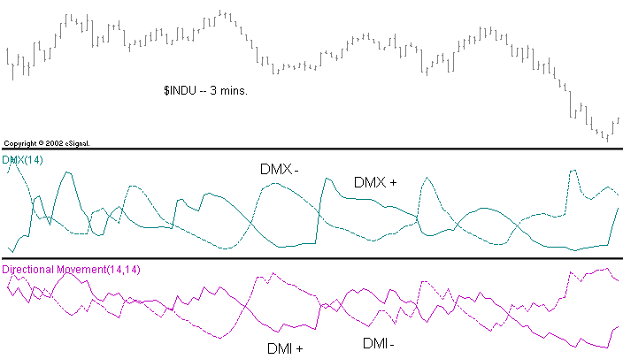

As there is no need to smooth DMX, both DMI and ADX are now obsolete.

### VEL (Signal Velocity)

> Ultra-smooth, accurate measurement of trend direction and speed (velocity).

Try using momentum indicators to estimate market direction, speed and reversals. Momentum's jagged plots lines make this analysis very difficult, delaying critical decisions until the picture is more certain, and money that was once "on the table" is now gone.

Also, the rapid crisscrossing of noisy indicators can trigger excessive trade signals. Unfortunately, attempts to mitigate this problem by smoothing the signal will make the signal slower, further delaying analysis and your trades.

VEL is Jurik's answer to this dilemma. VEL displays market velocity and direction with super-smooth curves, and it's just as timely as the original momentum signal. The chart shows VEL's incredible performance improvement.

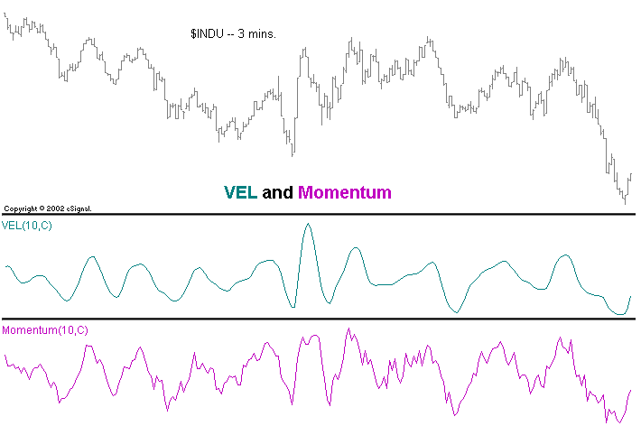

### JMA (Jurik Moving Average)

> Superior noise reduction lets you see underlying market activity.

Ever want to see what the market is "really" doing, behind all that noise? Tired of moving averages that are too slow?

Using ultra-smooth, low-lag, gap-smart technology, JMA strips away market noise and opens up new vistas of opportunity previously unattained by moving averages.

This is a moving average unlike any you've seen. Smooth and surprisingly agile. With significantly less lag than other moving averages, JMA's earlier, cleaner signals mean fewer late trades.

The chart compares JMA with a standard simple moving average (SMA).

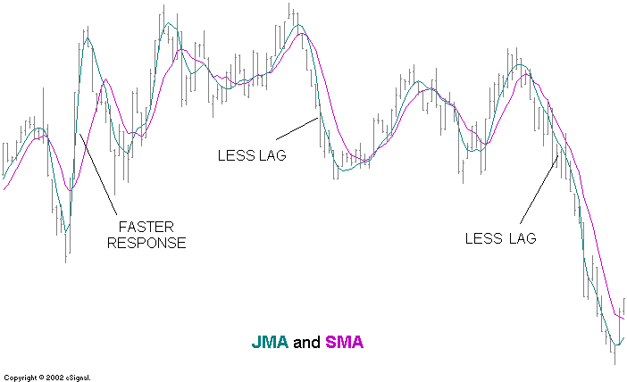

### RSX (Trend Strength Index)

> Replace RSI with Jurik's RSX: it's ultra smooth and accurate.

While the standard momentum indicator measures a trend's speed, analysts use Wilder's RSI to estimate a trend's quality. As a trend nears its end, price action becomes more random and quality drops, suggesting an impending reversal.

But the RSI can be very noisy, obscuring accurate estimates. This delays analysis until the picture is more certain. Meanwhile, good trading opportunities are missed and money is "left on the table".

Unfortunately, attempts to mitigate these problems by smoothing RSI also make the signal slower, further delaying analysis and trades.

Jurik's RSX solves this problem with a crystal clear picture of both direction and quality of market trends. The chart shows this amazing difference.

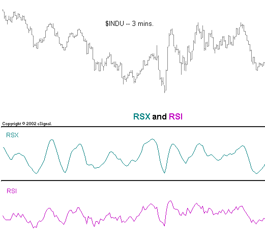

### CFB (Composite Fractal Behavior)

> CFB measures the duration and stability of a price trend.

Trend duration can be a useful measure for estimating the likelihood of a price reversal. One might also note that certain price patterns are likely to occur after a long trend.

Jurik Research has devised a way to measure trend duration by taking a composite index of various "trend fractals". The longer the trend, the more these fractals add up to a bigger value.

As a trend steadily grows, in either direction, the CFB index value increases. When a trend either stops or becomes unsteady, the CFB index value decreases. Trend followers like it as an "Early Warning" signal, letting you know when a trend is breaking up.


### For the Advanced Analyst

The ability to forecast price action and market dynamics may provide you with an important edge. However, building such models is no easy task. One common mistake is to feed a model too many indicator values. To avoid this problem, the user may spend months analyzing and removing irrelevant and redundant indicators.

Although there are several excellent software products that build models using artificial intelligence, all models can suffer from this form of "indicator overload". It is one of the reasons forecast models fail to meet expectations.

Assume your forecast model requires the last 60 historical values from each of 11 indicators. For each forecast, this model needs to input 660 indicator values. This huge size poses practical problems: Approximately 5,000 data records would be required to build a reliable linear regression model, and about 150,000 records for a reliable neural net! A model built on daily prices would require market data extending back to the days of Shakespeare!

Jurik Research has two very powerful tools for compressing market data into a significantly smaller collection of numbers, thereby eliminating "indicator overload".

**WAV (Waveform Compression):** WAV looks at the historical data stream of each indicator and compresses the information so that fewer numbers are needed. In this example, WAV would convert a window of 60 historical values into a window of only 13. With 11 such indicators, WAV has reduced the total number of inputs to the model from the original 660 (11x60) to only 143 (11x13).

**DDR (Decorrelation & Dimension Reduction):** Still, 143 inputs are too many. DDR attacks this problem by converting time series data from a large number of indicators into that of a smaller set of new indicators. In this example, DDR might transform the original 11 indicators into 4 new indicators.

With only 4 indicators and just 13 values from each, the new total input size for the forecast model is 52. Considering the original input size was 660, we can say WAV and DDR reduced the input load by 92%.

---

## JMA

### Theoretical Advantages

Market price charts can be noisy! To produce smoother curves, market technicians typically use moving averages, which can be very slow. See what the market is "really" doing with the world-renowned JMA. Only JMA excels in all four benchmarks of a truly great filter...

#### Benchmark #1: Accuracy

Moving Average (MA) filters have an adjustable parameter that controls their speed. Speed governs two opposing properties of a filter: smoothness (lack of random zig-zagging) and accuracy (closeness to the original data). That is, the smoother a filter becomes, the less it accurately resembles the original time series. This makes sense, as we do not want to accurately track zigzagging noise within our data.

Financial investors try to apply just enough smoothness to filter out noise without removing important structure in price activity. For example, in the chart below, the popular Triple Exponential Moving Average (TEMA) is just as smooth as JMA yet TEMA failed to track some rapid price movement. On the other hand, JMA follows the action very well.

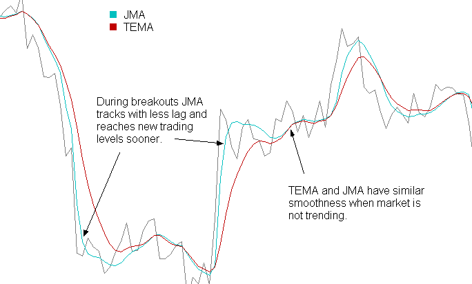

#### Benchmark #2: Timeliness

Most MA filters have another problem: they lag behind the original time series. This is a critical issue because excessive delay and late trades may reduce profits significantly. Ideally, you would like a filtered signal to be both smooth and lag free. For all moving average filters, including the three classics (simple, weighted, and exponential), greater smoothness produces greater lag. Even the more advanced TEMA moving average lags well behind JMA.

Adaptive filters developed by others, such as the Kaufman and Chande AMA, will also lag well behind your time series. Kaufman's Moving Average (KMA), is an exponential moving average whose speed is governed by the "efficiency" of price movement. For example, fast moving price with little retracement (a strong trend) is considered very efficient and the KMA will automatically speed up to prevent excessive lag. This interesting concept sometimes works well, sometimes not. As is shown in the chart above, JMA can track fast movement with ease.

The advantage in avoiding lag is readily apparent in the chart to the right. Here we see how JMA enhances the timing of a simple crossover oscillator. The top half of the chart shows crude oil closing prices tracked by two JMA filters of different speed. The bottom half uses two EMA (exponential moving average) filters.

The oscillator becomes positive when the curve of the faster filter crosses over the slower one. This occurrence suggests a "buy" signal.

Note that JMA's crossovers are 15 and 18 days earlier! Can you afford to be 15 days late?

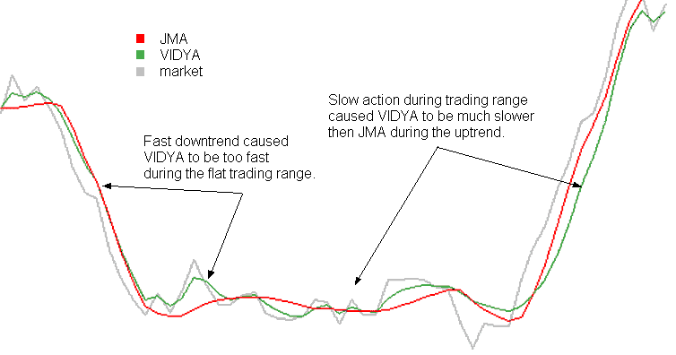

Some moving averages dynamically self-adjust their smoothness in order to minimize lag. For example, Chande's VIDYA (circa 1992) is an exponential moving average whose speed is governed by the ratio between the variance of recent price movement and variance over the long term. Fast moving price (such as a breakout) has large variance and is supposed to cause VIDYA to automatically speed up (in an attempt to prevent excessive lag). This concept sometimes works well, sometimes not.

In the chart below, both JMA and VIDYA perform approximately the same for the first 1/5 of the series, but due to the high volatility during the steep downward trend, VIDYA becomes hyperactive and fast tracks choppy waves during the congestion phase of this time series. However, an ideal filter should smoothly sail through choppy price action in order to avoid triggering trades. Note how JMA cuts right through with a much smoother line. Later on, when it becomes clear the market is trending upward, VIDYA lags behind JMA because the quiet market during the trading range made VIDYA too slow. In contrast, JMA has significantly less lag.

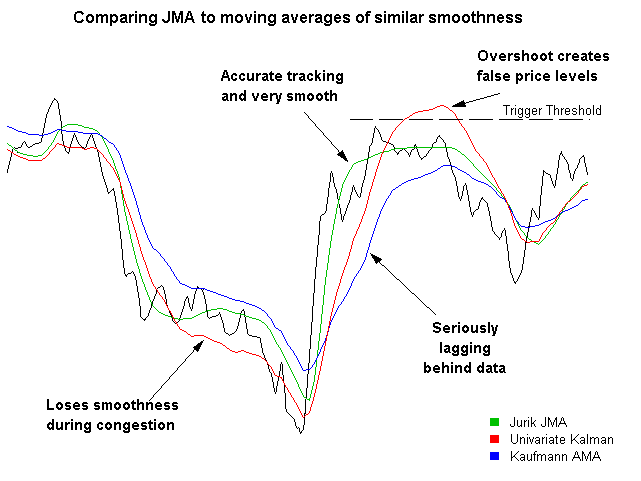

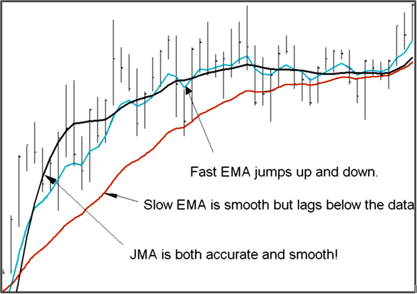

#### Benchmark #3: Overshoot

Because there is an inherent amount of noise in price action, many trading strategies trigger a trade when a moving average crosses a threshold level. Moving average lines have less noise and are less likely to produce false alarms. Unfortunately, common moving averages lag too much and many sophisticated designs, like DEMA, Kalman and Butterworth filters, tend to overshoot during price reversals. Overshoots create false impressions of prices having reached levels they never truly did. The chart below compares JMA with Kalman and Kaufmann adaptive moving averages.

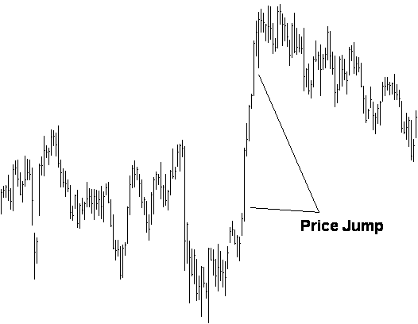

#### Benchmark #4: Smoothness

The most important property of a noise reduction filter is how well it removes noise, as measured by its smoothness.

In the chart to the right, EMA and JMA filters are run across closing prices. Note how much the fast EMA alternates upward and downward while JMA glides smoothly through the data. JMA reveals the noise-free underlying price more accurately.

If you try reducing EMA's erratic hopping by making it slower, you will discover its lag will become larger, producing late signals.

This is the best of both worlds. JMA resolves the riddle of how to get both smoothness and accuracy simultaneously.

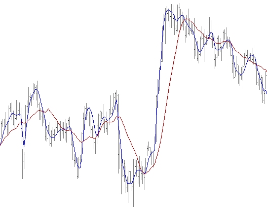

#### A Very Technical Memo (for geeks only)

Denoising nonstationary time series for real-time application (e.g. financial data streams) requires filtration by *causal* filters, because in such applications, future data at any point in time is not available. In contrast, wavelet filtering of a block of data is *non-causal*, and dominant cycle analysis methods depend on the presence of real cycles, which may not exist. JMA, the Jurik Moving Average is a causal, nonlinear, adaptive filter ideally suited for real-time cleaning of nonstationary time-series data. JMA's superior noise elimination is based on information filtering, not frequency filtering. JMA can clean noise off a square wave without destroying the square wave itself. It has no overshoot or undershoot and displays very little latency (lag).

---

### Sample Applications

#### Noise-free Tracking of The Market

Standard moving averages are too slow in adjusting to sudden price gaps, sometimes taking 10-20 bars before you can safely resume your technical analysis. In contrast, JMA recognizes gaps and jumps to new price levels in just a few bars, getting you back in action fast.

The best way to see how JMA works is to draw comparisons with other moving averages and note JMA's exceptional tracking capability. To begin, find price data that has at least one large price gap or level change. An example of a price jump is shown below.

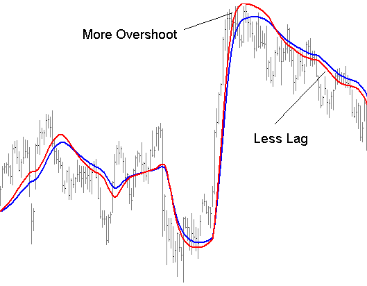

On the closing prices in your chart, plot a simple moving average (SMA) of length 16, an exponential moving average (EMA) of length 16, and the Jurik moving average (JMA) with length 7 and phase 50. For clarity, the chart below shows only SMA and JMA.

We define smoothness as the lack of bar-to-bar jitter in a moving average. JMA is so smooth that you can afford to make its length as small as 7 and still have less bar-to-bar jitter than the other two moving averages. Consequently, this faster speed gives JMA superior tracking capability, especially during large sudden price jumps. This suggests a unique application for JMA: generating a price proxy. That is, using JMA as a low noise replacement (proxy) for market prices. How this vastly improves certain technical analysis methods is discussed in detail in later sections.

#### JMA Parameter Settings

JMA's **LENGTH** parameter determines the degree of smoothness, and it can be any positive value. Small values make the moving average respond rapidly to price change, and larger values produce smoother, slower moving curves. Typical values for LENGTH range from 3 to 80. You can even use decimal numbers, such as 27.3.

JMA's **PHASE** parameter governs a classic trade-off in filter design, whereby the user can control the balance between two opposing behavioral features of JMA: lag and overshoot.

**LAG** is the amount by which any moving average trails behind a time series that is either trending upward or downward. When using JMA to track price action, less lag yields better results.

**OVERSHOOT** is the amount by which any moving average continues to move in the same direction despite the actual time series having already reversed direction. The more a filter overshoots, the more time it will require to reverse direction and catch up to the time series being tracked. Consequently, when using JMA to track price action, less overshoot is better.

Unfortunately, no moving average filter can deliver both minimum lag and minimum overshoot at the same time. When lag is reduced, overshoot is increased, and vice versa. To see how this tradeoff plays out with JMA, plot two JMA lines, one with phase set to +100 and one with phase set to -100, the maximum and minimum range. The demonstration chart below has these settings: Length=30, Phase=+100 and Length=30, Phase=-100.

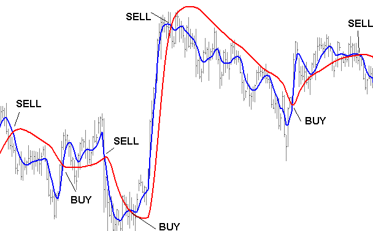

Note how the red line (phase = +100) has less lag than the blue line (phase = -100). It is also more likely to overshoot during large price jumps. If overshoot is not an issue, then consider using positive values of PHASE. If price overshoot is a real concern in your trading system, then consider using negative values of PHASE. If you really don't care one way or the other, then leave PHASE at its default value of 0.

PHASE plays an important role when trading strategies employ moving average crossovers. Since such crossovers are the essence of MACD indicators, the effect of phase on MACD indicator design is examined below.

#### Trending Markets

John Murphy, in his book, *Technical Analysis of the Futures Markets*, discusses the MACD indicator (by Gerald Appel). Typically, the classic MACD is simply the difference between the lines of two exponential moving average filters with different length settings. Over time, the EMA lines are either converging (coming together) or diverging. Thus its name: MACD = "Moving Average Convergence Divergence".

With the MACD, a typical buy signal occurs when a faster moving average line crosses above a slower one and a sell signal occurs when the crossover is in the opposite direction.

Standard MACD indicators are great during trending price activity, riding the wave, so to speak. However, they are disastrous during choppy sideways activity, creating excessive, unprofitable trades.

This phenomenon occurs because moving averages lag behind the price signal and this lag causes a delay in trading signals. During rapid price oscillations, this delay could be long enough to cause a sell trade to occur when the downward moving price has already hit bottom of a cycle or a buy trade to occur when the price has already reached the top of its cycle. Either way, the trader would experience a loss using classical MACD.

This chart below shows how using JMA in a MACD system can improve the odds. JMA succeeds because you can use significantly faster speeds, thereby decreasing lag, and still maintain required smoothness for clear, unambiguous crossover signals.

On our demonstration chart below, there are two indicators:

| Setting | Description |
|---------|-------------|
| length=40, phase=0 | slow line, medium overshoot (red) |
| length=7, phase=-100 | fast line, absolutely no overshoot (blue) |

The strategy illustrated below is to buy when the fast line crosses above the slow line and to sell when the fast line crosses below the slow one.

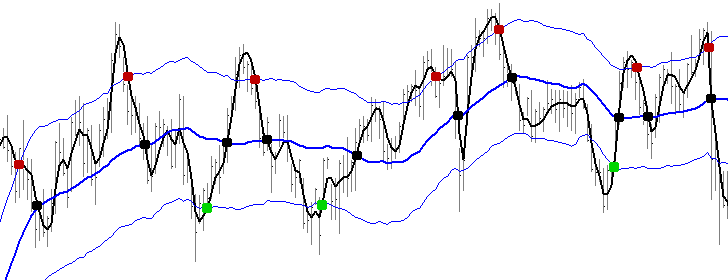

> *This strategy is only for demonstration purposes. The exact parameters used for this JMA demonstration may not work as well on other markets, or even other time frames. Do not trade real money using this system; it does not have all the necessary safety features for limiting exposure to risk. You should thoroughly test any trading strategy.*

#### Reversal Markets

The classic crossover strategy does not work well in markets that, instead of trending, tend to frequently reverse within a trading range. The inevitable lag between the actual time the market has reversed direction and when a trade is signaled by the crossover can be so large that by the time a trade is realized, the favorable trend is already over and the market is about to go against your position. In this environment, a more appropriate trading strategy is suggested.

The idea is to create a "channel" based on approximations of support and resistance. When the market breaks out of the channel, and fails to maintain momentum, odds are price will fall back toward the center of the channel. This tendency can be exploited in the following manner:

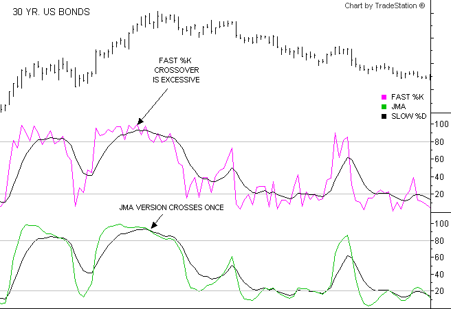

In the chart above, the blue lines are part of a Keltner Band (similar to a Bollinger Band). The middle blue line is a slow running JMA of the closing prices, with Length = 30 and phase = 0. The upper blue band is constructed by adding 1.5 times the 30-bar ATR (average true range[^1]) to the blue JMA line and the lower blue band by deducting the same amount. The black curve running through the data is a fast running JMA with length = 5 and phase = 100.

The red dots indicate when the market is retracting from a failed upward breakout, and the green dots mark when price is retracting from a failed downward breakout. These are places where one might want to enter the trade. The black dots indicate where price crosses the center of the channel, a reasonable place to exit the trade.

This method fails whenever price retraces slightly back into the channel, but reverses again and continues on its original trend. To prevent loss whenever a real trend occurs, it is best to add rules for exiting the market when this situation occurs. A simple approach might be to exit the market whenever JMA exits the Keltner channel in the direction contrary to the trade.

> *This strategy is only for demonstration purposes. The exact parameters used for this JMA demonstration may not work as well on other markets, or even other time frames. Do not trade real money using this system; it does not have all the necessary safety features for limiting exposure to risk. You should thoroughly test any trading strategy.*

[^1]: True Range is the maximum of three possible values: the current bar's high minus the low, the current high minus the prior bar's close, or the prior bar's close minus the current bar's low.

#### De-noising Classic Indicators

There may be occasions when you really like the behavior of a particular indicator, but you want to remove some of its noisy (jagged) motion. You discover that common filtering distorts the indicator's shape or adds unacceptable lag, thereby delaying decision-making.

JMA is ideal for "cleaning up" common technical indicators. The chart below illustrates the difficulty determining when Fast %K (magenta line) truly crosses over Slow %D. In contrast, JMA (green line) makes crossover determination very easy. The green line was produced by running Fast %K not on the closing price, but on the JMA of closing price.

Parameter settings for this chart:

| Parameter | Value |
|-----------|-------|
| Fast %K | length = 14 |
| JMA | length = 6, phase = 100 |
| Slow %D | length = 20 |

> *This strategy is only for demonstration purposes. The exact parameters used for this JMA demonstration may not work as well on other markets, or even other time frames. Do not trade real money using this system; it does not have all the necessary safety features for limiting exposure to risk. You should thoroughly test any trading strategy.*

#### Feeding the Price Proxy to RSX

> *This page is relevant only to those users whose charting platforms allow them to take the results of JMA and feed those results to RSX. If your charting platform does not support this feature, please skip this page.*

Additional power can be attained by combining Jurik tools. One way is to run various indicators independently of each other and construct trading rules based on their mutual agreement or confirmation. Another approach is to feed the results of one Jurik tool into another, thereby producing an even more powerful indicator. This section describes the latter technique.

We will be combining JMA with RSX. To run the demonstrations described herein, you will need to have both JMA and RSX installed and available on your charting platform.

As shown earlier, price data can be smoothed by applying JMA. We now want to illustrate the power in applying RSX to this price proxy, rather than to the original price data. This form of data preprocessing transforms the nature of RSX.

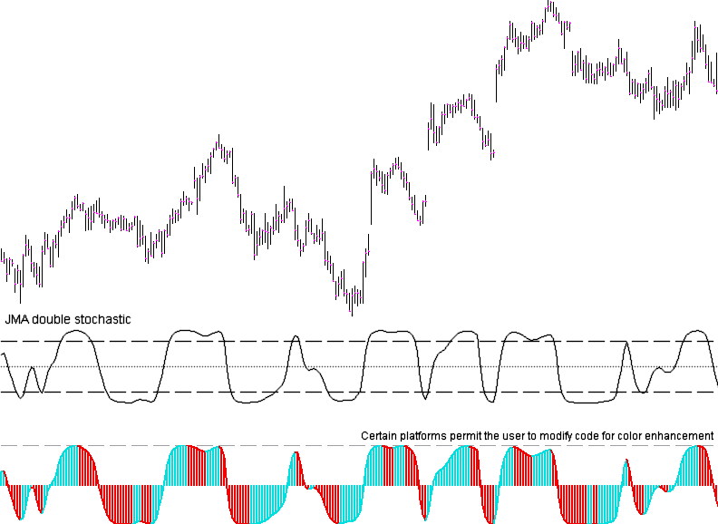

The chart shows price bars and four plots by RSX. The four plots differ in the amount of pre-smoothing by JMA. As pre-smoothness increases, unwanted oscillations in RSX disappear. This creates a "cleaner" signal, resulting in fewer false triggers. The tradeoff, however, is that greater JMA smoothness adds more lag, requiring the user to strike a balance between reducing crossovers and reducing lag.

The four chart plots A, B, C, D, were created by first running JMA over closing prices and then feeding the results to RSX with length=14. JMA lengths settings for the four plots were 1, 10, 30 and 60.

#### JMA Smoothed Double Stochastic

The double stochastic (D-stoch) is very handy for detecting small reversals. One problem with the standard implementation of D-stoch is that it is very noisy. An improved version of the D-stoch can be attained by smoothing the data stream with JMA in the following manner:

```
Price data ► Fast %K ► JMA ► Fast %K ► JMA ► chart
```

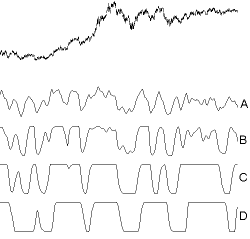

The result is very impressive. This cleaner signal will likely result in much fewer false triggers. The tradeoff, however, with any moving average, is that greater smoothness adds more lag, requiring the user to strike a balance between crossovers and lag. But with JMA, the lag produced is extremely small, so the tradeoff is moot.

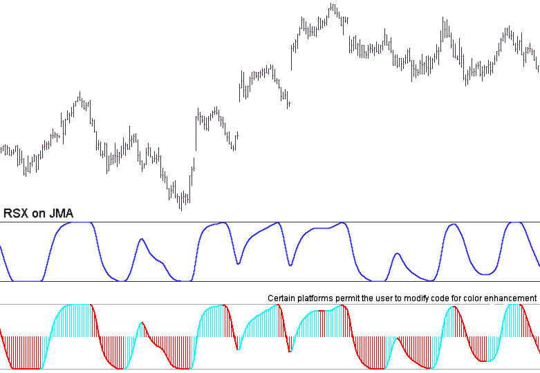

---

## RSX

### Theoretical Advantages

> Ultra smooth, accurate, low lag indicator of trend direction and purity.

Analysts use Wilder's RSI to estimate the direction, purity and turning points of market trends. These estimates are severely crippled by the jagged nature of their chart lines. By rapidly crisscrossing threshold levels, a noisy RSI can trigger excessive trade signals. In addition, the jagged lines obscure the true story, consequently delaying analysis until the picture is more certain. Meanwhile, good trading opportunities are missed. Unfortunately, attempts to mitigate these problems by smoothing RSI also make the signal slower, further delaying analysis and trades. ... You can do better!

Imagine that you could remove all the noise from RSI without either distorting the true signal or adding lag. With Jurik Research's RSX you can now have a crystal clear picture of both direction and strength of market trends. Its accurate and smooth performance removes noisy crisscrossing, and its low-lag agility opens up new opportunities for analysis. For example, the speed and direction measurements of RSX are smooth and accurate. Not so with RSI.

The best way to illustrate the power of RSX is quite simple: compare it with the RSI. In the chart below, we see daily bars of U.S. Bonds analyzed by RSX and the classical RSI. RSX is very smooth. Typically any indicator can be smoothed by a moving average, but the penalty is added lag to the resulting signal. Not only is RSX smoother than RSI, but its smoothness comes without added lag. RSX permits more accurate analysis, helping you to avoid many trades that would have been prematurely trigged by the jagged RSI. Once you begin using RSX, you'll probably never apply the standard RSI again!

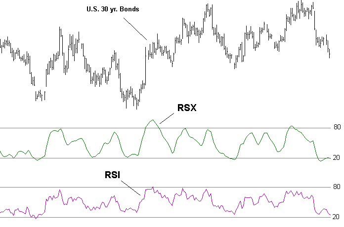

---

### Sample Applications

#### Length Parameter

RSX has one performance adjusting parameter: **LENGTH**. Adjusting LENGTH varies the smoothness of RSX. Small values make RSX respond rapidly to price change and larger values produce smoother, flatter curves. Typical values for LENGTH range from 8 to 40.

#### RSX Threshold

Trading signals can also be generated when RSX crosses a threshold line (a constant). That is, BUY LONG when RSX crosses above the threshold line and SELL SHORT when RSX crosses below. Such a strategy would have 2 adjustable parameters: RSX length and the value of the threshold line.

The chart below shows the type of trade signals produced by this method. The parameters were:

| Parameter | Value |
|-----------|-------|
| RSX series | closing prices |
| RSX length | 17 |
| threshold | 43 (note -- RSX range is from -100 to +100) |

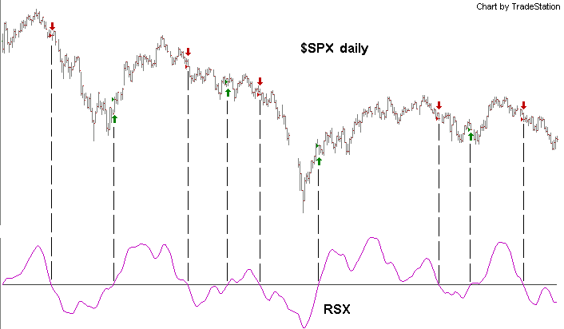

> *This strategy is only for demonstration purposes. The exact parameters used for this JMA demonstration may not work as well on other markets, or even other time frames. Do not trade real money using this system; it does not have all the necessary safety features for limiting exposure to risk. You should thoroughly test any trading strategy.*

#### RSX Momentum

RSX measures two aspects of market trend simultaneously: momentum and purity. Trend momentum is the speed with which price is moving, and trend purity is concerned with the relative proportion of bars that are actually moving in the direction of trend. A fast moving upward trend with 90% of the last 20 bars moving in the same direction will produce a strong RSX value (a value close to either 0 or 100). Congested price movement will have about half of the price bars moving up and half moving down. In that case, RSX will produce a neutral value of 50 out of 100 (just as the classical RSI would).

Trend momentum and purity are important aspects to consider when timing trade entries and exits. Because RSX is so smooth, you can create new indicators based on the slope (speed of change) of RSX. Many simple trading strategies can be built around the values of RSX and its slope. The following demonstration trading system is based on the following key rules: Buy when RSX is rising, sell when RSX is falling.

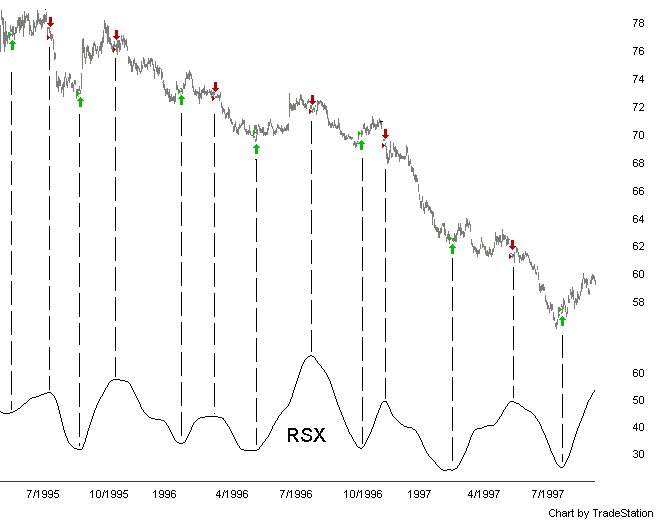

> *This strategy is only for demonstration purposes. The exact parameters used for this JMA demonstration may not work as well on other markets, or even other time frames. Do not trade real money using this system; it does not have all the necessary safety features for limiting exposure to risk. You should thoroughly test any trading strategy.*

#### Double RSX

> *This page is relevant only to those users whose charting platforms allow them to take the results of RSX and feed those results to another RSX. If your charting platform does not support this feature, please skip this page.*

One of the most challenging times to trade the market is during congestion, when price action is "stuck" within a small trading range. The up/down wave action reverses direction too quickly for trend-based indicators to react. The resulting lag places these indicators almost completely out of phase with true market direction. Trades based on these indicators during market congestion almost always lose.

RSX offers a simple solution to this problem: take the result of RSX and run it through RSX again, as shown here:

```
Market Data ► RSX #1 ► RSX #2 ► Chart
```

We call this "Double RSX". The chart shows this new indicator perfectly in phase with price reversals during market congestion.

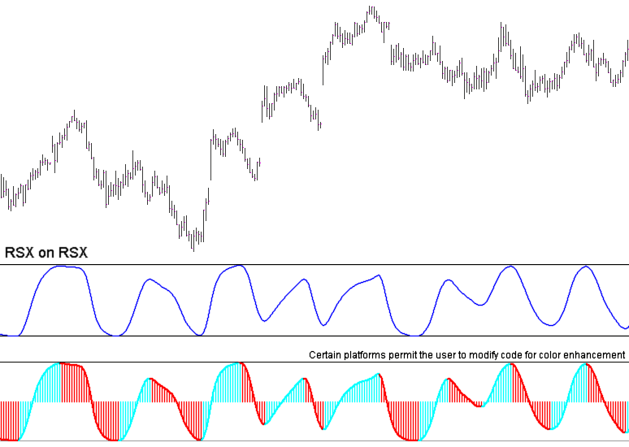

For both RSX, parameter length = 16.

---

## CFB

### Theoretical Advantages

> CFB is an index that reveals the market's trending time frame, ideal for creating adaptive window sizes of various technical indicators.

**Trend Duration:** All around you mechanisms adjust themselves to their environment. From simple thermostats that react to air temperature to computer chips in modern cars and trucks that respond to changes in engine temperature, rpm, torque, and throttle position. It was only a matter of time before fast desktop computers applied the mathematics of self-adjustment to systems that trade the financial markets.

Unlike basic systems with fixed formulas, an adaptive system adjusts its own behavior. For example, start with a basic channel breakout system that uses the highest closing price of the last N bars as a threshold for detecting breakouts on the up side. An adaptive and improved version of this system would adjust N according to market conditions, such as momentum, price volatility, acceleration or trend duration.

Author Murray Ruggiero noted the utility of adaptive indicators in the January '96 issue of Futures Magazine. He demonstrated a channel breakout system, whose lookback N was automatically adjusted. The trading strategy was applied to 15 years of a futures currency, and compared to a similar system that had a fixed optimal value of N. The adaptive version took in 20% more profit!

**CFB Overview:** CFB is composed of fractal filters of varying sizes. Each fractal looks for trends about the same size as itself. The value CFB produces at any point in time represents the current composite size of the strongest trending fractals in the market. The longer the market has been trending, the larger the CFB index value.

If you are considering using trend duration as the value for controlling adaptation, CFB may be for you. Unlike other indicators on the market that claim to find a dominant cycle length, CFB uses an algorithm that does not assume the presence of repeating short-term market cycles.

CFB measures trend duration by applying trend detecting fractal patterns of various sizes, and combining the results into a single value: a Composite Fractal Behavior (CFB) index. This index is especially sensitive to trend instability, in order to quickly reset itself to measure the duration of a new trend.

The chart shows long trending activity yields a large CFB index, and short choppy action yields a small index.

---

### Sample Applications

#### CFB as an Early Warning Signal

One might notice that in some markets, certain price patterns are more or less likely to occur after a long trend. Therefore, trend duration may be a useful measure for estimating the likelihood of a price reversal.

CFB looks for clean trends, so if the trend quality is smooth, the fractals register strongly. As a trend steadily grows, in either direction, the CFB index value increases. If the trend either stops or becomes jagged or excessively volatile, the fractals degrade and the CFB index immediately begins to decline. Trend followers like it as an "Early Warning" signal, letting you know when a trend is breaking up.

CFB has some resemblance to the commonly used technical indicator ADX. However, it is superior to ADX in its ability to assess strengthening and weakening trends.

The chart below shows two locations along CFB where rapid decline in value correlated with the ending of an upward and then downward trend. This does not imply the trend will always end, nor does it imply one must exit current trade that's riding the trend. It does suggest you would be wise to perform additional analysis, looking for confirmation.

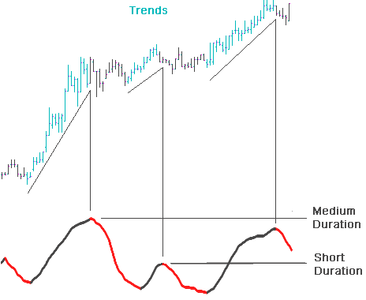

#### Using CFB to Modulate Momentum Analysis

This section on CFB discusses how to use CFB results to alter, on a bar-by-bar basis, the LENGTH parameter of VEL, Jurik's velocity indicator. This produces a momentum analysis of market prices, with a dynamically self-adjusting filter speed.

> *This section is intended for advanced users who write their own code, or whose charting platform allows them to code their own indicators. The charting platform must allow you to take the results of CFB and perform additional calculations to attain a new LENGTH value for VEL, at each point in the time series.*

Not all versions of VEL can accept a different value for its length parameter at each data point in the price time series. The versions that can do this are:

| Version | Platform |
|---------|----------|
| VELRT | for generic coding using our basic DLL |
| JRC.VEL2.flex, JRC_vel2_scalar | for TradeStation EasyLanguage |
| VEL_update | for Microsoft Excel's Visual Basic |

The purpose of this technique is to specify how much short term market movement we want to ignore by adjusting VEL's length parameter appropriately. CFB makes it possible to automate these adjustments in a manner that makes VEL slower during large (long) up/down trends, and faster during small (short) up/down trends.

The first step is to translate CFB's measure into an oscillator, something like a Fast %K stochastic, whose value slides from a minimum possible value of 0% (when CFB is at its lowest value) to a maximum possible value of 100% (when CFB is at its largest value). This oscillator value is then used to slide VEL's length value between user-specified upper and lower bounds. Finally, VEL is called on each bar with the calculated length parameter value.

The programming pseudo-code:

```
{ Lo_Limit is the lowest value of VEL you want used }
{ Hi_Limit is the highest value of VEL you want used }

USER INPUTS:         PriceTimeSeries.array(1...N),
                     Lo_Limit,
                     Hi_Limit

{ initialize variables }

CFB_max = 0
CFB_min = 99999          { 99999 is a very large arbitrary value }

{ run CFB through entire data array, creating another array }

CFB_result.array = CFB(PriceTimeSeries.array , smoothness=1, fractalsize=24 )

{ loop through N data points of CFB output array}

For k = 1 to N

    CFB_value = CFB_result.array(k)

    { evaluate stochastic ratio of CFB value }

    if CFB_value > CFB_max then CFB_max = CFB_value
    else if CFB_value < CFB_min then CFB_min = CFB_value

    denominator = CFB_max - CFB_min
    if denominator > 0
           then stoch_ratio = (CFB_result - CFB_min ) / denominator
           else stoch_ratio = 0.5

    { calc VEL length parameter and evaluate VEL }

    VEL_length = ceiling( lo_Limit + stoch_ratio * (hi_Limit - lo_Limit) )
    VEL_result.array(k) = VEL( PriceTimeSeries.array(k), VEL_length )
    end
```

The first plot shows daily bars of NYSE:IBM. Plot 2 is the modulated VEL produced by the algorithm provided above, using Lo_Limit = 8 and Hi_Limit = 24. The next plot shows the standard VEL with length = 24, and the last plot shows the standard VEL with length = 8, referred to as VEL-24 and VEL-8 respectively. For all three VEL plots, the price time series was HIGH+LOW.

The improvements our modulated VEL has over standard VEL can be seen at several locations on this chart:

- At time location #1, market price is rising and modulated VEL resembles VEL-24, both rising smoothly. In contrast, VEL-8 is very choppy and gets too close to the zero line; a behavior we would rather not have during a nice trend.
- At time location #2, price has reversed and is starting to rise, yet VEL-24 is not responding well and has not crossed the zero line. However, our modulated VEL did because the upward price reversal caused CFB to decrease in value, in turn making mod VEL speed up and behave more like VEL-8.
- At time slot #3, price has again reversed. Subsequently, mod VEL speeds up and crosses the zero line well before VEL-24. This occurs yet again at time location #4.

Mod VEL has the best of both worlds: smooth movement during trends and fast responses during market turn-around.

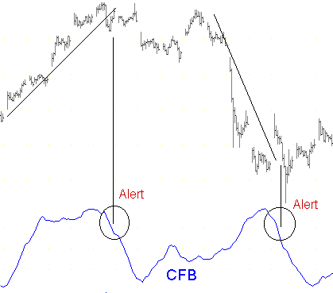

---

## DMX

### Theoretical Advantages

> DMX is the ultra-smooth, low-lag replacement for your classic DMI and ADX indicators.

The standard ADX is a slow and smooth version of the more basic, and noisier, DMI indicator. DMI is composed of two, non-negative, and very jittery components, DMI+ (or DMI⁺), and DMI- (or DMI⁻), combined the following way:

```
DMI  =  | DMI⁺ - DMI⁻ |
         ───────────────
          DMI⁺ + DMI⁻
```

Let's create a new signal, called "Bipolar DMI", and let it be the same as the classic DMI formula above, except that the absolute value in the numerator is not applied. This lets the bipolar DMI be both positive (during upward trends) and negative (during downward trends). The new formula is:

```
Bipolar DMI  =  DMI⁺ - DMI⁻
                ─────────────
                DMI⁺ + DMI⁻
```

The classic indicator DMI (Direction Movement Index) is so jagged (noisy) that its smoother version, ADX, is almost always used instead. Unfortunately, the smoothing process uses either a simple moving average or exponential average. Either way, the moving average adds unwanted lag to the signal, which, in turn, delays analysis and induces late trades. Jurik Research's DMX is a superior version of DMI. DMX replaces the classic moving average with JMA, producing ultra-smooth, timely and very responsive performance to fast market moves. Additionally, since there is no need to smooth DMX, both DMI and ADX are now obsolete.

The following chart shows bipolar DMI to be very noisy (jagged). However, smoothing this line, thereby producing the classic indicator ADX, would add unwanted lag to the signal. Compare DMI to DMX. DMX offers a clean, smooth picture, allowing you to detect true market direction faster, and with greater accuracy. With DMX, there is no need to use ADX either... because DMX is already ultra-smooth!

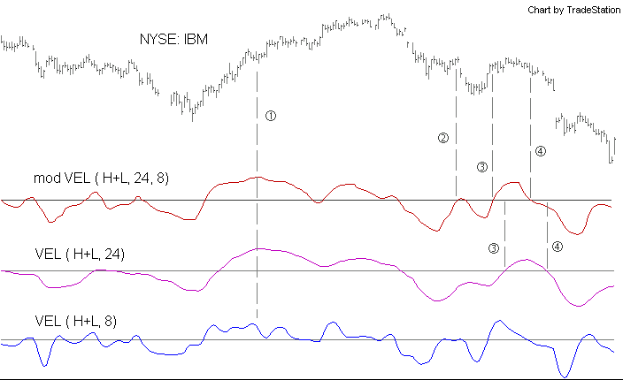

---

### Sample Applications

#### Zero-crossing

There are several ways to use DMX. The first example shows trading signals produced when DMX crosses the zero line. The rule used here is to buy when DMX crosses above the zero line and to sell when DMX crosses below. DMX length parameter = 14.

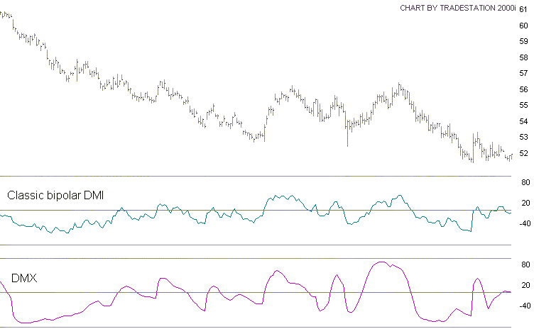

> *This strategy is only for demonstration purposes. The exact parameters used for this JMA demonstration may not work as well on other markets, or even other time frames. Do not trade real money using this system; it does not have all the necessary safety features for limiting exposure to risk. You should thoroughly test any trading strategy.*

#### Slope Reversal

This example shows trading signals generated when DMX reverses direction. To prevent unnecessary reversals, the DMX length parameter is increased to 32. This momentum technique would be virtually impossible using classic DMI, because the jagged lines produced by DMI with a shorter length would increase whipsaws, and a DMI with a longer length would lag considerably.

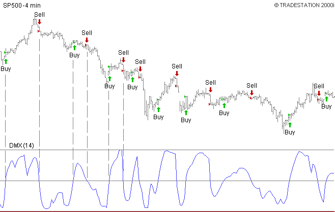

> *This strategy is only for demonstration purposes. The exact parameters used for this JMA demonstration may not work as well on other markets, or even other time frames. Do not trade real money using this system; it does not have all the necessary safety features for limiting exposure to risk. You should thoroughly test any trading strategy.*

---

## VEL

### Theoretical Advantages

> Lag-free smoothing of the standard momentum indicator!

The standard momentum indicator (i.e. today's price minus that of N bars ago) is a simple indication of market direction. As N increases, short-term activity is ignored and longer-term momentum is considered. However, a larger value of N also increases the indicator's inherent delay of N/2 bars. This can delay trades by a few critical bars, making them too late to be profitable.

What's needed is an indicator that is much smoother than standard momentum, yet completely avoids the lag penalty that comes with standard smoothing functions.

This is illustrated in the chart below. The top plot shows daily price bars. The second graph (line A) is the ordinary 7-day momentum oscillator. N=7 is fast enough to capture the cyclic motion and not too fast to be useless from excessive jitter. This is to be avoided as noisy indicators create many false triggers.

The typical method for reducing jitter is to run a moving average over the time series. The chart shows raw momentum (plot "A") and what happens when it is smoothed by a moving average filter (plot "B"). Note plot B crosses the zero-line fewer times than plot A.

This improvement comes with a penalty. The tops and bottoms of plot B lag behind those of plot A by three bars, on average. There is also a corresponding lag at all locations where plot B crosses the zero-threshold line. As you may have already experienced in your trading, being 3 bars late can make all the difference.

Line C was produced by our momentum oscillator, called "VEL" (velocity). This powerful indicator has smoother lines than standard momentum and no additional lag. The tops, bottoms and zero-crossings of plot C all coincide with those of plot A. It's like running standard momentum through a zero-lag smoothing filter!

**Jurik's VEL is not only smoother; it is more accurate and has less lag.**

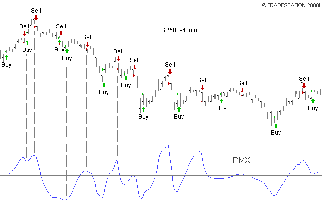

---

### Sample Applications

#### VEL Parameters

VEL's single adjustable parameter, **DEPTH**, determines the total number of bars back you want VEL to consider when making a calculation for the current bar. Typical values of DEPTH range from 5 to 30. Depth must be an integer (whole number).

VEL is similar to RSX, in the sense that both include market price momentum in their algorithm. Unlike RSX, VEL is not bound within a fixed range of 0 to 100, and that opens up opportunities for different applications.

#### Using VEL's Momentum

The first demonstration of VEL is similar to RSX, whereby the indicator's momentum is used to signal trading positions. The chart below shows the SP500, in 6-minute bars. The parameters for VEL were:

| Parameter | Value |
|-----------|-------|
| Time Series | High-Low |
| LENGTH | 17 |

The trading strategy was to BUY if VEL was rising and to SELL if VEL was falling.

> *This strategy is only for demonstration purposes. The exact parameters used for this JMA demonstration may not work as well on other markets, or even other time frames. Do not trade real money using this system; it does not have all the necessary safety features for limiting exposure to risk. You should thoroughly test any trading strategy.*

Here's another example of using VEL's momentum. For this chart, VEL's length parameter = 27. The trading strategy was to BUY if VEL was rising and SELL if VEL was falling.

> *This strategy is only for demonstration purposes. The exact parameters used for this JMA demonstration may not work as well on other markets, or even other time frames. Do not trade real money using this system; it does not have all the necessary safety features for limiting exposure to risk. You should thoroughly test any trading strategy.*

#### Waveform Divergence

VEL's smoothness and accuracy lends itself to a very powerful form of divergence analysis.

The chart below shows higher swing-highs during segment A of both the price and VEL time series. This convergence suggests continued upward price movement, which occurs during price segment B. However, in segment B, the swing-high is now lower in the VEL series. This divergence says the upward price action is decelerating and suggests an upcoming reversal. As shown, price does trend lower during the 2nd half of the chart. In segment C we see price potentially starting a new uptrend, but its divergence with VEL's lower swing-highs suggests there's no real energy to the upside, and price continues its downward movement.

NOTE -- This divergence analysis technique is not 100% perfect. (What is?) Nonetheless, VEL users tell us it works well enough to be part of their overall trading strategy.

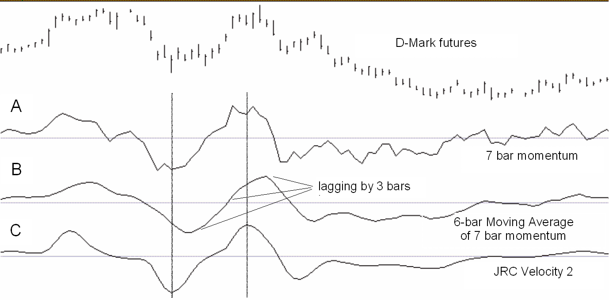

---

## WAV + DDR

### Theoretical Advantages

After pushing JMA, VEL, CFB, RSX and DMX as far as they can go, the advanced user will want to take his trading performance to the next level. This involves implementing leading indicators of the user's own design. Creating profitable leading indicators is not a trivial exercise, because it entails seeing what the market has not yet already discounted.

Typically, an advanced indicator will require (as input) various aspects of the market, such as momentum, relative price ratios, historical price values, etc. These market signals will almost certainly overlap in the information they convey. This redundancy between market signals will typically degrade the performance of a leading indicator. The reasoning goes like this:

1. A model with a small number of parameters (few degrees of freedom) is less likely to "remember" non-recurring market noise than a model with a large number of parameters (many degrees of freedom).
2. As there is no value in modeling market noise, smaller models are usually preferred over larger ones.
3. The more signals you feed a model, the larger the model becomes. Therefore, it is important to feed your model the smallest number of signals as is practical.
4. The more redundancy you have between signals, the less total information the collection of signals has to offer. Therefore, to feed a required amount of information to your model, you will need a larger number of redundant signals than non-redundant signals.
5. Because redundant signals force a model to have more degrees of freedom than would non-redundant signals, removing redundancy between signals typically yields smaller models with better resistance against "remembering" market noise.

Jurik Research offers two software modules that reduce redundancy in market data: WAV and DDR.

#### Neural Networks and Financial Forecasting

The very first step toward making a leading indicator requires the developer to decide how far into the future the leading indicator is to forecast. Our book, *Neural Networks and Financial Forecasting*, provides a formula for determining the optimal forecast horizon of any time series. The book also provides a heuristic for estimating the maximum amount of history required of each input (independent) variable for the model to make such a forecast. For example, suppose we determine the optimal forecast horizon (into the future) using daily 30 Yr. T-bonds as the target time series is 5.5 days, and that to "see" that far into the future, a model needs to look back and "see" 22 days of history. I published this finding into what is now called the Journal of Computational Finance. It was one of the first published works that combined chaos theory and information theory into a formula useful in financial modeling.

After determining the optimal forecast horizon, and the consequent maximum history that may be required of all signals feeding the leading indicator, the next step for the developer is to transform each input time series signal into a set of numbers that span the requisite history.

In the diagram at right, a user wants to feed five signals (S&P Fast K, S&P velocity, DOW velocity, DOW MACD, TRIN) to a leading indicator. Suppose he also decides that for each forecast produced by his model, 48 bars of history from each of the five signals are required. He could simply take the last 48 bars of each signal and feed them into the leading indicator, as shown in the diagram.

This would produce 5x48=240 input variables for the forecasting model. For reasons outlined above, 240 variables are excessive. We need a method for capturing the same amount of historical information with significantly fewer variables, to approach the goal of creating the smallest model possible. This goal is accomplished with our modules WAV and DDR.

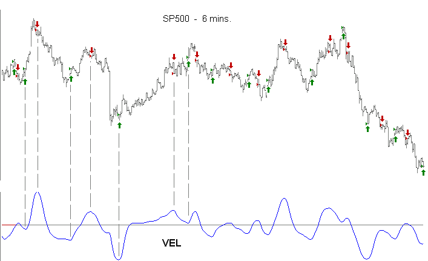

**WAV** — There are two ways to get 48-bars worth of historical market information. The simplest way is to feed your model all 48 values. However, because the market has a fading "memory" of its own past, using all 48 values is redundant, and redundancy is one thing we do not want to feed our forecast model. WAV exploits the market's memory of itself and delivers the same 48-bars worth of market information with only 12 values. Now, each of the original indicators can have its history expressed with just 12 values, instead of 48. A reduction of 75%.

In practice, we express each of the five indicators in the diagram as a column of data in an Excel spreadsheet. For each of these indicator columns, WAV produces an array of 12 columns. Each row in the array (spanning 12 cells) contains a compressed version of the last 48 bars of historical information of that indicator. Since the model calls for using five indicators, WAV would produce five arrays, for a total of 5x12=60 columns. Consequently, when a new set of five technical indicator values (arriving from some charting software) is appended to the spreadsheet, WAV produces a new row of 60 values, which could be immediately fed to a forecast model. Sixty values may seem large, but it is 75% smaller than using all 240 values as proposed earlier. We refer to this 75% reduction in the number of variables as "temporal compression".

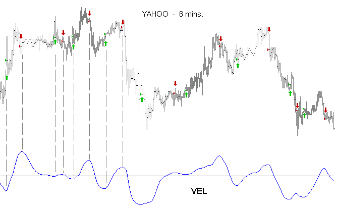

**DDR** — Even though a row of 60 cells is much smaller than 240, the count is still too large. Additional compression can be attained another way. It is very likely that there is much redundancy among the 60 variables produced by WAV. By eliminating all redundancy in the information contained by these 60 values, we may likely end up with a set of only 15 variables. The process of compressing 60 WAV variables into a smaller collection without sacrificing historical information is called "spatial compression".

DDR (Decorrelator and Dimension Reducer) performs spatial compression, using a powerful algorithm. Luckily, the user does not need to know anything about how DDR works in order to employ it. You simply tell DDR to process the 60-column spreadsheet array produced by WAV. DDR returns another array the same size as the original.

In practical terms, this means that for every 60-cell row produced by WAV, DDR will process it and return another 60-cell row. However, almost all the historical information needed for forecasting will be contained in just the first few values of DDR's output row. We can ignore all other values in that row!

In the example above, DDR may discover that the 60 WAV variables were highly redundant and will tell you that you can get 95% of the information using just the first 15 variables produced by DDR. That is a reduction of 75%. Together, WAV and DDR in this example reduced the variable count from 240 to just 15, a combined reduction of 94%!

As an added benefit, all 15 variables produced by DDR are mutually decorrelated. This is perfect for forecast models, which typically perform best when input variables are mutually independent.

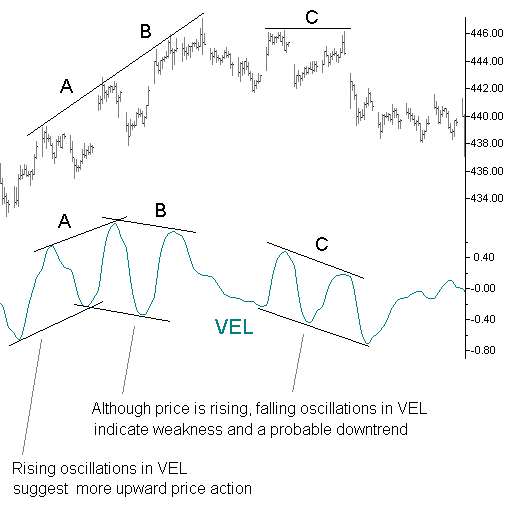

WAV and DDR together perform spatio-temporal compression very effectively. Ever since Jurik Research published this concept in Futures Magazine in 1992, it is becoming increasingly popular among forecast model builders. An entire issue has since been devoted to this topic in the Journal of Computational Finance.

#### Summary

DDR and WAV provide excellent data compression when modeling leading indicators. Although they are typically used in a spreadsheet, DDR and WAV are also available as generic DLL functions, just right for do-it-yourself software programmers.

---

## Product Availability and Pricing

Each software trading platform runs a particular set of Jurik Tools. For the most up-to-date listing, visit our web page:

> http://www.jurikres.com/products/os_upgrades.cfm

Download our latest order form from:

> http://jurikres.com/sales/ord_help.htm

Package pricing is available for all versions of Jurik Tools. The UT version has only one package of all 4 tools. For all other versions (TS, DL, XL, MS), you may select any number of tools. Package prices are shown below.

**TS / XL / DL versions** — Tools: JMA, RSX, VEL, CFB, DDR, WAV

| Number of tools | 1 | 2 | 3 | 4 | 5 | 6 |
|----------------|-----|-----|-----|-----|-----|-----|
| Price | $205 | $345 | $445 | $520 | $595 | $670 |

**MS version** — Tools: JMA, RSX, VEL, CFB

| Number of tools | 1 | 2 | 3 | 4 |
|----------------|-----|-----|-----|-----|
| Price | $205 | $345 | $445 | $520 |

**UT version** — Package [JMA + RSX + VEL + DMX]

| License term | Price |
|-------------|-------|
| 10 years | $750 |
| 1 year | $250 |
| 1/2 year | $150 |
| 3 month | $100 |

---

## User License Agreement

**JURIK RESEARCH LIMITED USE SOFTWARE LICENSE AGREEMENT**

CONCERNING SOFTWARE AND DOCUMENTATION, THIS LICENSE AGREEMENT IS THE ENTIRE AGREEMENT BETWEEN JURIK RESEARCH AND YOU. INSTALLING JURIK RESEARCH SOFTWARE REQUIRES YOUR CONSENT TO BE BOUND BY THE FOLLOWING TERMS AND CONDITIONS.

**PREFACE** — This manual (the "Documentation") refers to commercial software products (the "Software") provided by Jurik Research ("JR"). This Software will not operate unless you purchase or already own a fully paid license from JR. JR licenses its use under the terms set forth herein.

**LICENSE GRANT** — If you are a fully paid license holder, Jurik Research, as licensor, grants to you, and you accept, a non-exclusive license to use the enclosed program Software and accompanying Documentation, only as authorized in this agreement. You acquire no right, title or interest in or to the Documentation or Software, whose copyrights are owned by Jurik Research (JR). All rights are reserved. You agree to respect and to not remove or conceal from view any copyright notices appearing on the Software or Documentation. You may not sublicense this license. You may not rent, lease, modify, translate, disassemble, decompile, or reverse engineer the software, nor create derivative works based on the software without written permission from JR. The software may be used only on a single computer at a single location at any one time. JR permits you to make one archival copy of the software. No other copies or any portions thereof may be made by you or by any persons under your control. No part of this manual may be transmitted or reproduced in any form, by any means, for any purpose other than the purchaser's personal use without written permission of JR.

**TERM** — This license is effective until terminated. License will expire after a limited time from date of purchase. You may terminate it at any time. It will also terminate upon conditions set forth elsewhere in this Agreement if you fail to comply with any term or condition of this Agreement. You agree upon such termination to destroy the Software and Documentation together with all copies, modifications and merged portions of the software expressed in any media form, including archival copies.

**LIMITED WARRANTY** — The information in the user guide and on the diskette is subject to change without notice and does not represent a commitment on the part of JR. JR warrants the diskette and physical document to be free of defects in materials and workmanship. The user's sole remedy, in the event a defect is found, is that JR will replace the defective diskette or documentation. JR warrants that the Software, if properly installed and operated on software for which it is designed, will perform substantially as described in the Documentation. JR also warrants the software to be operationally compatible with the software platforms and operating systems as specified on the JR website, whose software version numbers for each relevant software product are also specified at said website. You recognize and accept that there is the possibility that a software platform developer or operating system developer may significantly change their product so as be incompatible with Jurik tools. Although JR may create a revised version of its tools to re-establish compatibility, no warranty is expressed or implied to that effect. In the case said incompatibility does occur, JR is under no obligation to provide a refund, product exchange, revision or upgrade. The above express warranty is the only warranty made by JR. It is in lieu of any other warranties, whether expressed or implied, including, but not limited to, any implied warranty of merchantability of fitness for a particular purpose. This warranty commences on the date of delivery to the Licensee and expires sixty (60) days thereafter. Any misuse or unauthorized modification of the Software will void this limited warranty. No JR dealer, distributor, agent or employee is authorized to make any modification or addition to this warranty. This warranty gives you specific legal rights, and you may have other rights that vary from state to state. Product may not be returned for a refund after warranty has expired.

**LIMITATION OF LIABILITY** — Because computer software is inherently complex and may not be completely free of errors, you are advised to test the software thoroughly before relying upon it. JR will not be responsible for your failure to do so. You assume full responsibility and risk for Software installation, application and results. Do not use the Software in any case where an error may cause significant damage or injury to persons, property or business. In no event shall JR be liable for any indirect, special, incidental, tort, economic, cover, consequential, exemplary damages or other damages, regardless of type, including, without limitation, damages or costs relating to the loss of profits, business, goodwill, data, or computer programs, arising out of the use of or inability to use JR products or services, even if the company or its agent has been advised of the possibility of such damages or of any claim by any other party. JR's total liability to you or any other party for any loss or damages resulting from any claims, demands or actions arising out of or related to this agreement shall not exceed the license fee paid to JR for use of this software. Some states or provinces do not allow the exclusion or limitation of implied warranties or limitation of liability for incidental or consequential damages, so the above exclusion or limitation may not apply to you.

**GOVERNING LAW and COST OF LITIGATION** — The license agreement shall be construed and governed in accordance with the laws of California. In any legal action regarding the subject matter hereof, venue shall be in the state of California, and the prevailing party shall be entitled to recover, in addition to any other relief granted, reasonable attorney fees and expenses of litigation. The export of JR products is governed by the U.S. Department of Commerce under the export administration regulations. It is your responsibility to comply with all such regulations.

**NO WAIVER** — The failure of either party to enforce any rights granted hereunder shall not be deemed a waiver by that party as to subsequent enforcement of rights in the event of future breaches.

**FEES** — A new password is required for installing Software into each additional computer. This license entitles you up to two passwords, one for each computer that you own. There is a fee for each additional password beyond the first two. Violation of this restriction is a direct copyright infringement to which Jurik Research shall seek legal remedy. Future upgrades may require a fee. Prices may change without notice.

---

## Notices

### If You Find a Bug... You Win

If you discover a legitimate bug in any of our software tools, please let us know! We will try to verify it on the spot. If you are the first to report it to us, you will receive the following two coupons redeemable toward your acquisition of any of our software add-in technical indicators:

- a $50 discount coupon
- a free upgrade coupon

You may collect as many coupons as you can. You may apply more than one discount coupon toward the purchase of your next tool.

### About Passwords

You may have passwords for up to two machines; additional licenses are extra. If you change your motherboard or BIOS, a replacement password is needed for all Jurik Tools except those running on TradeStation, where the password is locked to the TradeStation Customer ID number. To obtain a free replacement password, you must fax us a copy of the invoice for your new computer or motherboard purchase. Also, if you want to run the toolset on additional computers, you will need additional passwords. For customer support regarding passwords, call us at 323-258-4860.

### Investor Liability — You Assume All Risk

The buy-sell signals shown in some charts were generated by backtesting a trading strategy on historical data. Hypothetical or simulated performance results have certain inherent limitations. Simulated performance is subject to the fact that they are designed with the benefit of hindsight. We must also state here that, due to the frequently unpredictable nature of the marketplace, past performance of any trading system is never a guarantee of future performance.

The example trading strategies described in this manual are for illustration purposes only. Do not trade real money using these demonstration systems. A real trading system should be tested extensively for various kinds of flaws, including hyper-sensitivity to parameter settings. A real trading system also requires not one but several mutually concurring indicators as well as good money management rules for limiting exposure to risk.

All trading strategies have risk and certain markets leverage that risk. It is wise to limit the amount at risk to that which you are willing and can afford to lose.

The user is advised to test all software thoroughly before relying upon it. The user agrees to assume the entire risk of using Jurik Research software. In no event shall Jurik Research be responsible for any special, consequential, actual or other damages, regardless of type, nor shall it be responsible for any trading losses resulting from the use of the software.

---

## Trademarks, Copyrights & Policy

Jurik Research uses these following words for informational purposes only and not to infringe upon those trademarks and copyrights in any manner whatsoever.

- "Microsoft" and "Excel" are trademarks of Microsoft Corporation.
- "TradeStation" and "Easy Language" are trademarks of TradeStation Technologies, Inc.
- "Promised Land Technology" and "Braincel" are trademarks of Promised Land Technology Inc.
- "Palisade Inc." and "Evolver" are trademarks of Palisade Inc.
- "DataMaker" and "Pinnacle" are trademarks of Pinnacle Data Corporation.
- "Futures" and "Futures Magazine" are trademarks of Oster Communications Inc.
- "Jurik Research", "JMA", "WAV", "DDR", "VEL", "RSX", "DMX" and "CFB" are copyrights of Jurik Research.
- "MetaStock" is a trademark of Equis International.
- "BioComp Profit" is a trademark of BioComp Systems, Inc.
- "WaveWi$e" is a trademark of Jerome Technology, Inc.
- "NeoTicker" is a trademark of TickQuest, Inc.
- "NeuroShell" is a trademark of Ward Systems, Inc.
- "AmiBroker" is a trademark of AmiBroker.com; Poland.
- "Investor/RT" is a trademark of Linn Software.
- "Wealth-Lab" is a trademark of Wealth-Lab; Germany.
- "MetaStock" is a trademark of Equis International, a Reuters Company.
- "eSignal" is a trademark of Interactive Data Corporation.
- "FDC" and "Financial Data Calculator" are trademarks of Mathematical Investment Decisions.
- "Tradecision" is a trademark of Alyuda Research, Inc.
- "Trade Navigator" is a trademark of Genesis Financial Technologies, Inc.
- "TradingSolutions" is a trademark of NeuroDimensions, Inc.
- "Ninja Trader" is a trademark of NinjaTrader, Inc.
- "MATLAB" is a trademark of Mathworks, Inc.

### Document Copy Permission

Jurik Research hereby grants you permission to copy this document for non-commercial use within your organization only. In consideration of this permission, you agree that any copy you make shall include all copyright and other proprietary notices contained herein this document. Any Jurik Research publication may include technical inaccuracies or typographical errors. Jurik Research may make improvements and/or changes in the publications, products and/or the services described in these publications at any time without notice.

### Our Policy Regarding Software Piracy

Jurik tools are world-renowned for excellence and value. We can afford our low prices through large sales volume and by enforcing copyright protection with the following anti-piracy policy:

1. We have on permanent retainer one of the best intellectual property law firms in the U.S.
2. We do not perform cost-benefit analysis when it comes to litigation. We prosecute all offenders.
3. We register portions of our software with the U.S. Copyright office, entitling us to compensation for all legal costs, which is typically over $12,000 per lawsuit.
4. We offer up to $5000 reward for information leading to the successful prosecution of any offender(s).

---

*Source: http://jurikres.com/down__/product_guide_.pdf*
*Converted to markdown: 2026-05-03*
