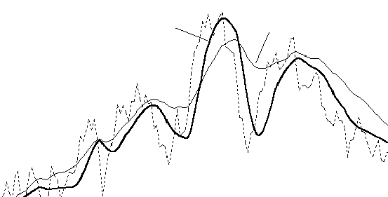
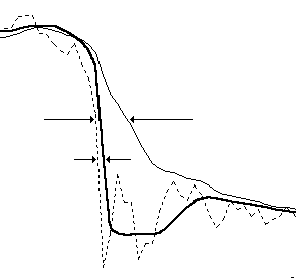
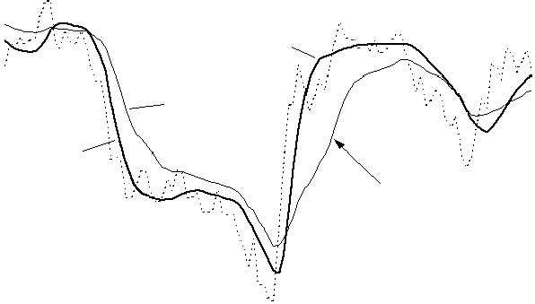
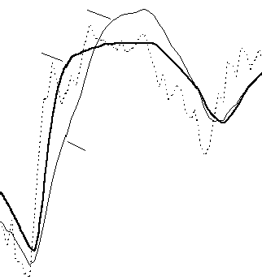
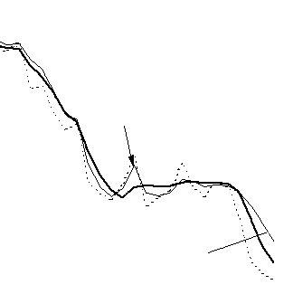
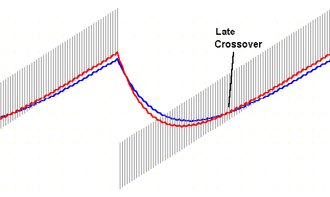
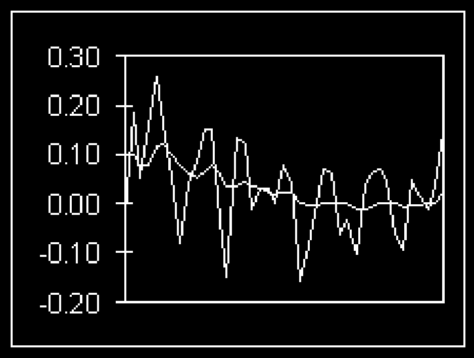
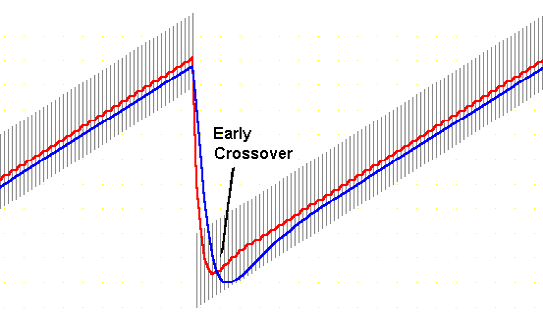
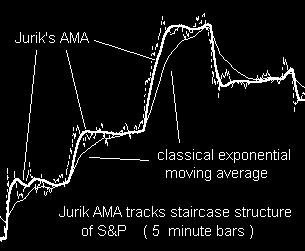

# Why Use JMA?

© 1999 Jurik Research — [www.jurikres.com](http://www.jurikres.com)

## BibTeX

```bibtex
@techreport{jurik1999why_jma,
  author       = {Jurik, Mark},
  title        = {Why Use {JMA}?},
  year         = {1999},
  institution  = {Jurik Research},
  url          = {http://jurikres.com/catalog1/ms_jma.htm},
  note         = {PDF: why\_jma.pdf, 4-benchmark comparison}
}
```

---

## Why Lose Money Using Slow, Lagging Indicators?

To filter out noise in market data, technicians use moving averages. JMA excels in all four benchmarks of a truly great, low lag filter.

---

## Benchmark #1: Accuracy

Moving Average (MA) filters have an adjustable parameter that controls its speed. Speed governs two opposing properties of a filter: smoothness (lack of random zigzagging) and accuracy (closeness to the original data). That is, the smoother a filter becomes, the less it accurately resembles the original time series. This makes sense, since we do not want to accurately track zigzagging noise within our data.

The financial investor tries to apply just enough smoothness to filter out noise without removing important structure in price activity. For example, in the chart below, the popular Double Exponential Moving Average (DEMA) is just as smooth as JMA yet DEMA fails to track large scale structure (the big cycles). On the other hand, JMA follows the cyclic action very well.



*Left: JMA preserves large scale structure. Right: DEMA loses large scale structure. Both curves are equally smooth.*

---

## Benchmark #2: Timeliness

Most MA filters have another problem: they lag behind the original time series. This is a critical issue because excessive delay and late trades may reduce profits significantly.

Ideally, you would like a filtered signal to be both smooth and lag free. For many types of moving average filters, including the three classics (simple, weighted, and exponential), greater smoothness produces greater lag.

For example, in the chart below, price action is the dotted line. The exponential moving average, EMA, lags well behind JMA (thick solid line). As you can see, with EMA's excessive lag, you would have had to wait a long time before it returned to the price action. In contrast, JMA never left it!



*JMA's lag is small; EMA's lag is large.*

Adaptive filters developed by others, such as the Kaufman and Chande AMA, will also lag well behind your time series. Kaufman's Moving Average (KMA) is an exponential moving average whose speed is governed by the "efficiency" of price movement. For example, fast moving price with little retracement (a strong trend) is considered very efficient and the KMA will automatically speed up to prevent excessive lag. This interesting concept sometimes works well, sometimes not. For example, the chart below shows KMA lagging well behind JMA.



*JMA runs through the data, rather than below it. KMA seriously lags behind data. JMA and KMA have similar smoothness.*

The advantage in avoiding lag is readily apparent in the chart below. Here we see how JMA enhances the timing of a simple crossover oscillator. The top half of the chart shows crude oil closing prices tracked by two JMA filters of different speed. The bottom half uses two EMA (exponential moving average) filters. The oscillator becomes positive when the curve of the faster filter crosses over the slower one. This occurrence suggests a "buy" signal.

Note that **JMA's crossovers are 15 and 18 days earlier!** Can you afford to be 15 days late?



*JMA crossover occurs 15 days before EMA (left) and 18 days before EMA (right).*

---

## Benchmark #3: Overshoot

Many trading systems set triggers to buy or sell when price reaches a certain threshold level. Because there is an inherent amount of noise in price action, the typical approach is to trigger when a moving average crosses the threshold. The smoothed line has less noise and is less likely to produce false alarms.

To do this right, you'll need an exceptional moving average indicator. Common versions lag too much and many sophisticated designs, like the Kalman or Butterworth filter, tend to overshoot during price reversals. Overshoots create false impressions of prices having reached levels it never truly did.

For example, in the chart below we see the famous Kalman filter overshoot price data, creating a false price level that the market never really achieved. DEMA filters also tend to overshoot. The overshoot crosses the shown threshold and triggers a false alarm. In contrast, JMA did not overshoot and thus avoided a false alarm with the user's set threshold.



*JMA stays below the threshold; the Kalman filter overshoots and triggers a false alarm.*

---

## Benchmark #4: Smoothness

The most important property of a noise reduction filter is its smoothness.

In the chart below, EMA and JMA filters are run across closing prices. Note how much the fast EMA alternates upward and downward while JMA glides smoothly through the data. Clearly JMA reveals the noise-free underlying price more accurately. If you try reducing EMA's erratic hopping by making it slower, you will discover its lag will become larger, producing late trade signals.



*Fast EMA jumps up and down. Slow EMA is smooth but lags below the data. JMA is both accurate and smooth!*

If you need a 2-bar momentum indicator, you could take the difference between two values along the EMA time series and produce the jagged line in the chart below. This is in contrast to the much smoother momentum signal based on JMA (flatter line). Imagine how many bad trades could be eliminated with this simple substitution!



*2-bar momentum comparison: EMA-based momentum (jagged) vs JMA-based momentum (smooth).*

---

Moving averages should have consistent behavior. Some do not. For example, Chande's VIDYA is an exponential moving average whose speed is governed by the variance of price movement. Fast moving price has large variance which will eventually cause VIDYA to automatically speed up (in an attempt to prevent excessive lag). This concept sometimes works well, sometimes not.

In the chart below, JMA is the thick solid line and VIDYA is the thin solid line. Both perform approximately the same for the first 1/3 of the series. But due to the high volatility during the downward trend, VIDYA becomes hyperactive and fast tracks the choppy waves during the congestion phase of this time series. Smoothing is lost. In contrast, JMA cuts right through with a smooth horizontal line. In addition, the decrease in signal volatility soon causes VIDYA to slow down, too much in fact, as it lags behind JMA during the next downward price trend.



*Comparing JMA to VIDYA. High volatility during the downward trend caused VIDYA to be too fast. Low volatility during congestion caused VIDYA to be too slow.*

---

## Crossover Performance

The two charts below simulate a rising trend of equal-sized price bars, punctuated by a downward gap. Trend following systems using signals from the crossover of classical moving averages would fail miserably because the crossovers would arrive too late to take full advantage of the trend. In contrast, JMA creates crossover signals almost immediately, riding a good portion of the trend for greater profit.

*(Simulated trend charts — see PDF for original illustrations)*

---

## Intraday Gap Tracking

JMA can also track price gaps produced by intraday data. The chart below shows how JMA jumps to the next day's price levels while the classical exponential moving average lags behind.



*JMA tracks staircase structure of S&P 500 (5-minute bars). Classical exponential moving average lags behind.*

---

## Summary

Create superior trading indicators with:

- Better timing
- Less noise
- Greater accuracy

Visit Jurik Research at [www.jurikres.com](http://www.jurikres.com)
