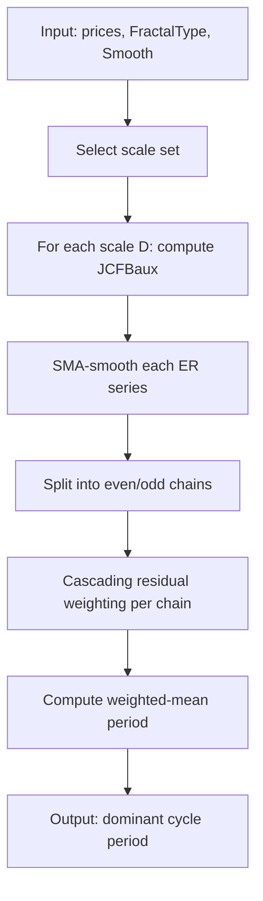

# JCFB — Composite Fractal Behavior

## Principle

Multi-scale trend duration estimator. Computes efficiency ratios at geometrically-spaced scales, applies cascading residual-probability weighting, and outputs the weighted-mean dominant period.

## Mathematical Formulas

**Single-scale efficiency ratio** (JCFBaux at depth $D$):

$$\text{path} = \sum_{i=0}^{D-1} |p_{t-i} - p_{t-i-1}|$$

$$\text{weighted\_path} = \sum_{i=0}^{D-1} (D - i)\,|p_{t-i} - p_{t-i-1}|$$

$$\text{displacement} = \left|D \cdot p_t - \sum_{i=0}^{D-1} p_{t-i-1}\right|$$

$$\text{ER}(t, D) = \frac{\text{displacement}}{\text{weighted\_path}}$$

**Cascading residual-probability weighting** (even chain, largest scale first):

$$w_k = r_k \cdot \overline{\text{ER}}_k, \qquad r_{k-1} = r_k \cdot (1 - w_k)$$

where $r_N = 1$ initially and $\overline{\text{ER}}_k$ is the SMA-smoothed efficiency ratio for scale $k$.

**Weighted-mean dominant period:**

$$P = \frac{\sum_i w_i^2 \cdot D_i}{\sum_i w_i^2}$$

## Algorithm

1. Define scale set based on `FractalType`:
   - Type 1 (JCFB24): depths = [2, 3, 4, 6, 8, 12, 16, 24]
   - Type 2 (JCFB48): depths = [2, 3, 4, 6, 8, 12, 16, 24, 32, 48]
   - Type 3 (JCFB96): depths = [2, 3, 4, 6, 8, 12, 16, 24, 32, 48, 64, 96]
   - Type 4 (JCFB192): depths = [2, 3, 4, 6, 8, 12, 16, 24, 32, 48, 64, 96, 128, 192]
2. For each scale, compute the efficiency ratio series via `JCFBaux`.
3. Smooth each efficiency ratio series with an SMA of window `Smooth`.
4. Split scales into even-indexed and odd-indexed chains.
5. For each chain, iterate from largest scale to smallest, applying cascading residual weighting.
6. Compute weighted-mean dominant period from all weighted values.

## Flow Diagram



## Pseudocode

```
function JCFBaux(prices, D):
    output = array of zeros
    for bar = D to len(prices)-1:
        path = 0
        weighted_path = 0
        price_sum = 0
        for i = 0 to D-1:
            diff = |prices[bar-i] - prices[bar-i-1]|
            path += diff
            weighted_path += (D - i) * diff
            price_sum += prices[bar-i-1]
        displacement = |D * prices[bar] - price_sum|
        output[bar] = displacement / weighted_path if weighted_path != 0 else 0
    return output

function JCFB(prices, FractalType, Smooth):
    scales = select_scales(FractalType)
    N = len(scales)
    er_smooth = []
    for each scale D in scales:
        er = JCFBaux(prices, D)
        er_smooth.append( SMA(er, Smooth) )

    // Cascading residual weighting
    w = array of zeros[N]
    // Even chain (indices 0,2,4,...) — largest first
    residual = 1.0
    for i in even_indices sorted by scale descending:
        w[i] = residual * er_smooth[i]
        residual *= (1 - w[i])
    // Odd chain (indices 1,3,5,...) — largest first
    residual = 1.0
    for i in odd_indices sorted by scale descending:
        w[i] = residual * er_smooth[i]
        residual *= (1 - w[i])

    // Weighted mean
    numerator = sum(w[i]^2 * scales[i] for all i)
    denominator = sum(w[i]^2 for all i)
    return numerator / denominator if denominator != 0 else 0
```

## Variable Mapping Table

| Original Variable | Description | Formula/Role |
|---|---|---|
| `jrc04` | Total path length | $\sum \|p_{t-i} - p_{t-i-1}\|$ |
| `jrc05` | Weighted path length | $\sum (D-i)\|p_{t-i} - p_{t-i-1}\|$ |
| `jrc06` | Sum of past prices | $\sum p_{t-i-1}$ |
| `jrc08` | Scaled net displacement | $\|D \cdot p_t - \text{jrc06}\|$ |
| `er23[i]` | Smoothed efficiency ratio for scale $i$ | SMA of JCFBaux output |
| `er22[i]` | Residual-weighted probability for scale $i$ | $r \cdot \text{er23}[i]$ |
| `er17` | Weighted period sum | $\sum w_i^2 \cdot D_i$ |
| `er18` | Weight sum | $\sum w_i^2$ |
| `FractalType` | Scale depth selector | 1→24, 2→48, 3→96, 4→192 |
| `Smooth` | SMA window for ER smoothing | Applied to each scale's ER |
