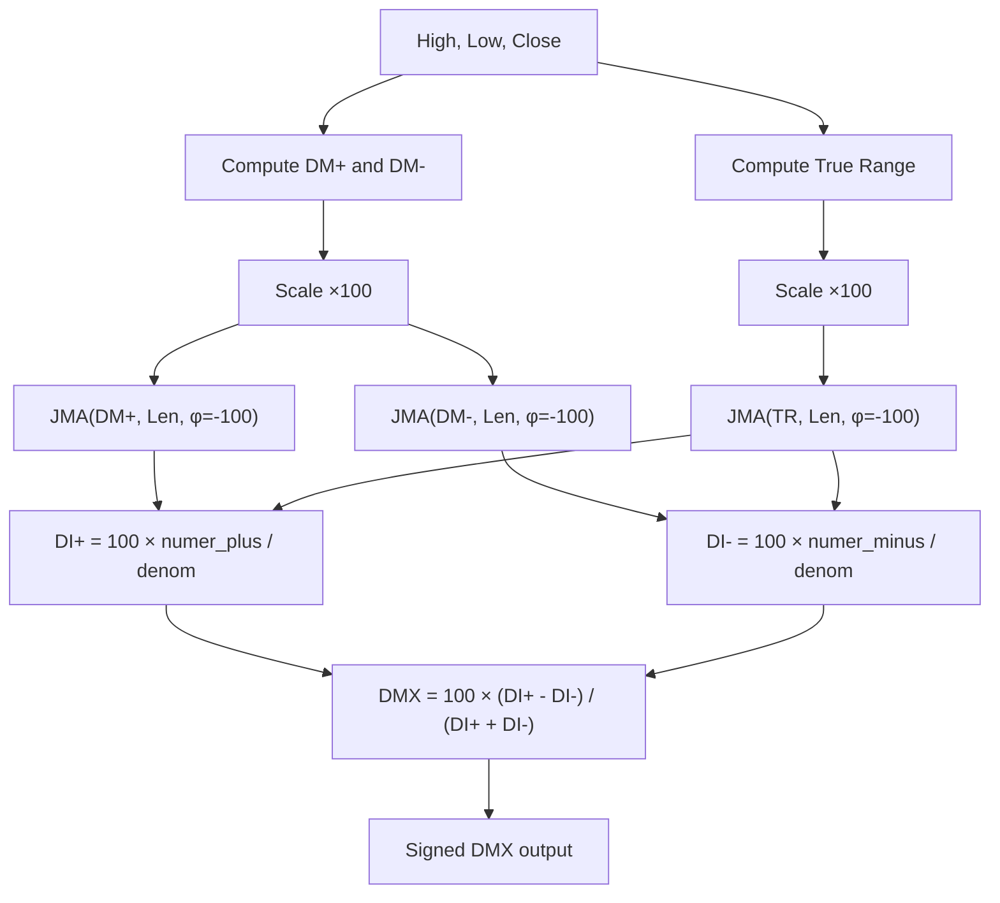

# JDMX — Jurik Directional Movement Index

## Principle

Wilder's Directional Movement (DM/ADX) concept with JMA (phase = −100) replacing Wilder's EMA for smoothing. The output is a **signed** value ranging from −100 to +100, unlike the classic ADX which is always positive. Positive values indicate bullish momentum; negative values indicate bearish momentum.

## Mathematical Formulas

**Directional Movement:**

$$
DM^+ = \begin{cases} \max(0,\; H_t - H_{t-1}) & \text{if } H_t - H_{t-1} > L_{t-1} - L_t \\ 0 & \text{otherwise} \end{cases}
$$

$$
DM^- = \begin{cases} \max(0,\; L_{t-1} - L_t) & \text{if } L_{t-1} - L_t > H_t - H_{t-1} \\ 0 & \text{otherwise} \end{cases}
$$

**Directional Indicators (after bar 40, when denominator > 0.00001):**

$$
DI^+ = 100 \times \frac{\text{JMA}(DM^+ \times 100,\; \text{Len},\; \phi\!=\!-100)}{\text{JMA}(TR \times 100,\; \text{Len},\; \phi\!=\!-100)}
$$

$$
DI^- = 100 \times \frac{\text{JMA}(DM^- \times 100,\; \text{Len},\; \phi\!=\!-100)}{\text{JMA}(TR \times 100,\; \text{Len},\; \phi\!=\!-100)}
$$

**Signed Directional Movement Index:**

$$
DMX = \begin{cases} 100 \times \dfrac{DI^+ - DI^-}{DI^+ + DI^-} & \text{if } DI^+ + DI^- > 0.00001 \\ 0 & \text{otherwise} \end{cases}
$$

## Algorithm

1. For each bar (starting at bar 1):
   - Compute `upMove = High[bar] - High[bar-1]`
   - Compute `downMove = Low[bar-1] - Low[bar]`
   - If `upMove > downMove` and `upMove > 0`: `DM+ = upMove`, else `DM+ = 0`
   - If `downMove > upMove` and `downMove > 0`: `DM- = downMove`, else `DM- = 0`
2. Multiply DM+, DM-, and TrueRange by 100 for numerical precision.
3. Smooth each series with JMA(length, phase=-100):
   - `numer_plus = JMA(DM+ × 100)`
   - `numer_minus = JMA(DM- × 100)`
   - `denom = JMA(TR × 100)`
4. After bar 40, when `denom > 0.00001`:
   - `DI+ = 100 × numer_plus / denom`
   - `DI- = 100 × numer_minus / denom`
5. Compute signed DMX:
   - If `DI+ + DI- > 0.00001`: `DMX = 100 × (DI+ - DI-) / (DI+ + DI-)`
   - Else: `DMX = 0`

## Flow Diagram



## Pseudocode

```
function JDMX(High[], Low[], Close[], Len):
    for bar = 1 to N-1:
        upMove   = High[bar] - High[bar-1]
        downMove = Low[bar-1] - Low[bar]

        if upMove > downMove and upMove > 0:
            dm_plus = upMove * 100
        else:
            dm_plus = 0

        if downMove > upMove and downMove > 0:
            dm_minus = downMove * 100
        else:
            dm_minus = 0

        TR = max(High[bar] - Low[bar],
                 abs(High[bar] - Close[bar-1]),
                 abs(Low[bar] - Close[bar-1])) * 100

    numer_plus  = JMA(dm_plus_series,  Len, phase=-100)
    numer_minus = JMA(dm_minus_series, Len, phase=-100)
    denom       = JMA(TR_series,       Len, phase=-100)

    for bar = 40 to N-1:
        if denom[bar] > 0.00001:
            DI_plus  = 100 * numer_plus[bar]  / denom[bar]
            DI_minus = 100 * numer_minus[bar] / denom[bar]
        else:
            DI_plus  = 0
            DI_minus = 0

        sum = DI_plus + DI_minus
        if sum > 0.00001:
            DMX[bar] = 100 * (DI_plus - DI_minus) / sum
        else:
            DMX[bar] = 0

    return DMX
```

## Variable Mapping Table

| Variable | Description | Domain |
|----------|-------------|--------|
| `High`, `Low`, `Close` | Input price arrays | Price > 0 |
| `Len` | JMA smoothing length | Integer ≥ 1 (default 14) |
| `upMove` | Upward price movement | ≥ 0 |
| `downMove` | Downward price movement | ≥ 0 |
| `dm_plus` | Positive directional movement × 100 | ≥ 0 |
| `dm_minus` | Negative directional movement × 100 | ≥ 0 |
| `TR` | True Range × 100 | ≥ 0 |
| `numer_plus` | JMA-smoothed DM+ | ≥ 0 |
| `numer_minus` | JMA-smoothed DM- | ≥ 0 |
| `denom` | JMA-smoothed TR | ≥ 0 |
| `DI_plus` | Positive directional indicator | 0–100 |
| `DI_minus` | Negative directional indicator | 0–100 |
| `DMX` | Signed directional movement index | −100 to +100 |
