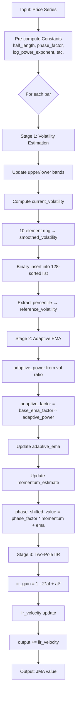

# JJMA — Jurik Moving Average

## Principle

Triple-stage adaptive filter. Stage 1 estimates volatility via a running percentile of smoothed price changes. Stage 2 is an adaptive first-order EMA whose bandwidth responds to volatility. Stage 3 is a two-pole IIR filter that further smooths and allows phase control (overshoot/undershoot).

## Mathematical Formulas

### Pre-computation (constants derived from `Len` and `Phase`)

$$
\text{half\_length} = \max\!\left(\frac{\text{Len} - 1}{2},\; 10^{-10}\right)
$$

$$
\text{phase\_factor} = \frac{\text{Phase}}{100} + 1.5, \quad \text{clamped to } [0.5,\; 2.5]
$$

$$
v_1 = \ln\!\left(\sqrt{\text{half\_length}}\right)
$$

$$
\text{log\_power\_exponent} = \max\!\left(0,\; \frac{v_1}{\ln 2} + 2\right)
$$

$$
\text{vol\_ratio\_exponent} = \max\!\left(0.5,\; \text{log\_power\_exponent} - 2\right)
$$

$$
\text{bandwidth\_param} = \sqrt{\text{half\_length}} \cdot \text{log\_power\_exponent}
$$

$$
\text{band\_tracking\_factor} = \frac{\text{bandwidth\_param}}{\text{bandwidth\_param} + 1}
$$

$$
\text{half\_length}' = \text{half\_length} \times 0.9
$$

$$
\text{base\_ema\_factor} = \frac{\text{half\_length}'}{\text{half\_length}' + 2}
$$

### Stage 1 — Adaptive Volatility Estimation

Upper/lower band tracking:

$$
\text{upper\_band} = \text{upper\_band} + (\text{price} - \text{upper\_band}) \cdot \text{band\_tracking\_factor}^{\text{counter\_power}}
$$

$$
\text{lower\_band} = \text{lower\_band} + (\text{price} - \text{lower\_band}) \cdot \text{band\_tracking\_factor}^{\text{counter\_power}}
$$

Current volatility:

$$
\text{current\_volatility} = \max\!\left(|\text{price} - \text{upper\_band}|,\; |\text{price} - \text{lower\_band}|\right) + 10^{-10}
$$

Smoothed volatility (10-element ring average):

$$
s_{20} = s_{20} + \frac{\text{current\_volatility} - \text{ring2}[s_{50}]}{10}
$$

Running percentile from 128-element sorted list:

$$
\text{reference\_volatility} = \frac{\displaystyle\sum_{i=s_{40}}^{s_{38}} \text{list}[i]}{s_{38} - s_{40} + 1}
$$

### Stage 2 — Adaptive First-Order EMA

$$
\text{adaptive\_power} = \text{clamp}\!\left(\left(\frac{\text{current\_volatility}}{\text{reference\_volatility}}\right)^{\text{vol\_ratio\_exponent}},\; 1,\; \text{log\_power\_exponent}\right)
$$

$$
\text{adaptive\_factor} = \text{base\_ema\_factor}^{\text{adaptive\_power}}
$$

$$
\text{adaptive\_ema} = (1 - \text{adaptive\_factor}) \cdot \text{price} + \text{adaptive\_factor} \cdot \text{adaptive\_ema}_{\text{prev}}
$$

$$
\text{momentum\_estimate} = (\text{price} - \text{adaptive\_ema}) \cdot (1 - \text{base\_ema\_factor}) + \text{base\_ema\_factor} \cdot \text{momentum\_estimate}_{\text{prev}}
$$

$$
\text{phase\_shifted\_value} = \text{phase\_factor} \cdot \text{momentum\_estimate} + \text{adaptive\_ema}
$$

### Stage 3 — Two-Pole IIR Filter

$$
f_{20} = -2 \cdot \text{adaptive\_factor}, \quad f_{40} = \text{adaptive\_factor}^2
$$

$$
\text{iir\_gain} = 1 + f_{20} + f_{40} = (1 - \text{adaptive\_factor})^2
$$

$$
\text{iir\_velocity} = (\text{phase\_shifted\_value} - \text{output}) \cdot \text{iir\_gain} + f_{40} \cdot \text{iir\_velocity}_{\text{prev}}
$$

$$
\text{output} = \text{output}_{\text{prev}} + \text{iir\_velocity}
$$

## Algorithm

### Step-by-step

1. **Pre-compute constants** from `Len` and `Phase` (see formulas above).
2. **For each bar** (indexed from 0):
   - If bar < 62, store price in `init_buffer[bar]`.
   - **Stage 1**: Update upper/lower bands adaptively. Compute `current_volatility`. Smooth via 10-element ring → `smoothed_volatility`. Insert into 128-element sorted list (binary search). Extract percentile sum → `reference_volatility`.
   - **Stage 2** (after warmup ≥ 30 bars): Compute `adaptive_power` from volatility ratio. Derive `adaptive_factor`. Update `adaptive_ema` and `momentum_estimate`. Apply phase shift → `phase_shifted_value`.
   - **Stage 3**: Apply two-pole IIR filter to `phase_shifted_value` → final `output`.
3. **Initialization** (first 30 bars): Use `init_buffer` to estimate initial velocity via interpolation using `bandwidth_param`. Set `adaptive_ema` and `output` to price.

## Flow Diagram



## Pseudocode

```python
def jjma(prices, length, phase):
    # --- Pre-computation ---
    half_length = max((length - 1) / 2, 1e-10)
    phase_factor = clamp(phase / 100 + 1.5, 0.5, 2.5)
    v1 = log(sqrt(half_length))
    log_power_exponent = max(0, v1 / log(2) + 2)
    vol_ratio_exponent = max(0.5, log_power_exponent - 2)
    bandwidth_param = sqrt(half_length) * log_power_exponent
    band_tracking_factor = bandwidth_param / (bandwidth_param + 1)
    half_length_adj = half_length * 0.9
    base_ema_factor = half_length_adj / (half_length_adj + 2)

    # --- State ---
    sorted_list[128], ring[128], small_ring[10], init_buffer[62]
    upper_band = lower_band = 0
    adaptive_ema = momentum = output = iir_velocity = 0
    warmup_counter = 0

    for bar, price in enumerate(prices):
        # Stage 1: Volatility
        update_bands(price, band_tracking_factor)
        current_vol = max(|price - upper|, |price - lower|) + 1e-10
        smoothed_vol = ring_average(current_vol, small_ring)
        sorted_insert(smoothed_vol, sorted_list)
        reference_vol = percentile_sum(sorted_list) / window_size

        # Stage 2: Adaptive EMA (after warmup)
        adaptive_power = clamp((current_vol / reference_vol) ^ vol_ratio_exponent,
                               1, log_power_exponent)
        af = base_ema_factor ^ adaptive_power
        adaptive_ema = (1 - af) * price + af * adaptive_ema
        momentum = (price - adaptive_ema) * (1 - base_ema_factor) + base_ema_factor * momentum
        phase_shifted = phase_factor * momentum + adaptive_ema

        # Stage 3: Two-pole IIR
        gain = (1 - af) ** 2
        iir_velocity = (phase_shifted - output) * gain + af * af * iir_velocity
        output += iir_velocity

    return output_array
```

## Variable Mapping Table

| Obfuscated | Readable Name | Description |
|-----------|---------------|-------------|
| `f0` | `initialized` | Flag: whether initialization is complete |
| `f8` | `current_price` | Current price sample |
| `f10` | `phase_factor` | Phase control factor (0.5–2.5) |
| `f18` | `upper_band` | Upper adaptive band |
| `f28` | `price_minus_upper` | Price minus upper band |
| `f38` | `lower_band` | Lower adaptive band |
| `f48` | `price_minus_lower` | Price minus lower band |
| `f50` | `base_ema_factor` | Base EMA smoothing factor |
| `f58` | `adaptive_power` | Exponent for adaptive bandwidth |
| `f60` | `reference_volatility` | Reference volatility from sorted list |
| `f68` | `intermediate` | Intermediate calculation value |
| `f70` | `adaptive_factor_1` | First adaptive factor |
| `f78` | `bandwidth_param` | Bandwidth parameter (sqrt(half_len)*log_exp) |
| `f80` | `half_length` | (Len-1)/2, adjusted |
| `f88` | `vol_ratio_exponent` | Exponent for volatility ratio |
| `f90` | `band_tracking_factor` | Factor for upper/lower band tracking |
| `f98` | `log_power_exponent` | Log2-derived power exponent |
| `fA0` | `current_volatility` | Current bar's volatility measure |
| `fA8` | `iir_velocity` | IIR filter velocity (state) |
| `fB0` | `iir_gain` | IIR gain normalization |
| `fB8` | `output` | Final JMA output value |
| `fC0` | `adaptive_ema` | Adaptive EMA (Stage 2 output) |
| `fC8` | `momentum_estimate` | Momentum/velocity estimate |
| `fD0` | `phase_shifted_value` | Phase-shifted EMA |
| `fD8` | `init_start_bar` | Bar index where initialization started |
| `fE0` | `bw_floor` | Floor of bandwidth_param |
| `fE8` | `bw_ceil` | Ceil of bandwidth_param |
| `fF0` | `buffer_count` | Count of samples in init buffer |
| `fF8` | `warmup_counter` | Counter for warmup period (0→30) |
| `s8` | `ring_sum` | Running sum for ring buffer |
| `s10` | `old_sorted_value` | Value being removed from sorted list |
| `s18` | `percentile_sum` | Sum extracted from sorted list percentile window |
| `s20` | `smoothed_volatility` | Smoothed volatility (ring2 average) |
| `s28` | `sorted_lower_bound` | Lower bound index in sorted list |
| `s30` | `sorted_upper_bound` | Upper bound index in sorted list |
| `s38` | `percentile_upper` | Upper index of percentile window |
| `s40` | `percentile_lower` | Lower index of percentile window |
| `s48` | `ring_index` | Current index in 128-element ring |
| `s50` | `ring2_index` | Current index in 10-element ring |
| `s58` | `old_position` | Position of old value in sorted list |
| `s60` | `new_position` | Position for new value in sorted list |
| `s68` | `binary_search_step` | Step size for binary search |
| `s70` | `total_samples` | Total number of samples processed |
| `list[]` | `sorted_volatility_list` | 128-element sorted list of volatilities |
| `ring[]` | `circular_buffer` | 128-element circular buffer |
| `ring2[]` | `small_ring` | 10-element ring for averaging |
| `buffer[]` | `init_buffer` | 62-element initialization buffer |
