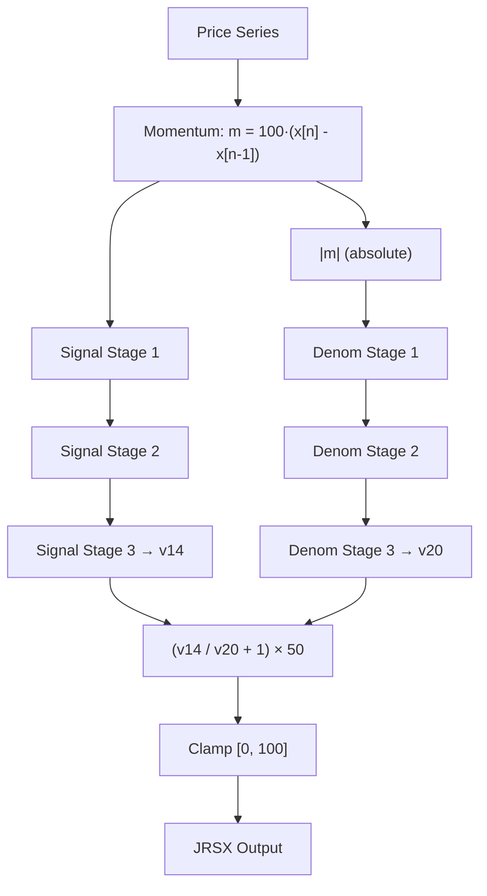

# JRSX — Jurik RSX (Relative Strength eXtended)

## Principle

JRSX is a momentum oscillator occupying the same 0–100 range as RSI, but engineered for significantly less lag and smoother output. Where classic RSI uses a single exponential moving average of gains and losses, JRSX applies **triple-cascaded, lag-compensated EMAs** to both the signed momentum (numerator) and absolute momentum (denominator).

Each cascade stage consists of an EMA pair followed by the extrapolation formula `1.5·fast - 0.5·slow`. This is mathematically equivalent to a Holt linear-trend correction: it estimates where the signal *will be* rather than where it *was*, cancelling first-order lag. Cascading three such stages compounds the lag reduction while preserving smoothness.

## Mathematical Formulas

Given a smoothing length $L$, define the gain:

$$K_g = \frac{3}{L + 2}, \qquad c = 1 - K_g$$

For each bar $n$, the momentum is:

$$m_n = 100 \cdot (x_n - x_{n-1})$$

Each **lag-reduced EMA stage** transforms input $u$ into output $y$ via an internal pair $(a, b)$:

$$
a_n = c \cdot a_{n-1} + K_g \cdot u_n
$$

$$
b_n = K_g \cdot a_n + c \cdot b_{n-1}
$$

$$
y_n = 1.5 \cdot a_n - 0.5 \cdot b_n
$$

The signal path cascades three stages on $m_n$:

$$S_1 = \text{Stage}(m_n), \quad S_2 = \text{Stage}(S_1), \quad S_3 = \text{Stage}(S_2)$$

The denominator path cascades three stages on $|m_n|$:

$$D_1 = \text{Stage}(|m_n|), \quad D_2 = \text{Stage}(D_1), \quad D_3 = \text{Stage}(D_2)$$

Final output:

$$\text{JRSX}_n = \text{clamp}\!\left(\left(\frac{S_3}{D_3} + 1\right) \times 50,\; 0,\; 100\right)$$

## Algorithm

1. Compute gain $K_g = 3/(L+2)$ and complement $c = 1 - K_g$.
2. Wait for a warmup period of $\max(L-1, 5)$ bars of non-constant data before emitting valid output.
3. On each bar after initialization, compute momentum $m = 100 \cdot \Delta\text{price}$.
4. Pass $m$ through three cascaded lag-reduced EMA stages (signal path) to get numerator $v_{14}$.
5. Pass $|m|$ through three cascaded lag-reduced EMA stages (denominator path) to get denominator $v_{20}$.
6. Compute ratio: if $v_{20} \neq 0$, result $= (v_{14}/v_{20} + 1) \times 50$; else $50$.
7. Clamp result to $[0, 100]$.

## Flow Diagram



## Pseudocode

```python
def jrsx(prices, length):
    Kg = 3 / (length + 2)
    c  = 1 - Kg
    warmup = max(length - 1, 5)

    # Six EMA pairs: 3 signal stages + 3 denominator stages
    # Each stage has (fast, slow) accumulators
    sig1_a = sig1_b = 0  # signal stage 1
    sig2_a = sig2_b = 0  # signal stage 2
    sig3_a = sig3_b = 0  # signal stage 3
    den1_a = den1_b = 0  # denom stage 1
    den2_a = den2_b = 0  # denom stage 2
    den3_a = den3_b = 0  # denom stage 3

    for bar in range(1, len(prices)):
        mom = 100 * (prices[bar] - prices[bar - 1])

        # --- Signal path (signed momentum) ---
        sig1_a = c * sig1_a + Kg * mom
        sig1_b = Kg * sig1_a + c * sig1_b
        s1_out = 1.5 * sig1_a - 0.5 * sig1_b

        sig2_a = c * sig2_a + Kg * s1_out
        sig2_b = Kg * sig2_a + c * sig2_b
        s2_out = 1.5 * sig2_a - 0.5 * sig2_b

        sig3_a = c * sig3_a + Kg * s2_out
        sig3_b = Kg * sig3_a + c * sig3_b
        numerator = 1.5 * sig3_a - 0.5 * sig3_b

        # --- Denominator path (absolute momentum) ---
        abs_mom = abs(mom)

        den1_a = c * den1_a + Kg * abs_mom
        den1_b = Kg * den1_a + c * den1_b
        d1_out = 1.5 * den1_a - 0.5 * den1_b

        den2_a = c * den2_a + Kg * d1_out
        den2_b = Kg * den2_a + c * den2_b
        d2_out = 1.5 * den2_a - 0.5 * den2_b

        den3_a = c * den3_a + Kg * d2_out
        den3_b = Kg * den3_a + c * den3_b
        denominator = 1.5 * den3_a - 0.5 * den3_b

        # --- Output ---
        if bar >= warmup and denominator != 0:
            output[bar] = clamp((numerator / denominator + 1) * 50, 0, 100)
```

## Variable Mapping Table

| Obfuscated Name | Readable Name       | Role                                    |
|-----------------|---------------------|-----------------------------------------|
| `f28`           | `sig1_a`            | Signal stage 1 — fast EMA accumulator   |
| `f30`           | `sig1_b`            | Signal stage 1 — slow EMA accumulator   |
| `vC`            | `s1_out`            | Signal stage 1 — lag-reduced output     |
| `f38`           | `sig2_a`            | Signal stage 2 — fast EMA accumulator   |
| `f40`           | `sig2_b`            | Signal stage 2 — slow EMA accumulator   |
| `v10`           | `s2_out`            | Signal stage 2 — lag-reduced output     |
| `f48`           | `sig3_a`            | Signal stage 3 — fast EMA accumulator   |
| `f50`           | `sig3_b`            | Signal stage 3 — slow EMA accumulator   |
| `v14`           | `numerator`         | Signal stage 3 — lag-reduced output     |
| `f58`           | `den1_a`            | Denom stage 1 — fast EMA accumulator    |
| `f60`           | `den1_b`            | Denom stage 1 — slow EMA accumulator    |
| `v18`           | `d1_out`            | Denom stage 1 — lag-reduced output      |
| `f68`           | `den2_a`            | Denom stage 2 — fast EMA accumulator    |
| `f70`           | `den2_b`            | Denom stage 2 — slow EMA accumulator    |
| `v1C`           | `d2_out`            | Denom stage 2 — lag-reduced output      |
| `f78`           | `den3_a`            | Denom stage 3 — fast EMA accumulator    |
| `f80`           | `den3_b`            | Denom stage 3 — slow EMA accumulator    |
| `v20`           | `denominator`       | Denom stage 3 — lag-reduced output      |
| `v8`            | `mom`               | Bar-to-bar momentum (×100)              |
| `Kg`            | `Kg`                | EMA gain factor: 3/(Len+2)             |
