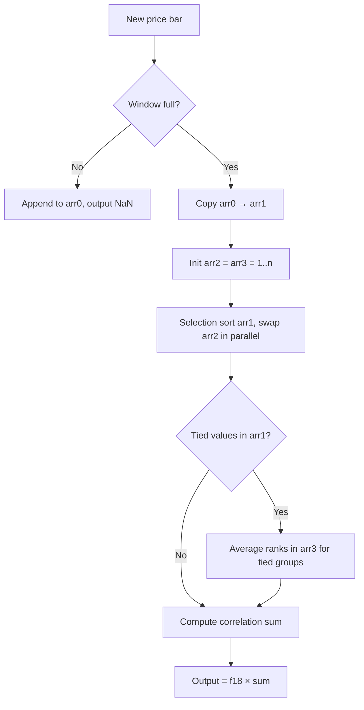

# JTPO — Turning Point Oscillator (Spearman Rank Correlation)

## Principle

Measures trend strength and direction via **Spearman rank correlation** between price ranks and time positions over a rolling window.

- **+1** = perfect uptrend (prices monotonically increasing)
- **-1** = perfect downtrend (prices monotonically decreasing)
- **0** = no monotonic trend

## Mathematical Formulas

**Spearman's rank correlation coefficient:**

$$\rho = \frac{12}{n(n^2 - 1)} \sum_{i=1}^{n} \left( R_{\text{time}}(i) - \frac{n+1}{2} \right) \left( R_{\text{price}}(i) - \frac{n+1}{2} \right)$$

where $n$ = window length (`Len`), $R_{\text{time}}(i)$ = time rank (original position), $R_{\text{price}}(i)$ = price rank (position after sorting).

**Normalization factor:**

$$f_{18} = \frac{12}{n(n-1)(n+1)} = \frac{12}{n(n^2-1)}$$

This ensures output is bounded to $[-1, +1]$.

**Tied-rank handling:**

When consecutive sorted prices are equal, their ranks are replaced by the average rank of the tied group:

$$R_{\text{avg}} = \frac{r_{\text{start}} + r_{\text{end}}}{2}$$

## Algorithm

1. **Initialization**: Wait for `Len` bars of non-constant data before producing output.
2. **Rolling window**: Maintain a circular buffer `arr0` of the last `f48 = Len` prices.
3. **Each bar** (once window is full):
   - Copy `arr0` → `arr1` (working copy for sort)
   - Create `arr2[i] = i` for `i ∈ [1..f48]` — tracks original positions through sort
   - Create `arr3[i] = i` for `i ∈ [1..f48]` — will hold price ranks
   - **Selection sort** `arr1` ascending, swapping `arr2` elements in parallel
   - **Tie correction**: scan sorted `arr1`; for runs of equal values, set corresponding `arr3` entries to the average rank
   - **Correlation sum**: `sum = Σ (arr3[i] - midpoint) * (arr2[i] - midpoint)` where `midpoint = (f48 + 1) / 2`
   - **Output** = `f18 * sum`

## Flow Diagram



## Pseudocode

```
function JTPO(Series, Len):
    f48 = Len
    f18 = 12 / (f48 * (f48 - 1) * (f48 + 1))
    midpoint = (f48 + 1) / 2

    for each new bar:
        append Series to arr0 (rolling window of f48 values)
        if window not full: output NaN; continue

        arr1 = copy of arr0          # prices to sort
        arr2 = [1, 2, ..., f48]      # original position indices
        arr3 = [1, 2, ..., f48]      # ranks (modified for ties)

        # Selection sort ascending
        for i = 1 to f48-1:
            for j = i+1 to f48:
                if arr1[j] < arr1[i]:
                    swap arr1[i], arr1[j]
                    swap arr2[i], arr2[j]

        # Handle tied ranks
        i = 1
        while i <= f48:
            j = i
            while j < f48 and arr1[j+1] == arr1[j]:
                j += 1
            if j > i:
                avg_rank = (i + j) / 2
                for k = i to j:
                    arr3[k] = avg_rank
            i = j + 1

        # Spearman correlation
        sum = 0
        for i = 1 to f48:
            sum += (arr3[i] - midpoint) * (arr2[i] - midpoint)

        output = f18 * sum
```

## Variable Mapping Table

| Decompiled Variable | Role | Description |
|---|---|---|
| `f48` | Window length | `Len` parameter, number of bars in rolling window |
| `f18` | Normalization | `12 / (f48 * (f48-1) * (f48+1))` — Spearman scaling factor |
| `f20` | Midpoint | `(f48 + 1) / 2` — center rank for correlation |
| `f30` | Init flag | Tracks whether valid (non-constant) data has been received |
| `f38` | Bar counter | Counts bars received for warmup |
| `arr0` | Price buffer | Rolling window of last `f48` prices |
| `arr1` | Sort buffer | Working copy of prices for sorting |
| `arr2` | Position tracker | Original positions; after sort, `arr2[i]` = time rank of i-th smallest price |
| `arr3` | Rank array | Price ranks (1..n), adjusted for ties |
| `var6` | Loop index i | Outer loop of selection sort / correlation sum |
| `varA` | Loop index j | Inner loop of selection sort / tie detection |
| `var12` | Tie start | Start index of a tied group |
| `var14` | Tie end | End index of a tied group |
| `var18` | Average rank | Computed average rank for tied group |
| `var1C` | Sum accumulator | Running sum for Spearman correlation |
| `var20` | Temp swap | Temporary variable for swap operations |
| `var24` | Output | Final JTPO value for current bar |
