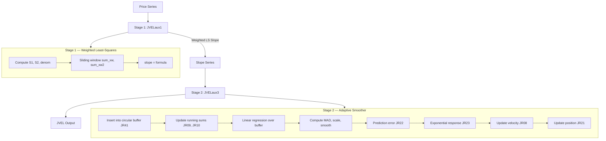

# JVEL — Jurik Velocity

## Principle

Two-stage indicator. Stage 1 extracts a weighted least-squares slope (velocity of price). Stage 2 applies a novel adaptive smoother that uses local linear regression for trend estimation and MAD-normalized exponential response for noise rejection.

## Mathematical Formulas

### Stage 1 — Weighted Least-Squares Slope

Given window size $N = \text{Depth} + 1$ and weights $w_i = N - i$ for $i = 0, \ldots, \text{Depth}$:

$$S_1 = \sum_{i=0}^{\text{Depth}} w_i = \frac{N(N+1)}{2}$$

$$S_2 = \sum_{i=0}^{\text{Depth}} w_i^2 = \frac{S_1 (2N+1)}{3}$$

$$\text{denom} = S_1^3 - S_2^2$$

$$\text{sum\_xw} = \sum_{i=0}^{\text{Depth}} \text{price}[\text{bar} - i] \cdot (N - i)$$

$$\text{sum\_xw2} = \sum_{i=0}^{\text{Depth}} \text{price}[\text{bar} - i] \cdot (N - i)^2$$

$$\text{slope} = \frac{\text{sum\_xw2} \cdot S_1 - \text{sum\_xw} \cdot S_2}{\text{denom}}$$

### Stage 2 — Adaptive Smoother

**Response function:**

$$\text{JR23} = 1 - \exp\!\left(-\frac{|\text{error}|}{\text{MAD} \cdot \text{period}}\right)$$

**Damping coefficient:**

$$\text{damping} = 0.86 - \frac{0.55}{\sqrt{3}}$$

**EMA factor for MAD smoothing:**

$$\text{ema\_factor} = 1 - \exp\!\left(-\frac{\ln 4}{3}\right)$$

**Velocity update:**

$$\text{velocity} = \text{JR23} \cdot \text{error} + \text{velocity} \cdot \text{damping}$$

**Position update:**

$$\text{position} \mathrel{+}= \text{velocity}$$

## Algorithm

### Stage 1 — JVELaux1(Series, Depth)

1. Set $N = \text{Depth} + 1$.
2. Precompute $S_1$, $S_2$, and $\text{denom}$.
3. For each bar from $\text{Depth}$ to end:
   - Compute $\text{sum\_xw}$ and $\text{sum\_xw2}$ over the window.
   - Calculate slope from the formula.
4. Output the slope series.

### Stage 2 — JVELaux3(slope_series)

1. Initialize: period=30, buffer size=100, MAD ring, sums for regression.
2. For each new slope value:
   a. Insert into 100-element circular buffer (JR41).
   b. Update running sums (JR09 = sum of values, JR10 = sum of weighted values).
   c. Grow current_length (JR11) until it reaches buffer_length (JR06=31).
   d. Compute linear regression over the buffer:
      - $\text{slope} = \frac{6(\text{JR10} - \text{midpoint} \cdot \text{JR09})}{\text{denom}}$
      - $\text{intercept} = \text{JR09}/\text{len} - \text{slope} \cdot \text{midpoint}$
   e. Compute MAD from regression line across buffer, scale by $(\text{full\_len}/\text{current\_len})^{0.25}$.
   f. Smooth MAD via EMA: $\text{JR20} += \text{ema\_factor} \cdot (|\text{raw\_mad}| - \text{JR20})$.
   g. Compute prediction error: $\text{JR22} = \text{input} - \text{JR21}$.
   h. Compute response: $\text{JR23} = 1 - \exp(-|\text{JR22}| / (\text{JR20} \cdot \text{period}))$.
   i. Update velocity: $\text{JR08} = \text{JR23} \cdot \text{JR22} + \text{JR08} \cdot \text{damping}$.
   j. Update position: $\text{JR21} += \text{JR08}$.
3. Every 1000 bars: full recomputation of sums to prevent float drift.

## Flow Diagram



## Pseudocode

```
function JVELaux1(series, depth):
    N = depth + 1
    S1 = N*(N+1)/2
    S2 = S1*(2*N+1)/3
    denom = S1^3 - S2^2
    output = array of NaN

    for bar = depth to length(series)-1:
        sum_xw = 0
        sum_xw2 = 0
        for i = 0 to depth:
            w = N - i
            sum_xw += series[bar - i] * w
            sum_xw2 += series[bar - i] * w^2
        output[bar] = (sum_xw2 * S1 - sum_xw * S2) / denom
    return output

function JVELaux3(slope_series):
    period = 30
    damping = 0.86 - 0.55/sqrt(3)
    ema_factor = 1 - exp(-ln(4)/3)
    buffer_length = 31
    buffer = circular_array(100)
    velocity = 0
    position = slope_series[0]
    current_length = 0
    sum_values = 0
    sum_weighted = 0
    smoothed_mad = 0
    output = array of NaN

    for each value in slope_series:
        insert value into buffer
        update sum_values, sum_weighted incrementally
        current_length = min(current_length + 1, buffer_length)

        compute regression slope and intercept from sums
        compute MAD over buffer, scale by (buffer_length/current_length)^0.25
        smoothed_mad += ema_factor * (|raw_mad| - smoothed_mad)

        error = value - position
        response = 1 - exp(-|error| / (smoothed_mad * period))
        velocity = response * error + velocity * damping
        position += velocity
        output[bar] = position

        if bar mod 1000 == 0: recompute sums from scratch
    return output
```

## Variable Mapping Table

### Stage 1

| Original | Descriptive Name | Description |
|----------|-----------------|-------------|
| jrc01 | series | Input price series |
| jrc02 | depth | Lookback parameter |
| jrc04 | window_size | N = depth + 1 |
| jrc05 | sum_weights | S1 = N*(N+1)/2 |
| jrc06 | sum_weights_sq | S2 = S1*(2*N+1)/3 |
| jrc07 | denominator | S1^3 - S2^2 |
| jrc08 | sum_xw | Σ(price * weight) |
| jrc09 | sum_xw2 | Σ(price * weight²) |
| jrc10 | loop_index | Loop counter i |

### Stage 2

| Original | Descriptive Name | Description |
|----------|-----------------|-------------|
| JR01 | internal_period | Fixed period = 30 |
| JR02 | epsilon | Small constant = 0.0001 |
| JR03 | response_period | = 3 |
| JR04 | damping | 0.86 - 0.55/√3 |
| JR05 | ema_factor | 1 - exp(-ln4/3) |
| JR06 | buffer_length | 31 |
| JR07 | init_slope_lookback | 3 |
| JR08 | velocity | Adaptive velocity accumulator |
| JR09 | sum_values | Running sum of buffer values |
| JR10 | sum_weighted | Running sum of position-weighted values |
| JR11 | current_length | Current active buffer length |
| JR12 | regression_denom | Denominator for regression |
| JR13 | midpoint | (current_length - 1) / 2 |
| JR14 | half_span | (current_length - 1) / 2.0 |
| JR15 | loop_var | Loop variable |
| JR16 | regression_slope | Slope from buffer regression |
| JR17 | regression_value | Predicted value on regression line |
| JR18 | mad_ring_index | Index into MAD circular buffer |
| JR19 | sum_abs_dev | Sum of absolute deviations |
| JR20 | smoothed_mad | EMA-smoothed MAD |
| JR21 | output_position | Adaptive output position |
| JR22 | prediction_error | Input minus current position |
| JR23 | response_factor | Exponential response magnitude |
| JR24 | circular_index | Current index in circular buffer |
| JR25 | buffer_head | Head pointer for circular buffer |
| JR26 | start_bar | First valid bar index |
| JR27 | current_bar | Current bar counter |
| JR28 | init_const_count | Initialization constant count |
| JR29 | loop | General loop variable |
| JR40 | mad_ring | Circular buffer for MAD computation |
| JR41 | value_buffer | 100-element circular buffer for values |
