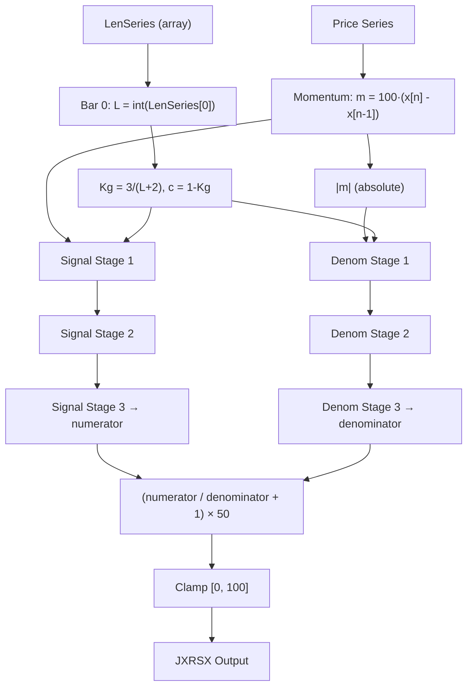

# JXRSX — Extended RSX (Series-Length Input)

## Principle

Same algorithm as JRSX but accepts a length *series* instead of a scalar integer. In practice, only the first bar's length value (index 0) is used for the EMA gain Kg. This enables wrappers like JARSX to dynamically select the length via a pre-computed series, even though the RSX core uses a fixed Kg throughout.

The "extended" aspect is purely an API difference: the function signature accepts `LenSeries[Bar]` (a per-bar array), but internally only reads `LenSeries[0]` during initialization to compute `Kg = 3 / (int(LenSeries[0]) + 2)`.

## Mathematical Formulas (same as JRSX)

Given the length from bar 0, $L_0 = \text{int}(\texttt{LenSeries}[0])$:

$$K_g = \frac{3}{L_0 + 2}, \qquad c = 1 - K_g$$

For each bar $n$, momentum:

$$m_n = 100 \cdot (x_n - x_{n-1})$$

Each **lag-reduced EMA stage** (identical to JRSX):

$$a_n = c \cdot a_{n-1} + K_g \cdot u_n$$
$$b_n = K_g \cdot a_n + c \cdot b_{n-1}$$
$$y_n = 1.5 \cdot a_n - 0.5 \cdot b_n$$

Signal path: three cascaded stages on $m_n$.
Denominator path: three cascaded stages on $|m_n|$.

Final output:

$$\text{JXRSX}_n = \text{clamp}\!\left(\left(\frac{S_3}{D_3} + 1\right) \times 50,\; 0,\; 100\right)$$

## Algorithm Differences from JRSX

| Aspect | JRSX | JXRSX |
|--------|------|-------|
| Length parameter | Scalar `int` | Series `np.ndarray` |
| Kg computation | `3 / (length + 2)` | `3 / (int(length_series[0]) + 2)` |
| Warmup | `max(length - 1, 5)` | `max(int(length_series[0]) - 1, 5)` |
| Core algorithm | Identical | Identical |
| Per-bar Kg update | N/A | **None** — Kg is fixed from bar 0 |

The only code difference is that the length is read from `length_series[0]` instead of a scalar parameter. All subsequent processing is identical to JRSX.

## Flow Diagram



## Pseudocode

```python
def jxrsx(prices, length_series):
    # Only bar 0's length is used
    L = int(length_series[0])
    Kg = 3 / (L + 2)
    c  = 1 - Kg
    warmup = max(L - 1, 5)

    # Six EMA pairs: 3 signal stages + 3 denominator stages
    sig1_a = sig1_b = 0
    sig2_a = sig2_b = 0
    sig3_a = sig3_b = 0
    den1_a = den1_b = 0
    den2_a = den2_b = 0
    den3_a = den3_b = 0

    for bar in range(1, len(prices)):
        mom = 100 * (prices[bar] - prices[bar - 1])

        # --- Signal path (signed momentum) ---
        sig1_a = c * sig1_a + Kg * mom
        sig1_b = Kg * sig1_a + c * sig1_b
        s1_out = 1.5 * sig1_a - 0.5 * sig1_b

        sig2_a = c * sig2_a + Kg * s1_out
        sig2_b = Kg * sig2_a + c * sig2_b
        s2_out = 1.5 * sig2_a - 0.5 * sig2_b

        sig3_a = c * sig3_a + Kg * s2_out
        sig3_b = Kg * sig3_a + c * sig3_b
        numerator = 1.5 * sig3_a - 0.5 * sig3_b

        # --- Denominator path (absolute momentum) ---
        abs_mom = abs(mom)

        den1_a = c * den1_a + Kg * abs_mom
        den1_b = Kg * den1_a + c * den1_b
        d1_out = 1.5 * den1_a - 0.5 * den1_b

        den2_a = c * den2_a + Kg * d1_out
        den2_b = Kg * den2_a + c * den2_b
        d2_out = 1.5 * den2_a - 0.5 * den2_b

        den3_a = c * den3_a + Kg * d2_out
        den3_b = Kg * den3_a + c * den3_b
        denominator = 1.5 * den3_a - 0.5 * den3_b

        # --- Output ---
        if bar >= warmup and denominator != 0:
            output[bar] = clamp((numerator / denominator + 1) * 50, 0, 100)
```

## Variable Mapping (same as JRSX)

| Obfuscated Name | Readable Name       | Role                                    |
|-----------------|---------------------|-----------------------------------------|
| `@LenSeries[Bar]` | `length_series[0]` | Length read at bar 0 only (series input) |
| `f18` / `f20`   | `Kg` / `c`          | EMA gain and complement (set at bar 0)  |
| `f28`           | `sig1_a`            | Signal stage 1 — fast EMA accumulator   |
| `f30`           | `sig1_b`            | Signal stage 1 — slow EMA accumulator   |
| `vC`            | `s1_out`            | Signal stage 1 — lag-reduced output     |
| `f38`           | `sig2_a`            | Signal stage 2 — fast EMA accumulator   |
| `f40`           | `sig2_b`            | Signal stage 2 — slow EMA accumulator   |
| `v10`           | `s2_out`            | Signal stage 2 — lag-reduced output     |
| `f48`           | `sig3_a`            | Signal stage 3 — fast EMA accumulator   |
| `f50`           | `sig3_b`            | Signal stage 3 — slow EMA accumulator   |
| `v14`           | `numerator`         | Signal stage 3 — lag-reduced output     |
| `f58`           | `den1_a`            | Denom stage 1 — fast EMA accumulator    |
| `f60`           | `den1_b`            | Denom stage 1 — slow EMA accumulator    |
| `v18`           | `d1_out`            | Denom stage 1 — lag-reduced output      |
| `f68`           | `den2_a`            | Denom stage 2 — fast EMA accumulator    |
| `f70`           | `den2_b`            | Denom stage 2 — slow EMA accumulator    |
| `v1C`           | `d2_out`            | Denom stage 2 — lag-reduced output      |
| `f78`           | `den3_a`            | Denom stage 3 — fast EMA accumulator    |
| `f80`           | `den3_b`            | Denom stage 3 — slow EMA accumulator    |
| `v20`           | `denominator`       | Denom stage 3 — lag-reduced output      |
| `f88`           | `warmup`            | Warmup counter (set from bar 0 length)  |
| `f90`           | (init flag)         | 0 on first bar, 1 thereafter            |
