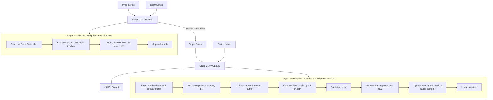

# JXVEL — Extended VEL (Series-Depth + Explicit Period)

## Principle

Same two-stage architecture as JVEL but with per-bar adaptive depth in Stage 1 and configurable smoother period in Stage 2. Stage 1 reads a depth *series* so the WLS window size changes on every bar. Stage 2 accepts an explicit `Period` parameter (float) that controls the smoother's response characteristics, buffer usage, and MAD scaling.

## Mathematical Formulas

### Stage 1 — Per-Bar Weighted Least-Squares Slope

On each bar $b$, compute $D_b = \lceil \text{DepthSeries}[b] \rceil$ and set $N_b = D_b + 1$:

$$S_1^{(b)} = \frac{N_b(N_b+1)}{2}$$

$$S_2^{(b)} = \frac{S_1^{(b)}(2N_b+1)}{3}$$

$$\text{denom}^{(b)} = \left(S_1^{(b)}\right)^3 - \left(S_2^{(b)}\right)^2$$

$$\text{sum\_xw} = \sum_{i=0}^{D_b} \text{price}[b - i] \cdot (N_b - i)$$

$$\text{sum\_xw2} = \sum_{i=0}^{D_b} \text{price}[b - i] \cdot (N_b - i)^2$$

$$\text{slope}[b] = \frac{\text{sum\_xw2} \cdot S_1^{(b)} - \text{sum\_xw} \cdot S_2^{(b)}}{\text{denom}^{(b)}}$$

### Stage 2 — Adaptive Smoother with Explicit Period

**Key constants (differ from JVEL):**

$$\text{jrc03} = \min(500,\; \max(\epsilon,\; \text{Period}))$$

$$\text{jrc06} = \max(31,\; \lceil 2 \cdot \text{Period} \rceil) \quad \text{(buffer usage length)}$$

$$\text{jrc07} = \min(30,\; \lceil \text{Period} \rceil) \quad \text{(initial slope lookback)}$$

$$\text{ema\_factor} = 1 - \exp\!\left(-\frac{\ln 4}{\text{Period} / 2}\right) \quad \text{(note: Period/2 vs JVEL's fixed 3)}$$

**MAD scaling:**

$$\text{scaled\_mad} = 1.2 \cdot \text{raw\_mad} \cdot \left(\frac{\text{jrc06}}{\text{current\_length}}\right)^{0.25}$$

**Response function:**

$$\text{response} = 1 - \exp\!\left(-\frac{|\text{error}|}{\text{smoothed\_mad} \cdot \text{jrc03}}\right)$$

**Damping coefficient:**

$$\text{damping} = 0.86 - \frac{0.55}{\sqrt{\text{jrc03}}}$$

**Velocity and position updates (same form as JVEL):**

$$\text{velocity} = \text{response} \cdot \text{error} + \text{velocity} \cdot \text{damping}$$

$$\text{position} \mathrel{+}= \text{velocity}$$

## Algorithm (Differences from JVEL highlighted)

### Stage 1 — JXVELaux1(Series, DepthSeries)

1. For each bar $b$:
   - **[DIFF]** Read $D_b = \lceil \text{DepthSeries}[b] \rceil$ (per-bar, not fixed).
   - Set $N_b = D_b + 1$; compute $S_1$, $S_2$, $\text{denom}$ fresh for this bar.
   - If $b < D_b$ or $\text{denom} = 0$: output NaN.
   - Otherwise compute WLS slope over the window $[b - D_b, b]$.

### Stage 2 — JXVELaux3(slope_series, Period)

1. **[DIFF]** Clamp Period: $\text{jrc03} = \min(500, \max(\epsilon, \text{Period}))$.
2. **[DIFF]** Buffer size = 1001 (vs 100 in JVEL).
3. **[DIFF]** Buffer usage length: $\text{jrc06} = \max(31, \lceil 2 \cdot \text{Period} \rceil)$.
4. **[DIFF]** Initial slope lookback: $\text{jrc07} = \min(30, \lceil \text{Period} \rceil)$.
5. **[DIFF]** EMA factor: $1 - \exp(-\ln 4 / (\text{Period}/2))$.
6. **[DIFF]** Damping: $0.86 - 0.55 / \sqrt{\text{jrc03}}$.
7. For each value in slope_series:
   a. Insert into circular buffer.
   b. **[DIFF]** Full recomputation of sums every bar (no incremental + periodic refresh).
   c. Compute linear regression over buffer.
   d. Compute MAD, **[DIFF]** scale by $1.2 \cdot (\text{jrc06}/\text{len})^{0.25}$.
   e. Smooth MAD via EMA.
   f. Compute prediction error, response, velocity, position.
   g. Output position.

## Flow Diagram



## Pseudocode

```
function JXVELaux1(series, depth_series):
    output = array of NaN

    for bar = 0 to length(series)-1:
        D = ceil(depth_series[bar])
        if bar < D: continue
        N = D + 1
        S1 = N*(N+1)/2
        S2 = S1*(2*N+1)/3
        denom = S1^3 - S2^2
        if denom == 0: continue

        sum_xw = 0
        sum_xw2 = 0
        for i = 0 to D:
            w = N - i
            sum_xw += series[bar - i] * w
            sum_xw2 += series[bar - i] * w^2
        output[bar] = (sum_xw2 * S1 - sum_xw * S2) / denom
    return output

function JXVELaux3(slope_series, Period):
    epsilon = 0.0001
    jrc03 = min(500, max(epsilon, Period))
    buffer_size = 1001
    jrc06 = max(31, ceil(2 * Period))          # buffer usage length
    jrc07 = min(30, ceil(Period))              # initial slope lookback
    ema_factor = 1 - exp(-ln(4) / (Period/2)) # MAD EMA factor
    damping = 0.86 - 0.55 / sqrt(jrc03)

    buffer = circular_array(buffer_size)
    velocity = 0
    position = first valid value
    current_length = 0
    smoothed_mad = 0
    output = array of NaN

    for each value in slope_series:
        insert value into buffer
        current_length = min(current_length + 1, jrc06)

        # Full recomputation every bar (no incremental optimization)
        sum_values = 0
        sum_weighted = 0
        for k = 0 to current_length-1:
            idx = (buffer_head - current_length + k) mod buffer_size
            sum_values += buffer[idx]
            sum_weighted += buffer[idx] * k

        # Linear regression
        midpoint = (current_length - 1) / 2
        sum_x_sq = current_length * (current_length-1) * (2*current_length-1) / 6
        reg_denom = sum_x_sq - current_length * midpoint^2
        slope = (sum_weighted - midpoint * sum_values) / reg_denom
        intercept = sum_values / current_length - slope * midpoint

        # MAD
        raw_mad = 0
        for k = 0 to current_length-1:
            predicted = intercept + slope * k
            raw_mad += |buffer[k] - predicted|
        raw_mad = raw_mad / current_length
        raw_mad *= 1.2 * (jrc06 / current_length)^0.25

        # Smooth MAD
        if bar_count <= jrc07 + 1:
            smoothed_mad = raw_mad
        else:
            smoothed_mad += ema_factor * (raw_mad - smoothed_mad)

        # Adaptive update
        error = value - position
        if smoothed_mad * jrc03 < epsilon:
            response = 1.0
        else:
            response = 1 - exp(-|error| / (smoothed_mad * jrc03))
        velocity = response * error + velocity * damping
        position += velocity
        output[bar] = position

    return output

function JXVEL(series, depth_series, Period):
    slopes = JXVELaux1(series, depth_series)
    return JXVELaux3(slopes, Period)
```

## Variable Mapping

### Stage 1 (same structure as JVEL, but per-bar recomputation)

| Original | Descriptive Name | Description |
|----------|-----------------|-------------|
| jrc01 | series | Input price series |
| jrc02 | depth_series | Per-bar depth series (float, ceiled) |
| jrc04 | window_size | N = ceil(depth_series[bar]) + 1 (varies per bar) |
| jrc05 | sum_weights | S1 = N*(N+1)/2 (recomputed each bar) |
| jrc06 | sum_weights_sq | S2 = S1*(2*N+1)/3 (recomputed each bar) |
| jrc07 | denominator | S1^3 - S2^2 (recomputed each bar) |
| jrc08 | sum_xw | Sum(price * weight) |
| jrc09 | sum_xw2 | Sum(price * weight^2) |

### Stage 2

| Original | Descriptive Name | Description |
|----------|-----------------|-------------|
| jrc01 | slope_series | Input (slope series from Stage 1) |
| jrc02 | Period_param | Explicit Period parameter (float) |
| jrc03 | clamped_period | min(500, max(epsilon, Period)) |
| JR02 | epsilon | Small constant = 0.0001 |
| JR04 | damping | 0.86 - 0.55/sqrt(jrc03) |
| JR05 | ema_factor | 1 - exp(-ln4 / (Period/2)) |
| JR06 | buffer_length | max(31, ceil(2*Period)) — buffer usage length |
| JR07 | init_slope_lookback | min(30, ceil(Period)) |
| JR08 | velocity | Adaptive velocity accumulator |
| JR09 | sum_values | Sum of buffer values (recomputed each bar) |
| JR10 | sum_weighted | Sum of position-weighted values (recomputed each bar) |
| JR11 | current_length | Current active buffer length (grows to JR06) |
| JR12 | regression_denom | Denominator for regression |
| JR13 | midpoint | (current_length - 1) / 2 |
| JR16 | regression_slope | Slope from buffer regression |
| JR19 | sum_abs_dev | Sum of absolute deviations |
| JR20 | smoothed_mad | EMA-smoothed MAD (scaled by 1.2) |
| JR21 | output_position | Adaptive output position |
| JR22 | prediction_error | Input minus current position |
| JR23 | response_factor | Exponential response magnitude |
| JR25 | buffer_head | Head pointer for circular buffer |
| JR27 | bar_count | Current bar counter |
| JR41 | value_buffer | 1001-element circular buffer |
