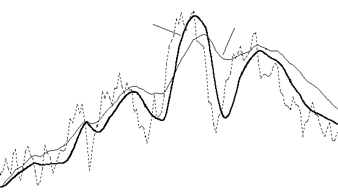
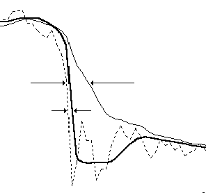
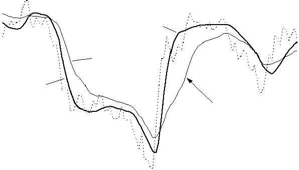
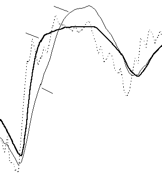
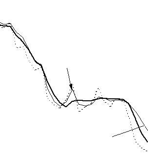
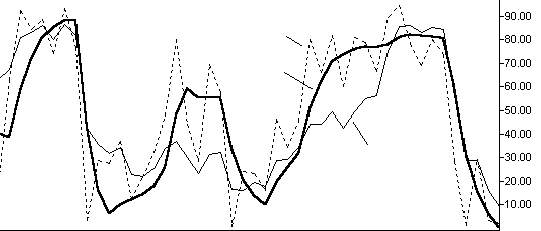
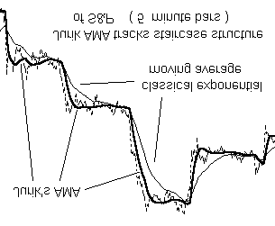
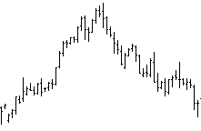
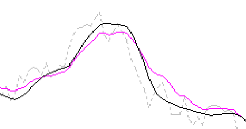

# JMA — Jurik Moving Average

## User's Guide

**Add-In Tool for Omega Research Software**
*(Omega Research TradeStation / SuperCharts 4 or TradeStation / ProSuite 2000)*

© 1998-1999 Jurik Research and Consulting, Aurora, CO — www.jurikres.com

Source: `JMA.PDF` from TradeStation 2000i distribution disk.

## BibTeX

```bibtex
@manual{jurik1999jma_ts,
  author       = {Jurik, Mark},
  title        = {{JMA} --- Jurik Moving Average: User's Guide},
  year         = {1999},
  organization = {Jurik Research and Consulting},
  address      = {Aurora, CO},
  note         = {Add-in tool for Omega Research TradeStation / SuperCharts 4 / TradeStation 2000i}
}
```

---

## Table of Contents

- [License Agreement](#license-agreement)
- [Installation Instructions](#installation-instructions)
  - [Step 1: Installation](#step-1-installation)
  - [Step 2: Transfer / Import](#step-2-transfer--import)
- [Important Notice to TS2000 Users](#important-notice-to-tradestation--prosuite-2000-users)
- [Executive Summary](#executive-summary)
- [Why Use JMA?](#why-use-jma)
  - [Benchmark #1: Accuracy](#benchmark-1-accuracy)
  - [Benchmark #2: Timeliness](#benchmark-2-timeliness)
  - [Benchmark #3: Overshoot](#benchmark-3-overshoot)
  - [Benchmark #4: Smoothness](#benchmark-4-smoothness)
  - [Comparing JMA to VIDYA](#comparing-jma-to-vidya)
- [User Guide](#user-guide)
- [Demonstrations](#demonstrations)
  - [Demo #1: Comparing Moving Averages](#demo-1-comparing-moving-averages)
  - [Demo #2: Controlling Lag with PHASE](#demo-2-controlling-lag-with-phase)
  - [Demo #3: Threshold MACD Trading System](#demo-3-threshold-macd-trading-system)
  - [Demo #4: Reverse MACD Trading System](#demo-4-reverse-macd-trading-system)
  - [Demo #5: Enhancing Other Technical Indicators](#demo-5-enhancing-other-technical-indicators)
  - [Demo #6: Reverse RSX Trading System](#demo-6-reverse-rsx-trading-system)
  - [Demo #7: Threshold RSX Trading System](#demo-7-threshold-rsx-trading-system)
- [Bug Bounty & Anti-Piracy](#bug-bounty--anti-piracy)
- [Risk & Liability](#risk--liability)

---

## License Agreement

Jurik Research & Consulting ("JRC") grants you a non-exclusive license to use the accompanying software documentation ("Documentation") in the manner described as follows:

1. **LICENSE GRANT.** As licensor, JRC grants to you, and you accept, a non-exclusive license to use the enclosed Documentation, only as authorized in this agreement.

2. **COPYRIGHT.** This Document is copyrighted and protected by both United States copyright law and international treaty provisions. All rights are reserved. You may not permit other individuals to use the Documentation except under the terms in this agreement. No part of the Documentation may be reproduced or transmitted in any form or by any means, for any purpose other than the purchaser's personal use without the written permission of JRC. You may not remove any proprietary notices or labels on the Documentation. You may print this document only for your personal use.

3. **LIMITED WARRANTY.** Information in the Documentation is subject to change without notice and does not represent a commitment on the part of JRC. The user's sole remedy, in the event a typographical or other error is found in the Documentation within the warranty period, is that JRC will replace the documentation. The above express warranty is the only warranty made by JRC. It is in lieu of any other warranties, whether expressed or implied, including, but not limited to, any implied warranty of merchantability of fitness for a particular purpose.

4. **LIMITATION OF LIABILITY.** The user agrees to assume the entire risk of using the software described by the Documentation. In no event shall JRC be liable for any indirect, incidental, consequential, special or exemplary damages or other damages, regardless of type. JRC's total liability to you or any other party for any loss or damages resulting from any claims, demands or actions arising out of or related to this agreement shall not exceed the license fee paid to JRC for use of the software described by the Documentation.

5. **TITLE.** You acquire no right, title or interest in or to the Documentation. Title, ownership rights, and intellectual property rights shall remain in Jurik Research and/or its respective suppliers.

6. **GOVERNING LAW.** The license agreement shall be construed and governed in accordance with the laws of the State of Colorado.

---

## Installation Instructions

The software accompanying this manual is designed to be used inside Omega Research's TradeStation 4, SuperCharts 4, TradeStation 2000 or ProSuite 2000.

Getting Jurik's tools into an Omega Research software application is a 2-step process:

- **INSTALLATION:** to create .ELA or .ELS files containing the Jurik modules.
- **TRANSFER:** to move the modules into your Omega Research software product.

### Step 1: Installation

1. The name of the installation software is `JRSACT_2.EXE`
2. If you HAVE received a password from Jurik Research (on a colored sheet of paper that came with this software), then SKIP THIS STEP and proceed to step #3. Otherwise, using Windows' Explorer (or File Manager), double-click or run the installer program `JRSACT_2.EXE`. If you have TradeStation 4 or SuperCharts 4, enter your Omega security block number if you have one. (SuperCharts end-of-day users probably have no security block number so they should leave the field blank.) If you have TradeStation 2000 or ProSuite 2000, enter your Omega Research Customer ID number. Working through, select all the Jurik tools you currently have license to use. Eventually the program will give you an identification code. To receive your activation password from us, e-mail to: nfs@nfsmith.net, or call 323-258-4860 or fax 323-258-0598, and tell us your name, phone number, the platform you are installing to (TS4, SC4, TS2000, PS2000) and the identification code. After receiving your password, proceed to step #3.
3. Close your Omega Research software application (SuperCharts, TradeStation or ProSuite). Leaving it open may interfere with the installation process. You do NOT need to shut down the data server.
4. Using Windows' Explorer (or File Manager), double-click or run `JRSACT_2.EXE`. Enter your Omega security block number or Customer ID number, if applicable. Also enter your password. Click OK. Select all and only those tools you currently have license to use, otherwise the password will not be accepted. Click OK. Follow other instructions on screen.
5. At this point, all the Jurik tools (eg. JMA, VEL, CFB, WAV, DDR, RSX) you currently have license to use were placed as Easy Language files on your hard drive. The next page shows how to transfer (import) them into your Omega software product.

### Step 2: Transfer / Import

#### Transferring to TradeStation 4.0 / SuperCharts 4.0

1. Run `TOOLS / VERIFY_ALL` to ensure all linkages are correct.
2. Using either QuickEditor or PowerEditor, use the `FILE / OPEN` command to bring up a dialog box, then press the TRANSFER button.
3. Select "Transfer .... FROM Easy Language Archive File" and press the OK button.
4. Transfer in JMA, whose default filepath is `C:\JRSOMEGA\EASYLANG\JRC_JMA.ELA`. Enter the filepath and press OK.
5. Select "Transfer All" and press OK. All JMA related tools will be automatically transferred.
6. Do not assume all transferred modules were properly verified. Execute `TOOLS \ VERIFY_ALL` to ensure all linkages are correct.

#### Importing to TradeStation 2000 / ProSuite 2000

1. Using the PowerEditor, execute `FILES \ VERIFY_ALL` to ensure all linkages are correct.
2. Execute the `FILE \ IMPORT_and_EXPORT` command.
3. Select "Import Easy Language Archive Files" to import .ELS files. Press the OK button.
4. Import JMA, whose default filepath is `C:\JRSOMEGA\EASYLANG\JMA.ELS`. Enter the filepath or use the browser to find it. Make sure you select to import all studies contained within the ELS file. Press OK.
5. During importation, it may want to load the same function several times, so you may repeatedly see a dialog box asking if you want to overwrite an already existing module. To speed up the import process, select "YES TO ALL".
6. Do not assume all the imported modules were properly verified. Execute the command `FILES \ VERIFY ALL` to ensure all linkages are correct.

---

## Important Notice to TradeStation / ProSuite 2000 Users

### Incompatibility

TradeStation 2000 and ProSuite 2000 (hereafter referred to as "TS2000") are 32-bit programs, which makes them completely different than TradeStation 4 and SuperCharts 4 (hereafter referred to as "TS4/SC4"), which are 16-bit programs. Consequently, the Jurik modules designed for TS4/SC4 are not compatible with TS2000. To get Jurik modules for TS2000, you must run the installer and designate that platform.

### Expanded Names

Easy Language studies (functions, indicators and systems) will include during transfers (imports & exports) all functions required to make them work. Therefore, any studies that you import to TS2000 that were developed in TS4/SC4 will also transfer with them any Jurik functions that they utilize. Because these functions are not compatible with TS2000 (see incompatibility notice above), it is imperative that they not overwrite the Jurik modules already installed in TS2000.

To accomplish this, the names of all Jurik functions, indicators and systems for TS2000 have been expanded to include the suffix "2k". For example, if this user manual refers to a function named `JRC.JMA`, its expanded name for TS2000 is `JRC.JMA.2k`

You will need to modify any studies you transferred in from TS4/SC4 so that they will now include the ".2k" suffix on the names of all Jurik functions that they utilize.

---

## Executive Summary

*Brief instructions for those who don't read user manuals*

Use the JRC JMA indicator just as if it were an exponential moving average. It uses a proprietary user function, called `JRC.JMA`. You can code your own Easy Language modules to employ the user function as follows:

```easylanguage
value1 = JRC.JMA ( SERIES , LENGTH , PHASE )
```

**SERIES** is the series to be filtered, such as the daily closing price. To use closing prices, replace "SERIES" in the above expression with "close". This input series can also be any QuickEditor expression that produces a series. For example, "SERIES" could be replaced by `7+RSI (close, 14)`.

**LENGTH** determines the degree of smoothness and it can be any positive value. Small values make the moving average respond rapidly to price change and larger values produce smoother, flatter curves. Typical values for LENGTH range from 5 to 80. You can even use decimal numbers, such as 28.3.

**PHASE** affects the amount of lag (delay). PHASE ranges from -100 (max lag) to +100 (min lag). Its default value is 0.

> **NOTE:** lower lag tends to produce larger overshoot during price gaps, so you need to consider the trade-off between lag and overshoot and select a value for PHASE that balances your trading system's needs.

### Dynamic Inputs with JRC.JMA.flex

There may be times when you want to dynamically alter the inputs to JMA on a bar-to-bar basis. As such, you would create new variables and feed their values to JMA. For this purpose, we have a special version of JMA, called `JRC.JMA.flex`. In the following example, all three input values are calculated just prior to feeding JMA:

```easylanguage
series = close + 0.5 * stdev ( high , 10 ) ;
length = 35 + RSI ( close , 13 ) ;
phase = momentum ( high , 10 ) ;
result = JRC.JMA.flex ( series , length , phase ) ;
```

> **NOTE:** Although `JRC.JMA.flex` has this advantage over `JRC.JMA`, it also has two important disadvantages. Both are directly the result of the properties of type SIMPLE user functions in Easy Language.

**Disadvantage 1:** `JRC.JMA.flex` does not produce a time series. Consequently, you cannot reference past values of it directly. However, you can do so indirectly by referring its output to a variable and then seeking past values of that variable.

```easylanguage
{ INVALID EXPRESSION: }
result = JRC.JMA.flex (series,length,phase)[7] ;

{ VALID EXPRESSION: }
value1 = JRC.JMA.flex (series,length,phase) ;
result = value1[7] ;
```

> Note: This method of referencing past values of variables is not permitted inside type-SIMPLE user functions.

**Disadvantage 2:** `JRC.JMA.flex` is not automatically evaluated on every bar. You must control when it gets evaluated. This can be advantageous. For instance, you can take a moving average of only Tuesday's closing prices when using a daily chart, by writing code so that JMA is called only on Tuesdays:

```easylanguage
if (DateOfWeek(Date) = 2) then result = JRC.JMA.flex (close,length,phase) ;
```

---

## Why Use JMA?

**The SMART MOVING AVERAGE by Jurik Research**

Daily prices produce a time series with some amount of random fluctuations. To remove this noise, market technicians typically use moving average (MA) filters. Only JMA excels in all four benchmarks of a truly great filter...

### Benchmark #1: Accuracy

Moving Average (MA) filters have an adjustable parameter that controls its speed. Speed governs two opposing properties of a filter: smoothness (lack of random zigzagging) and accuracy (closeness to the original data). That is, the smoother a filter becomes, the less it accurately resembles the original time series.

The financial investor tries to apply just enough smoothness to filter out noise without removing important structure in price activity. For example, in the chart below, the popular Double Exponential Moving Average (DEMA) is just as smooth as JMA yet DEMA fails to track large scale structure (the big cycles). On the other hand, JMA follows the cyclic action very well.



### Benchmark #2: Timeliness

Most MA filters have another problem: they lag behind the original time series. This is a critical issue because excessive delay and late trades may reduce profits significantly.

Ideally, you would like a filtered signal to be both smooth and lag free. For many types of moving average filters, including the three classics (simple, weighted, and exponential), greater smoothness produces greater lag. In the chart below, price action is the dotted line. The exponential moving average, EMA, lags well behind JMA (thick solid line).



Adaptive filters developed by others, such as the Kaufman and Chande AMA, will also lag well behind your time series. Kaufman's Moving Average (KMA) is an exponential moving average whose speed is governed by the "efficiency" of price movement. For example, fast moving price with little retracement (a strong trend) is considered very efficient and the KMA will automatically speed up to prevent excessive lag. This interesting concept sometimes works well, sometimes not.



The advantage in avoiding lag is readily apparent in the chart below. Here we see how JMA enhances the timing of a simple crossover oscillator. The top half shows crude oil closing prices tracked by two JMA filters of different speed. The bottom half uses two EMA (exponential moving average) filters. The oscillator becomes positive when the curve of the faster filter crosses over the slower one, suggesting a "buy" signal.

Note that JMA's crossovers are 15 and 18 days earlier! Can you afford to be 15 days late?

### Benchmark #3: Overshoot

Many trading systems set triggers to buy or sell when price reaches a certain threshold level. Because there is an inherent amount of noise in price action, the typical approach is to trigger when a moving average crosses the threshold. The smoothed line has less noise and is less likely to produce false alarms.

To do this right, you'll need an exceptional moving average indicator. Common versions lag too much and many sophisticated designs, like the Kalman or Butterworth filter, tend to overshoot during price reversals. Overshoots create false impressions of prices having reached levels it never truly did.



### Benchmark #4: Smoothness

The most important property of a noise reduction filter is how well it removes noise, as measured by its smoothness.

In the chart below, EMA and JMA filters are run across closing prices. Note how much the Fast EMA jumps up and down while JMA glides smoothly through the data. Clearly JMA reveals the noise-free underlying price more accurately.

If you try reducing EMA's erratic hopping by making it slower, you will discover its lag will become larger, producing late trade signals.

If you need a 2-bar momentum indicator, you could take the difference between two values along the EMA time series and produce a jagged line. This is in contrast to the much smoother momentum signal based on JMA. Imagine how many bad trades could be eliminated with this simple substitution!



### Comparing JMA to VIDYA

Moving averages should have consistent behavior. Some do not. For example, Chande's VIDYA is an exponential moving average whose speed is governed by the variance of price movement. Fast moving price has large variance which will eventually cause VIDYA to automatically speed up (in an attempt to prevent excessive lag). This concept sometimes works well, sometimes not.

In the chart below, JMA is the thick solid line and VIDYA is the thin solid line. Both perform approximately the same for the first 1/3 of the series. But due to the high volatility during the downward trend, VIDYA becomes hyperactive and fast tracks the choppy waves during the congestion phase. Smoothing is lost. In contrast, JMA cuts right through with a smooth horizontal line. The decrease in signal volatility soon causes VIDYA to slow down too much, as it lags behind JMA during the next downward price trend.



### JMA Enhances Technical Indicators

JMA resolves the riddle of how to get both smoothness and accuracy simultaneously, even with technical indicators! The chart below compares the Fast %K indicator (dotted line) and two smoothed versions: one produced by the classic Slow %D (thin solid line) and the other produced by smoothing Fast %K with JMA (thick solid line). Clearly, JMA is both smoother and more accurate than slow %D!

JMA can also track price gaps produced by INTRA-DAY data — it jumps to the next day's price levels while the classical exponential moving average lags behind.



---

## User Guide

### For Use in TradeStation and SuperCharts Power Editor

After installing JMA, the indicator `JRC JMA` is ready for use. You may use it the same way as you would use the exponential moving average indicator. The indicator `JRC JMA` consists of the following Easy Language code:

```easylanguage
INPUTS: PRICE(CLOSE), LENGTH(8), PHASE(0) ;
VARS: JMAplot(0);

JMAplot = JRC.JMA(PRICE, LENGTH, PHASE);
PLOT1(JMAplot,"JRC JMA");
```

The first line of code says the indicator requires 3 input parameters:

- **PRICE** — defines the time series to be smoothed. Defaults to the closing price of each bar. PRICE can be any simple calculation that produces a series, such as `(High+Low+Close)/3`, or any function that produces a series as its output, such as `RSI(close, 14)`. In the latter case, a line of code may look like this:

```easylanguage
JMAplot = JRC.JMA(RSI(close,14), LENGTH, PHASE);
```

Although any type-series function can be used to generate input to `JRC.JMA`, we do not recommend using any time series other than simple combinations of Open, High, Low and Close, for example, `(H+L+C) / 3`. This gives results with the least lag.

- **LENGTH** — determines the amount of smoothness to be applied to the time series. Larger values produce a smoother result. Default value is 8.

- **PHASE** — affects the filter's lag and can be either advanced (up to +100) or retarded (down to -100). Defaults to 0.

The third line of code calls the user function `JRC.JMA`. This user function contains a proprietary algorithm that performs the smoothing operation. It is encrypted and cannot be viewed. The last line tells the indicator to draw a plot of JMA's results.

Set the indicator's PROPERTIES so that its maximum number of bars referenced (MaxBarsBack) is as specified in the Executive Summary section of this manual.

### For Use in SuperCharts Quick Editor

SuperCharts users can easily build their own JMA indicator by specifying it as follows:

```
Indicator Name: my_JMA
Plot1 Formula:  JRC.JMA ( price, length, phase )
MaxBarsBack:    30

Inputs:         Name      Default Value
                Series    close
                Length    8
                Phase     0
```

The formula for Plot1 may use complex expressions for PRICE. For example:

```easylanguage
JRC.JMA(RSI(close,14), LENGTH, PHASE);
```

---

## Demonstrations

The remaining portion of this user manual contains demonstrations that show the power of JMA. The demonstrations include two simple systems for the S&P and two for US 30-Yr Bonds. You are invited to perform the same experiments. Just follow the instructions in the manual, and you should get similar results.

### Loading Sample Data

#### Loading U.S. T-Bond Data (or SP500 Data) in TradeStation 4 / SuperCharts 4

1. Select menu command `FILE / NEW WINDOW / CHART`
2. In the INSERT PRICE DATA box select DIRECTORY radio button
3. Press NEW DIR and enter `C:\JMSOMEGA\DATA\` in the DIRECTORY field and select ASCII
4. Press OK. Select `USBONDS.TXT` or `SP500.TXT`. Select "Prompt for Format". Press PLOT
5. Select FIRST LINE OF DATA FILE and press OK.
6. In SETTINGS box:
   - Select FUTURE as data type
   - Enter "US" (for Bonds) or "SP" (for SP500) in the SEARCH FOR field
   - Deselect EXACT MATCH
   - Press FIND
   - Select "TREASURY BONDS 30 Yr" or "S&P500 Index" in the DATA NAME field
   - For the S&P, specify: Min Move = 5, Value = 500
   - Press OK
7. In FORMAT PRICE DATA box, select SETTINGS tab
8. For Bonds: First Date = 1/03/84, Last Date = 1/03/90. For S&P: First Date = 1/01/83, Last Date = 1/10/96. Press OK.

#### Loading in ProSuite 2000 / TradeStation 2000

1. Select `FILE / NEW… / TradeStation Chart`
2. Select `INSERT / SYMBOL…`, then press NEW DIR…
3. Select DATA TYPE as ASCII and press BROWSE to find the `JRSOMEGA \ DATA` folder
4. Press OK to exit. Select either `USBONDS.TXT` or `SP500.TXT` and press PLOT. Select "First Line of Data File"
5. Select date format MONTH/DAY/YEAR for SP500, or YEAR/MONTH/DAY for USBONDS. Press OK
6. In Settings box, set DATA TYPE: future
7. For S&P: SEARCH FOR = SP. For BONDS: SEARCH FOR = US
8. Deselect "EXACT MATCH", press FIND
9. For S&P: Select "S&P500 Index", set MIN MOVE = 5, VALUE = 500. For BONDS: Select "TREASURY BONDS 30 Yr", set MIN MOVE = 1, VALUE = 1000. Press OK
10. In Format Symbol box, set FIRST DATE = 01/01/83, LAST DATE = 01/10/96. Press OK

---

### Demo #1: Comparing Moving Averages

The best way to see how the Adaptive Moving Average works is to see some demonstration examples.

First, load some price data onto a chart. On the chart plot an exponential moving average indicator onto subgraph 1 (the price data) using the formula:

```easylanguage
Xaverage(close,15)
```

Make sure its MaxBarsBack is set to 30, and its scale is set to "price data". Next plot the following indicator with a different color on the same chart:

```easylanguage
JRC JMA(close,15,0)
```

Make sure its MaxBarsBack is set to 30, and its scale is set to "price data".

Note that although both have approximately the same smoothness, JMA tracks all the big moves more accurately than the exponential moving average. The LENGTH parameter determines the degree of smoothness and it can be any positive value. Small values make the moving average respond rapidly to price change and larger values produce smoother, flatter curves. Typical values for LENGTH range from 5 to 80. You can even use decimal numbers, such as 28.3.

---

### Demo #2: Controlling Lag with PHASE

Load any price data onto a chart. Create a "Custom 2 Line" indicator for subgraph 1 (the price data) and specify the formula for Plot #1 to be:

```easylanguage
JRC.JMA ( close, 15, -100 )
```

and the formula for plot #2 to be:

```easylanguage
JRC.JMA ( close, 15, 100 )
```

Make sure its MaxBarsBack is set to 30, and its scale is set to "Same as price data".

PHASE affects the amount of lag (delay). PHASE ranges from -100 (max lag) to +100 (min lag). Its default value is 0.

Note how the line with PHASE = -100 lags well behind the line with PHASE = 100. Although low lag is appealing, it is more likely to overshoot during price gaps than with lower values of PHASE. If price overshoot is not an issue, then you will probably prefer using positive values of PHASE.

If price overshoot is a real concern in your trading system, then you may prefer using negative values of PHASE. If you really don't care one way or the other, then leave PHASE at its default value of 0.

You can also optimize your system for the best value of PHASE.

---

### Demo #3: Threshold MACD Trading System

John Murphy, in his book *Technical Analysis of the Futures Markets*, discusses the MACD indicator (by Gerald Appel). Typically, the MACD is simply the difference between the lines of two exponential moving average (EMA) filters with different speeds. Over time, the EMA lines are either converging (coming together) or diverging. Thus its name: Moving Average Convergence Divergence, or MACD.

With the MACD, a buy signal occurs when a faster moving average line crosses above a slower one and a sell signal occurs when the crossover is in the opposite direction. A simple trading rule using MACD might be: "If the MACD is positive (i.e., the faster line is higher than the slower one), be long (buy). If negative (i.e. the faster line is lower than the slower one), be short (sell)."

Classical MACD indicators are great during trending price activity, riding the wave. However, they are disastrous during choppy sideways activity, creating excessive, unprofitable trades.

This phenomenon occurs because moving averages lag behind the price signal and this lag causes a delay in transactions. During rapid price oscillations, this delay could be long enough to cause a sell trade to occur when the downward moving price has already hit bottom of a cycle or a buy trade to occur when the price has already reached the top of its cycle.

This demonstration shows how using JMA in a MACD system can improve the odds. JMA succeeds because you can control its lag. The installed trading system "JRC thresh MACD" uses a signal generated by an installed user function called `JRC.JMA.MACD`. This function takes the difference between two moving averages, just like a regular MACD, with the exception that the two moving averages are produced by JMA.

The system simply compares the MACD signal to two thresholds: Buyline and Selline. If the signal crosses above buyline, then buy long. If the signal crosses below the selline, then sell short.

```easylanguage
Input: series(close), L1(36), P1(40), L2(46), P2(-65), Buyline(-0.25), Selline(0.65);

IF JRC.JMA.MACD(series,L1,P1,L2,P2) crosses above BuyLine
Then Buy on Close ;

IF JRC.JMA.MACD(series,L1,P1,L2,P2) crosses below SelLine
Then Sell on Close ;
```

**Settings for U.S. Bond data:**

| Parameter | Value |
|-----------|-------|
| Commission | $30 |
| Slippage | $50 |
| Margin | $2,700 |
| Money Management (Stop Loss) | $1,550 |
| MaxBarsBack | 50 |
| Default Trade Amount | 1 contract |

**System input parameters:**

| Input | Value | Description |
|-------|-------|-------------|
| series | close | price series to be analyzed |
| L1 | 36 | length of faster JMA |
| P1 | 40 | phase of faster JMA |
| L2 | 46 | length of slower JMA |
| P2 | -65 | phase of slower JMA |
| Buyline | -0.25 | threshold to enter long |
| Selline | 0.65 | threshold to enter short |

**Results: JRC thresh MACD — USBONDS.TXT-Daily 01/02/84 – 01/03/90**

| Metric | Value |
|--------|-------|
| Total net profit | $46,602 |
| Total # of trades | 37 |
| Percent profitable | 49% |
| Ratio avg win/avg loss | 2.73 |
| Avg trade (win & loss) | $1,259 |
| Max intraday drawdown | $-7,925 |
| Profit factor | 2.59 |
| Account size required | $10,625 |
| Return on account | 439% |

This very simple system was profitable during the 6 years of trading. $46,000 profit is not bad for trading with $2,700 margin. Note, however, that only 37 trades were taken and this may not be sufficient for assessing the value of this system.

> **NOTE:** Historical back-testing does not prove a system will be profitable in the future, but it can demonstrate whether or not a system would be worthless in the future. The example trading systems described in this manual are for illustration purposes only. Do not trade real money using these demonstration systems. A real trading system requires not one but several mutually concurring indicators as well as good money management rules.

---

### Demo #4: Reverse MACD Trading System

The classic MACD strategy does not work well in markets that frequently reverse rather than trend. In some markets, taking the opposite strategy (buy instead of sell and sell instead of buy) actually works. The S&P500 is one such market.

The reverse MACD method is counter-intuitive. It trades the opposite of what the standard MACD would suggest. It compares the MACD signal to two thresholds: Buyline and Selline. If the signal crosses *below* the buyline, then buy long. If the signal crosses *above* the selline, then sell short.

This approach makes profits during price cycles, but loses during long trends. These losses can be limited with appropriate money management.

```easylanguage
Input: series(close), L1(46), P1(76), L2(74), P2(-60), Buyline(0.13), Selline(-0.15);

IF JRC.JMA.MACD(series,L1,P1,L2,P2) crosses below BuyLine
Then Buy on Open ;

IF JRC.JMA.MACD(series,L1,P1,L2,P2) crosses above SelLine
Then Sell on Open ;
```

**Settings for S&P 500 data:**

| Parameter | Value |
|-----------|-------|
| Commission | $30 |
| Slippage | $150 |
| Margin | $15,000 |
| Money Management (Stop Loss) | $3,400 |
| Profit Target | $3,700 |
| MaxBarsBack | 30 |
| Default Trade Amount | 1 contract |

**System input parameters:**

| Input | Value | Description |
|-------|-------|-------------|
| series | close | price series to be analyzed |
| L1 | 46 | length of faster JMA |
| P1 | 76 | phase of faster JMA |
| L2 | 74 | length of slower JMA |
| P2 | -60 | phase of slower JMA |
| Buyline | 0.13 | threshold to enter long |
| Selline | -0.15 | threshold to enter short |

**Results:**

| Metric | Value |
|--------|-------|
| Total net profit | $95,155 |
| Total # of trades | 84 |
| Avg trade (win & loss) | $1,132 |
| Profit factor | 2.00 |
| Max intraday drawdown | $-13,910 |
| Return on account | 329% |

Even though this system has only 3 lines of code, it was profitable. In a real trading system, max drawdown should be much smaller. Nonetheless, getting any profit out of the S&P is no easy task. Once again, we see the profit potential in using lag-controllable signals.

---

### Demo #5: Enhancing Other Technical Indicators

Some indicators are inherently noisy, jumping up and down. One way to smooth them out is to increase their window length. For example, consider the 14-day RSI indicator. You can increase its length from 14 to 20 by using `RSI(close, 20)`. However, you still get a jagged curve as well as a decrease in the RSI's effective range.

On the other hand you could run the original indicator through a smoothing filter, such as an exponential moving average:

```easylanguage
XAVERAGE( RSI(close,14), 10)
```

Although this reduces the jagged motion, it also reduces the RSI's effective range. A better way is to smooth the RSI with JMA:

```easylanguage
JRC.JMA ( RSI(close,14), 10, 0)
```

The chart below illustrates how you get better smoothness using JMA as well as better dynamic range. The superior range improves chances that the signal will reach any particular threshold for determining oversold/overbought conditions. The superior smoothness improves the chances that your thresholds will be reached only when true conditions exist and not because of noise inherent in price charts and classical indicators.



---

### Demo #6: Reverse RSX Trading System

*The following examples require Jurik tools JMA and RSX.*

This section illustrates the power of combining Jurik's JMA with another tool, the RSX. As shown earlier, classical indicators can be smoothed by applying JMA to the indicator's output. In addition, you can also apply JMA to data *before* it is fed to a classical indicator. This form of preprocessing may transform the nature of a classical indicator into a completely new function.

For example, the chart below shows Jurik's RSX indicator with varying degrees of JMA pre-smoothing. As pre-smoothness increases, note how RSX tends to yield more extreme values. In plot D, RSX yields only two values, its maximum and minimum, indicating "trend-up" and "trend-down".

```easylanguage
{ Plot A: } JRC.RSX ( JRC.JMA ( close,  0, 0 ) , 14 )
{ Plot B: } JRC.RSX ( JRC.JMA ( close, 10, 0 ) , 14 )
{ Plot C: } JRC.RSX ( JRC.JMA ( close, 30, 0 ) , 14 )
{ Plot D: } JRC.RSX ( JRC.JMA ( close, 60, 0 ) , 14 )
```



Demonstration #4 revealed how you can exploit the reversal nature of the S&P500 by waiting for the naturally lagging MACD to cross a threshold and then place a trade opposite to the way it is typically done. This demonstration proposes another system for trading reversal markets. It still uses the philosophy of Demo #4, but replaces the MACD with RSX.

The user functions are called `JRC.RSX` (type SERIES) and `JRC.RSX.flex` (type SIMPLE). The two functions produce the same values, and measure trend strength (not trend duration) in terms of what percentage of all current price action is in one direction. If all price action is in the up direction (strong uptrend), output is +100%. If all price action is in the down direction (strong downtrend), output is 0%. Sideways action produces values close to 50%.

```easylanguage
Input: series(H+L), L1(5), P1(9), L2(22), lag(8) ;

IF JRC.RSX( JRC.JMA( series[lag], L1, P1 ), L2 ) crosses below 50
Then Buy at market ;

IF JRC.RSX( JRC.JMA( series[lag], L1, P1 ), L2 ) crosses above 50
Then Sell at market ;
```

**Settings for S&P 500 (13 years daily data):**

| Parameter | Value |
|-----------|-------|
| Commission | $30 |
| Slippage | $150 |
| Margin | $15,000 |
| Money Management (Stop Loss) | $3,850 |
| MaxBarsBack | 40 |
| Default Trade Amount | 1 contract |

**System input parameters:**

| Input | Value | Description |
|-------|-------|-------------|
| series | H+L | price series to be analyzed |
| L1 | 5 | length of JMA |
| P1 | 9 | phase of JMA |
| L2 | 22 | length of RSX |
| lag | 8 | added lag to the price time series |

**Results: JRC reverse RSX — SP500.TXT-Daily 01/03/83 – 01/10/96**

| Metric | Value |
|--------|-------|
| Total net profit | $166,250 |
| Gross profit | $345,485 |
| Gross loss | $-179,235 |
| Total # of trades | 125 |
| Percent profitable | 58% |
| Ratio avg win/avg loss | 1.37 |
| Avg trade (win & loss) | $1,330 |
| Max intraday drawdown | $-17,580 |
| Profit factor | 1.93 |
| Account size required | $32,580 |
| Return on account | 510% |

Even though this system has only 3 lines of code, it is more profitable than the MACD system in demo #4. The number of trades increased from 84 to 125 and returns increased from 329% to 510%. The more trades your system produces when paper trading, the more reliable are the performance results.

---

### Demo #7: Threshold RSX Trading System

This demonstration starts with the same system as Demo #6, but replaces the reverse trading rule with the classical (non-reversed) version in order to make it useful in more trendy markets. In this application, we need to remove as much lag as possible. Consequently the LAG parameter was removed and replaced by two threshold values for triggering early buy/sell signals, as in Demo #3.

The system simply compares the new signal to two thresholds: Buyline and Selline. If the signal crosses above buyline, then buy long. If the signal crosses below the selline, then sell short.

```easylanguage
Input: series(close), L1(2), P1(49), L2(9), Buyline(39), Selline(54) ;

IF JRC.RSX( JRC.JMA( series, L1, P1 ), L2 ) crosses above BuyLine
Then Buy on Close ;

IF JRC.RSX( JRC.JMA( series, L1, P1 ), L2 ) crosses below SelLine
Then Sell on Close ;
```

**Settings for U.S. Bond data:**

| Parameter | Value |
|-----------|-------|
| Commission | $30 |
| Slippage | $50 |
| Margin | $2,700 |
| Money Management (Stop Loss) | $2,550 |
| MaxBarsBack | 50 |
| Default Trade Amount | 1 contract |

**System input parameters:**

| Input | Value | Description |
|-------|-------|-------------|
| series | close | price series to be analyzed |
| L1 | 2 | length of JMA |
| P1 | 49 | phase of JMA |
| L2 | 9 | length of RSX |
| Buyline | 39 | threshold to enter long |
| Selline | 54 | threshold to enter short |

**Results: JRC thresh RSX — USBONDS.TXT-Daily 01/02/84 – 01/03/90**

| Metric | Value |
|--------|-------|
| Total net profit | $60,361 |
| Gross profit | $119,705 |
| Gross loss | $-59,343 |
| Total # of trades | 99 |
| Percent profitable | 49% |
| Ratio avg win/avg loss | 2.06 |
| Avg trade (win & loss) | $609 |
| Max intraday drawdown | $-9,400 |
| Profit factor | 2.02 |
| Account size required | $12,100 |
| Return on account | 499% |

This very simple Bond trading system was profitable during the 6 years of trading. It placed significantly more trades than JRC thresh MACD making it a more reliable study. With a $2,700 margin and a max drawdown of $9,400, the account size required was approximately $12,100. With a profit of $60,000, that's a return of almost 500%.

> **NOTE:** Historical back-testing does not prove a system will be profitable in the future, but it can demonstrate whether or not a system would be worthless in the future. The example trading systems described in this manual are for illustration purposes only. Do not trade real money using these demonstration systems. A real trading system requires not one but several mutually concurring indicators as well as good money management rules useful for assessing how much to invest and for placing exit stops.

---

## Bug Bounty & Anti-Piracy

### If You Find a Bug... You Win

If you discover a legitimate bug in any of our preprocessing tools, please let us know! We will try to verify it on the spot. If you are the first to report it to us, you will receive the following two coupons redeemable toward your acquisition of any of our preprocessing tools:

- a $50 discount coupon
- a free upgrade coupon

You may collect as many coupons as you can. You may apply more than one discount coupon toward the purchase of your next tool.

### Anti-Piracy Reward Policy

Jurik tools are world renown for excellence and value. We manage to keep costs down with large sales volume, maintained in part by protecting our copyrights with the following anti-piracy policy:

1. We have on permanent retainer one of the best intellectual property law firms in the U.S.
2. We do not perform cost-benefit analysis when it comes to litigation. We prosecute all offenders.
3. We register portions of our software with the U.S. Copyright office, entitling us to demand the offender compensate Jurik Research for all legal costs, which is typically over $10,000 per lawsuit.
4. We offer up to $5,000 reward for information leading to the prosecution of any offender(s).

---

## Risk & Liability

Hypothetical or simulated performance results have certain inherent limitations. Simulated performance is subject to the fact that they are designed with the benefit of hindsight.

We must also state here that, due to the frequently unpredictable nature of the marketplace, past performance of any trading system is never a guarantee of future performance. In addition, all trading systems have risk and commodities trading leverages that risk. We advise you never to place at risk more than you can afford to lose. It's only common sense.

The user is advised to test the software thoroughly before relying upon it. The user agrees to assume the entire risk of using the software. In no event shall JRC be responsible for any special, consequential, actual or other damages, regardless of type, and any lost profit resulting from the use of this software.
