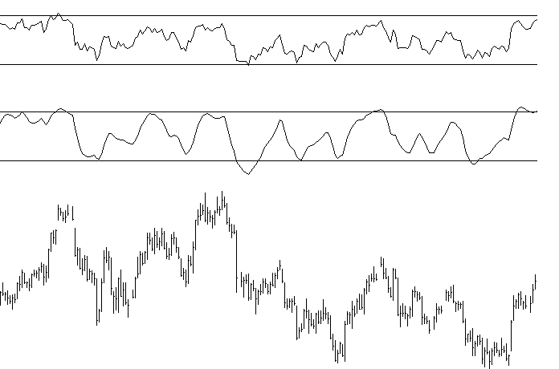
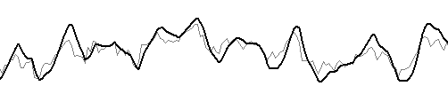
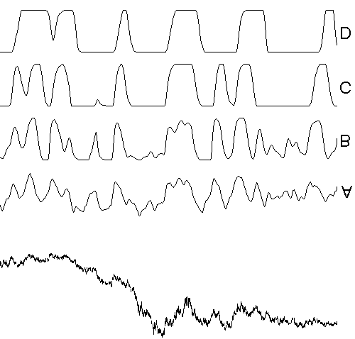

# RSX — Relative Trend Strength Index

## User's Guide

**Add-In Tool for Omega Research Software**
*(Omega Research TradeStation / SuperCharts 4 or TradeStation / ProSuite 2000)*

© 2000 Jurik Research and Consulting, Aurora, CO — www.jurikres.com

Source: `RSX.PDF` from TradeStation 2000i distribution disk.

## BibTeX

```bibtex
@manual{jurik2000rsx_ts,
  author       = {Jurik, Mark},
  title        = {{RSX} --- Relative Trend Strength Index: User's Guide},
  year         = {2000},
  organization = {Jurik Research and Consulting},
  address      = {Aurora, CO},
  note         = {Add-in tool for Omega Research TradeStation / SuperCharts 4 / TradeStation 2000i}
}
```

---

## Table of Contents

- [License Agreement](#license-agreement)
- [Installation Instructions](#installation-instructions)
  - [Step 1: Installation](#step-1-installation)
  - [Step 2: Transfer / Import](#step-2-transfer--import)
- [Important Notice to TS2000 Users](#important-notice-to-tradestation--prosuite-2000-users)
- [Executive Summary](#executive-summary)
- [Why Use RSX?](#why-use-rsx)
- [User Guide](#user-guide)
- [Demonstrations](#demonstrations)
  - [Demo #1: Comparing RSX to RSI](#demo-1-comparing-rsx-to-rsi)
  - [Demo #2: RSX Zones Trading System](#demo-2-rsx-zones-trading-system)
  - [Demo #3: RSX Zones 2 Trading System](#demo-3-rsx-zones-2-trading-system)
  - [Demo #4: Threshold RSX Trading System](#demo-4-threshold-rsx-trading-system)
  - [Demo #5: Reverse RSX Trading System](#demo-5-reverse-rsx-trading-system)
- [Bug Bounty & Anti-Piracy](#bug-bounty--anti-piracy)
- [Risk & Liability](#risk--liability)

---

## License Agreement

Jurik Research & Consulting ("JRC") grants you a non-exclusive license to use the accompanying software documentation ("Documentation") in the manner described as follows:

1. **LICENSE GRANT.** As licensor, JRC grants to you, and you accept, a non-exclusive license to use the enclosed Documentation, only as authorized in this agreement.

2. **COPYRIGHT.** This Document is copyrighted and protected by both United States copyright law and international treaty provisions. All rights are reserved. You may not permit other individuals to use the Documentation except under the terms in this agreement. No part of the Documentation may be reproduced or transmitted in any form or by any means, for any purpose other than the purchaser's personal use without the written permission of JRC.

3. **LIMITED WARRANTY.** Information in the Documentation is subject to change without notice and does not represent a commitment on the part of JRC. The user's sole remedy, in the event a typographical or other error is found in the Documentation within the warranty period, is that JRC will replace the documentation.

4. **LIMITATION OF LIABILITY.** The user agrees to assume the entire risk of using the software described by the Documentation. In no event shall JRC be liable for any indirect, incidental, consequential, special or exemplary damages. JRC's total liability shall not exceed the license fee paid to JRC.

5. **TITLE.** You acquire no right, title or interest in or to the Documentation. Title, ownership rights, and intellectual property rights shall remain in Jurik Research and/or its respective suppliers.

6. **GOVERNING LAW.** The license agreement shall be construed and governed in accordance with the laws of the State of Colorado.

---

## Installation Instructions

The software accompanying this manual is designed to be used inside Omega Research's TradeStation 4, SuperCharts 4, TradeStation 2000 or ProSuite 2000.

Getting Jurik's tools into an Omega Research software application is a 2-step process:

- **INSTALLATION:** to create .ELA or .ELS files containing the Jurik modules.
- **TRANSFER:** to move the modules into your Omega Research software product.

### Step 1: Installation

1. The name of the installation software is `JRSACT_2.EXE`
2. If you HAVE received a password from Jurik Research, SKIP THIS STEP and proceed to step #3. Otherwise, run `JRSACT_2.EXE`. If you have TradeStation 4 or SuperCharts 4, enter your Omega security block number. If you have TradeStation 2000 or ProSuite 2000, enter your Omega Research Customer ID number. Select all Jurik tools you have license to use. The program will give you an identification code. To receive your activation password, e-mail to: nfs@nfsmith.net, or call 323-258-4860 or fax 323-258-0598.
3. Close your Omega Research software application. You do NOT need to shut down the data server.
4. Run `JRSACT_2.EXE`. Enter your security block number or Customer ID number. Enter your password. Select all and only those tools you currently have license to use. Follow other instructions on screen.
5. At this point, all the Jurik tools you currently have license to use were placed as Easy Language files on your hard drive.

### Step 2: Transfer / Import

#### Transferring to TradeStation 4.0 / SuperCharts 4.0

1. Run `TOOLS / VERIFY_ALL` to ensure all linkages are correct.
2. Using either QuickEditor or PowerEditor, use `FILE / OPEN` to bring up a dialog box, then press the TRANSFER button.
3. Select "Transfer .... FROM Easy Language Archive File" and press OK.
4. Transfer in RSX, whose default filepath is `C:\JRSOMEGA\EASYLANG\JRC_RSX.ELA`. Enter the filepath and press OK.
5. Select "Transfer All" and press OK. All RSX related tools will be automatically transferred.
6. Execute `TOOLS \ VERIFY_ALL` to ensure all linkages are correct.

#### Importing to TradeStation 2000 / ProSuite 2000

1. Using the PowerEditor, execute `FILES \ VERIFY_ALL` to ensure all linkages are correct.
2. Execute the `FILE \ IMPORT_and_EXPORT` command.
3. Select "Import Easy Language Archive Files" to import .ELS files. Press OK.
4. Import RSX, whose default filepath is `C:\JRSOMEGA\EASYLANG\RSX.ELS`. Make sure you select to import all studies contained within the ELS file. Press OK.
5. During importation, you may repeatedly see a dialog box asking if you want to overwrite an already existing module. Select "YES TO ALL".
6. Execute `FILES \ VERIFY ALL` to ensure all linkages are correct.

---

## Important Notice to TradeStation / ProSuite 2000 Users

### Incompatibility

TradeStation 2000 and ProSuite 2000 ("TS2000") are 32-bit programs, completely different than TradeStation 4 and SuperCharts 4 ("TS4/SC4"), which are 16-bit programs. Consequently, the Jurik modules designed for TS4/SC4 are not compatible with TS2000. To get Jurik modules for TS2000, you must run the installer and designate that platform.

### Expanded Names

Easy Language studies will include during transfers all functions required to make them work. Therefore, any studies imported to TS2000 from TS4/SC4 will also transfer Jurik functions that are not compatible with TS2000. It is imperative that they not overwrite the Jurik modules already installed in TS2000.

To accomplish this, the names of all Jurik functions, indicators and systems for TS2000 have been expanded to include the suffix "2k". For example, if this user manual refers to a function named `JRC.RSX`, its expanded name for TS2000 is `JRC.RSX.2k`

---

## Executive Summary

*Brief instructions for those who don't read user manuals*

Use the JRC RSX indicator just as if it were the classical RSI indicator. It uses a proprietary function, called `JRC.RSX`. You can code your own Easy Language modules to employ the user function as follows:

```easylanguage
value1 = JRC.RSX ( SERIES , LENGTH ) ;
```

**SERIES** is the time series to be processed, such as the daily closing price. To use closing prices, replace "SERIES" with "close". This input series can also be any QuickEditor expression that produces a series. For example, "SERIES" could be replaced by `7+average (close, 14)`.

**LENGTH** is roughly the number of bars used in the calculation of RSX, and it determines the degree of smoothness. Small values make RSX respond rapidly to price change and larger values produce smoother, flatter curves. Typical values for LENGTH range from 5 to 30. You can even use decimal numbers, such as 28.3.

### Dynamic Inputs with JRC.RSX.flex

There may be times when you want to feed RSX your own calculated time series variable. For this purpose, we have a special version of RSX, called `JRC.RSX.flex`:

```easylanguage
series = close + 0.5 * stdev ( high , 10 ) ;
result = JRC.RSX.flex ( series , 14 ) ;
```

> **NOTE:** Although `JRC.RSX.flex` has this advantage over `JRC.RSX`, it also has two important disadvantages. Both are directly the result of the properties of type SIMPLE user functions in Easy Language.

**Disadvantage 1:** `JRC.RSX.flex` does not produce a time series. Consequently, you cannot reference past values of it directly. However, you can do so indirectly:

```easylanguage
{ INVALID EXPRESSION: }
result = JRC.RSX.flex (series,length)[7] ;

{ VALID EXPRESSION: }
value1 = JRC.RSX.flex (series,length) ;
result = value1[7] ;
```

> Note: This method of referencing past values of variables is not permitted inside type-SIMPLE functions.

**Disadvantage 2:** `JRC.RSX.flex` is not automatically evaluated on every bar. You must control when it gets evaluated:

```easylanguage
if (DateOfWeek(Date) = 2) then result = JRC.RSX.flex (close,length) ;
```

### MaxBarsBack Reference

Max number of bars RSX will reference equals the lookback of the input time series plus the lookback of RSX itself.

| Input to RSX | Full Expression | MaxBarsBack |
|-------------|----------------|-------------|
| `close` | `JRC.RSX ( close, 21 )` | 21 |
| `close[5]` | `JRC.RSX ( close[5], 21 )` | 21 + 5 |
| `average(close[5],14)` | `JRC.RSX ( average(close[5], 14 ), 21 )` | 21 + 14 + 5 |

---

## Why Use RSX?

**The popular RSI indicator is very noisy. RSX eliminates noise completely!**

There is only one convincing way to illustrate the power of RSX. In the chart below, we see daily bars of U.S. Bonds analyzed by RSX and the classical RSI.

RSX is very smooth. Typically any indicator can be smoothed by a moving average, but the penalty is added lag to the resulting signal. Not only is RSX smoother than RSI, but its smoothness comes without added lag.

RSX permits more accurate analysis, helping you avoid many trades that would have been prematurely triggered by the jagged RSI. Once you begin using RSX, you may never apply the classical RSI again!



---

## User Guide

### For Use in TradeStation and SuperCharts Power Editor

After installing RSX, the indicator `JRC RSX` is ready for use. You may use it the same way as you would use the classical RSI indicator. The indicator `JRC RSX` consists of the following Easy Language code:

```easylanguage
INPUTS: PRICE(CLOSE), LENGTH(8) ;
VARS: RSXplot(0);

RSXplot = JRC.RSX(PRICE, LENGTH);
PLOT1(RSXplot,"JRC RSX");
```

The first line of code says the indicator requires 2 input parameters:

- **PRICE** — defines the time series to be processed. Defaults to the closing price of each bar. PRICE can be any simple calculation that produces a series, such as `(High+Low+Close)/3`, or any function that produces a series as its output, such as `average(close, 14)`. In the latter case:

```easylanguage
RSXplot = JRC.RSX(average(close,14), LENGTH);
```

Although any type-series function can be used to generate input to `JRC.RSX`, we do not recommend using any time series other than simple combinations of Open, High, Low and Close (e.g., `(H+L+C) / 3`). This gives results with the least lag.

- **LENGTH** — determines the function's time scale. Larger values produce a smoother result. Default value is 8.

The third line of code calls the user function `JRC.RSX`. This user function contains a proprietary algorithm. It is encrypted and cannot be viewed.

Set the indicator's PROPERTIES so that its MaxBarsBack is as specified in the Executive Summary section.

### For Use in SuperCharts Quick Editor

```
Indicator Name: my_RSX
Plot1 Formula:  JRC.RSX ( price, length )
MaxBarsBack:    1

Inputs:         Name      Default Value
                Series    close
                Length    8
```

---

## Demonstrations

The remaining portion of this user manual contains demonstrations that show the power of RSX. The demonstrations include systems for the S&P and for US 30-Yr Bonds. The installer created two data files in the `JMSOMEGA \ DATA` directory: `USBONDS.TXT` and `SP500.TXT`.

### Loading Sample Data

#### Loading in TradeStation 4 / SuperCharts 4

1. Select `FILE / NEW WINDOW / CHART`
2. In the INSERT PRICE DATA box select DIRECTORY radio button
3. Press NEW DIR and enter `C:\JMSOMEGA\DATA\` in the DIRECTORY field and select ASCII
4. Press OK. Select `USBONDS.TXT` or `SP500.TXT`. Select "Prompt for Format". Press PLOT
5. Select FIRST LINE OF DATA FILE and press OK.
6. In SETTINGS box:
   - Select FUTURE as data type
   - Enter "US" (for Bonds) or "SP" (for SP500) in the SEARCH FOR field
   - Deselect EXACT MATCH, press FIND
   - Select "TREASURY BONDS 30 Yr" or "S&P500 Index"
   - For S&P: Min Move = 5, Value = 500
   - Press OK
7. In FORMAT PRICE DATA box, select SETTINGS tab
8. For Bonds: First Date = 1/03/84, Last Date = 1/03/90. For S&P: First Date = 1/01/83, Last Date = 1/10/96.

#### Loading in ProSuite 2000 / TradeStation 2000

1. Select `FILE / NEW… / TradeStation Chart`
2. Select `INSERT / SYMBOL…`, then press NEW DIR…
3. Select DATA TYPE as ASCII, BROWSE to `JRSOMEGA \ DATA` folder
4. Select `USBONDS.TXT` or `SP500.TXT`, press PLOT. Select "First Line of Data File"
5. Date format: MONTH/DAY/YEAR for SP500, YEAR/MONTH/DAY for USBONDS
6. Set DATA TYPE: future
7. For S&P: SEARCH FOR = SP. For BONDS: SEARCH FOR = US
8. Deselect "EXACT MATCH", press FIND
9. For S&P: "S&P500 Index", MIN MOVE = 5, VALUE = 500. For BONDS: "TREASURY BONDS 30 Yr", MIN MOVE = 1, VALUE = 1000
10. FIRST DATE = 01/01/83, LAST DATE = 01/10/96

---

### Demo #1: Comparing RSX to RSI

Load any price data onto a chart. Insert onto your chart the indicator "Custom 2 line". Before pressing the PLOT button, make sure the "Format" box is selected.

- For "Input 1", enter: `RSI ( close , 10 )`
- For "Input 2":
  - In TradeStation/SuperCharts 4: `JRC.RSX ( close , 10 )`
  - In TradeStation 2000: `JRC.RSX.2k ( close , 10 )`

Set it to plot on any subgraph other than subgraph 1.

The heavy line is RSX and the thin, lighter line is RSI. Note RSX smoothness. Smoothness can be adjusted by varying the LENGTH parameter. Small values make RSX respond rapidly to price change and larger values produce smoother, flatter curves. Typical values for LENGTH range from 5 to 80.



> **NOTE:** Historical back-testing does not prove a system will be profitable in the future, but it can demonstrate whether or not a system would be worthless in the future. The example trading systems described in this manual are for illustration purposes only. Do not trade real money using these demonstration systems. A real trading system requires not one but several mutually concurring indicators as well as good money management rules.

---

### Demo #2: RSX Zones Trading System

RSX measures two aspects of market trend simultaneously: **momentum** and **purity**. Trend momentum is the speed with which price is moving, and trend purity is concerned with the relative proportion of bars that are actually moving in the direction of trend. A fast moving upward trend with 90% of the last 20 bars moving in the same direction will produce a strong RSX value (close to either 0 or 100). Congested price movement will produce a neutral value of 50 out of 100.

The following demonstration trading system is based on these key rules: Buy when RSX is rising, sell when RSX is falling. However, if RSX is in either extreme long/short range, let the current position continue until RSX falls out of the extreme range. There's no point in ending a trade when the trend is going strong.

```easylanguage
Inputs: rlen(12), LongZone(74), ShrtZone(34);
vars: RSX(0) ;

RSX = JRC.RSX.2k(h+l,rlen) ;

If RSX < RSX[1] AND RSX < LongZone then sell
else if RSX > RSX[1] and RSX > ShrtZone then buy ;
```

**System parameter definitions:**

- **RLEN** — length of RSX
- **LONGZONE** — RSX level above which no "sell-short" commands may be executed
- **SHRTZONE** — RSX level below which no "buy-long" commands may be executed

**Settings for U.S. Bond data:**

| Parameter | Value |
|-----------|-------|
| Commission | $30 |
| Slippage | $50 |
| Margin | $2,700 |
| Rlen | 12 |
| LongZone | 74 |
| ShrtZone | 34 |
| MaxBarsBack | 50 |
| Default Trade Number | 1 contract |

**Results: JRC RSX Zones — USBONDS.TXT-Daily 01/02/84 – 01/03/90**

| Metric | Value |
|--------|-------|
| Total net profit | $44,315 |
| Gross profit | $140,888 |
| Gross loss | $-96,573 |
| Total # of trades | 182 |
| Percent profitable | 41.76% |
| Ratio avg win/avg loss | 2.03 |
| Avg trade (win & loss) | $243 |
| Max intraday drawdown | $-9,860 |
| Profit factor | 1.46 |
| Account size required | $12,560 |
| Return on account | 352% |

---

### Demo #3: RSX Zones 2 Trading System

The previous demonstration had a profit factor of only 1.46. Examination of the actual trades reveals many were entered prematurely, despite the RSX zones. The question becomes "How do I get additional confirmation before entering a trade?"

Additional confirmation of a trend reversal is attained by requiring the bar of entry to move sufficiently in the direction of the anticipated new trend direction. This is accomplished by requiring the bar low to be below a moving average before entering a SHORT trade, and requiring the high to be above the moving average before entering a LONG trade.

```easylanguage
Inputs: Rlen(10), Wlen(24), LongZone(77), ShrtZone(38);
vars: RSX(0), Wavg(0) ;

RSX = JRC.RSX.2k(h+l,rlen) ;
Wavg = waverage( waverage( (h+l)/2, Wlen), Wlen ) ;

If RSX < RSX[1] and RSX < LongZone and L < Wavg then sell;
If RSX > RSX[1] and RSX > ShrtZone and H > Wavg then buy;
```

Although not as good as Jurik's JMA moving average, the double weighted moving average employed in this system does a fair job of smoothing with low lag.

**System parameter definitions:**

- **RLEN** — length of RSX
- **WLEN** — length of the double weighted moving average
- **LONGZONE** — RSX level above which no "sell-short" commands may be executed
- **SHRTZONE** — RSX level below which no "buy-long" commands may be executed

**Settings for U.S. Bond data:**

| Parameter | Value |
|-----------|-------|
| Commission | $30 |
| Slippage | $50 |
| Margin | $2,700 |
| Rlen | 10 |
| Wlen | 24 |
| LongZone | 77 |
| ShrtZone | 38 |
| MaxBarsBack | 50 |
| Default Trade Number | 1 contract |

**Results: JRC RSX Zones 2 — USBONDS.TXT-Daily 01/02/84 – 01/03/90**

| Metric | Value |
|--------|-------|
| Total net profit | $45,183 |
| Gross profit | $101,452 |
| Gross loss | $-56,268 |
| Total # of trades | 102 |
| Percent profitable | 41% |
| Ratio avg win/avg loss | 2.58 |
| Avg trade (win & loss) | $442 |
| Max intraday drawdown | $-11,533 |
| Profit factor | 1.80 |
| Account size required | $14,233 |
| Return on account | 317% |

The profit factor increased from 1.46 to 1.80. Significantly fewer trades were needed to maintain the same overall net profit, as profit per trade almost doubled. The downside is that maximum drawdown increased, lowering ROA from 352% to 317%.

---

### Combining RSX with JMA

*The following examples require Jurik tools RSX and JMA.*

Most technical indicators can be smoothed by applying JMA to the indicator's output. In addition, you can also apply JMA to data *before* it is fed to an indicator. This form of pre-processing may transform the nature of a technical indicator into a completely new function.

For example, plot A below shows the RSX indicator with no pre-smoothing by JMA. In plots B, C and D, JMA's smoothness parameter is 10, 30 and 60 respectively. As pre-smoothness increases, note how RSX tends to yield more extreme values. In plot D, RSX yields only two values, its maximum and minimum, indicating "trend-up" and "trend-down".

```easylanguage
{ Plot A: } JRC.RSX ( JRC.JMA ( close,  0, 0 ) , 14 )
{ Plot B: } JRC.RSX ( JRC.JMA ( close, 10, 0 ) , 14 )
{ Plot C: } JRC.RSX ( JRC.JMA ( close, 30, 0 ) , 14 )
{ Plot D: } JRC.RSX ( JRC.JMA ( close, 60, 0 ) , 14 )
```



---

### Demo #4: Threshold RSX Trading System

In this demonstration, we take the RSX signal, whose input was pre-smoothed by JMA, and compare it to two threshold values for triggering buy/sell signals. If the signal crosses above BUYLINE, then buy long. If the signal crosses below SELLINE, then sell short.

```easylanguage
Input: series(close), L1(2), P1(49), L2(9), Buyline(39), Selline(54) ;

IF JRC.RSX( JRC.JMA( series, L1, P1 ), L2 ) crosses above BuyLine
Then Buy on Close ;

IF JRC.RSX( JRC.JMA( series, L1, P1 ), L2 ) crosses below SelLine
Then Sell on Close ;
```

**System parameter definitions:**

- **SERIES** — the price time series to be analyzed
- **L1** — length of JMA
- **P1** — phase of JMA
- **L2** — length of RSX
- **BUYLINE** — RSX level that triggers a buy command
- **SELLINE** — RSX level that triggers a sell command

**Settings for U.S. Bond data:**

| Parameter | Value |
|-----------|-------|
| Commission | $30 |
| Slippage | $50 |
| Margin | $2,700 |
| series | close |
| L1 | 2 |
| P1 | 49 |
| L2 | 9 |
| Buyline | 39 |
| Selline | 54 |
| Money Management | $2,550 |
| MaxBarsBack | 50 |
| Default Trade Number | 1 contract |

**Results: JRC thresh RSX — USBONDS.TXT-Daily 01/02/84 – 01/03/90**

| Metric | Value |
|--------|-------|
| Total net profit | $60,361 |
| Gross profit | $119,705 |
| Gross loss | $-59,343 |
| Total # of trades | 99 |
| Percent profitable | 49% |
| Ratio avg win/avg loss | 2.06 |
| Avg trade (win & loss) | $609 |
| Max intraday drawdown | $-9,400 |
| Profit factor | 2.02 |
| Account size required | $12,100 |
| Return on account | 499% |

This simple system was more profitable than demonstrations #2 and #3. Overall net profit was $60,000, profit factor was 2.06, average trade was $609 and ROA was almost 500%.

> Note: This demonstration system has more input variables than the prior demonstrations, naturally lending it to be more finely tuned to the market's behavior. However, there is always the danger of developing systems that are too complex, enabling it to memorize specific trades, rather than learn the general behavior of a market. This is why it is crucial to keep your system as simple as possible.

---

### Demo #5: Reverse RSX Trading System

This demonstration illustrates a strategy for trading reversal markets. Its design philosophy is based on the notion that reversal markets flip direction too fast for trend following systems to track. By the time a trend following indicator registers an uptrend, the market may have already reversed into a downtrend. When this occurs, we say the indicator is "out of phase" with the market's swings.

Because the market's reversals are fairly regular, "phase error" can be fairly constant. We exploited this property by adding lag to the indicator, making it so late as to put it back in phase again, but with the market's next reversal.

```easylanguage
Input: series(H+L), L1(5), P1(9), L2(22), lag(8) ;

IF JRC.RSX( JRC.JMA( series[lag], L1, P1 ), L2 ) crosses below 50
Then Buy at market ;

IF JRC.RSX( JRC.JMA( series[lag], L1, P1 ), L2 ) crosses above 50
Then Sell at market ;
```

**Settings for S&P 500 (13 years daily data):**

| Parameter | Value |
|-----------|-------|
| Commission | $30 |
| Slippage | $150 |
| Margin | $15,000 |
| series | H+L |
| L1 | 5 |
| P1 | 9 |
| L2 | 22 |
| lag | 8 |
| Money Management | $3,850 |
| MaxBarsBack | 40 |
| Default Trade Number | 1 contract |

Note that because this is a reversal-market system, it is blind to long price trends. For example, although all of 1995 was one huge uptrend for the S&P, this system did not capitalize on it, and for most of the year, was out of the market.

**Results: JRC reverse RSX — SP500.TXT-Daily 01/03/83 – 01/10/96**

| Metric | Value |
|--------|-------|
| Total net profit | $166,250 |
| Gross profit | $345,485 |
| Gross loss | $-179,235 |
| Total # of trades | 125 |
| Percent profitable | 58% |
| Ratio avg win/avg loss | 1.37 |
| Avg trade (win & loss) | $1,330 |
| Max intraday drawdown | $-17,580 |
| Profit factor | 1.93 |
| Account size required | $32,580 |
| Return on account | 510% |

---

## Bug Bounty & Anti-Piracy

### If You Find a Bug... You Win

If you discover a legitimate bug in any of our preprocessing tools, please let us know! We will try to verify it on the spot. If you are the first to report it to us, you will receive:

- a $50 discount coupon
- a free upgrade coupon

You may collect as many coupons as you can. You may apply more than one discount coupon toward the purchase of your next tool.

### Anti-Piracy Reward Policy

1. We have on permanent retainer one of the best intellectual property law firms in the U.S.
2. We do not perform cost-benefit analysis when it comes to litigation. We prosecute all offenders.
3. We register portions of our software with the U.S. Copyright office, entitling us to demand the offender compensate Jurik Research for all legal costs, which is typically over $10,000 per lawsuit.
4. We offer up to $5,000 reward for information leading to the prosecution of any offender(s).

---

## Risk & Liability

Hypothetical or simulated performance results have certain inherent limitations. Simulated performance is subject to the fact that they are designed with the benefit of hindsight.

Past performance of any trading system is never a guarantee of future performance. All trading systems have risk and commodities trading leverages that risk. We advise you never to place at risk more than you can afford to lose.

The user is advised to test the software thoroughly before relying upon it. The user agrees to assume the entire risk of using the software. In no event shall JRC be responsible for any special, consequential, actual or other damages, regardless of type, and any lost profit resulting from the use of this software.
