# Turning Point Oscillator for TradeStation — User Manual

**Custom Trading Solutions**
Brian Bell

## BibTeX

```bibtex
@manual{bell2000tpo_ts,
  author       = {Bell, Brian},
  title        = {Turning Point Oscillator for {TradeStation}: User Manual},
  year         = {2000},
  organization = {Custom Trading Solutions},
  address      = {Colorado},
  note         = {Distributed with Jurik Research TradeStation 2000i package}
}
```

---

## Table of Contents

- [Installation Instructions](#installation-instructions)
- [Executive Summary](#executive-summary)
- [Overview](#overview)
  - [Introduction](#introduction)
  - [Concept](#concept)
  - [Why the Turning Point Oscillator?](#why-the-turning-point-oscillator)
  - [Using the Turning Point Oscillator](#using-the-turning-point-oscillator)
  - [Strength and Weakness](#strength-and-weakness)
  - [Patterns — The TPO Failure and the X2](#patterns--the-tpo-failure-and-the-x2)
  - [TPO and Price Bar Marking](#tpo-and-price-bar-marking)
  - [Summary](#summary)
- [Reference](#reference)
  - [The Indicator](#the-indicator)
  - [The ShowMe's](#the-showmes)
  - [The PaintBar's](#the-paintbars)
  - [The Functions](#the-functions)

---

## Installation Instructions

The software accompanying this manual is designed to be used inside Omega Research's TradeStation 4, SuperCharts 4, TradeStation 2000 or ProSuite 2000. If you do not have an up-to-date version, call Omega Research for the appropriate upgrade.

Getting the Turning Point Oscillator for TradeStation into an Omega Research software application is a 2-step process:

- **INSTALLATION**: to create .ELA or .ELS files containing the TPO modules.
- **TRANSFER**: to move the modules into your Omega Research software product.

### Step 1: INSTALLATION

1. The name of the installation software is `CTS_TPO.EXE`.

2. If you HAVE received a password from Custom Trading Solutions or Jurik Research (on a colored sheet of paper that came with this software), then SKIP THIS STEP and proceed to step #3. Otherwise, using Windows' Explorer (or FileManager), double-click or run the installer program `CTS_TPO.EXE`. If you have TradeStation 4 or SuperCharts 4, enter your Omega security block number if you have one. (SuperCharts end-of-day users probably have no security block number so they should leave the field blank.) If you have TradeStation 2000 or ProSuite 2000, enter your Omega Research Customer ID number. Working through, select all the Custom Trading Solutions tools you currently have license to use. Eventually the program will give you an identification code. To receive your activation password from us, e-mail to: support@customtradingsolutions.com, or call (303) 730-3388 or fax (303) 730-3389, and tell us your name, phone number, the platform you are installing to (TS4, SC4, TS2000, PS2000) and the identification code. After receiving your password, proceed to step #3.

3. Close your Omega Research software application (SuperCharts, TradeStation or ProSuite). Leaving it open may interfere with the installation process. You do NOT need to shut down the data server.

4. Using Windows' Explorer (or File Manager), double-click or run `CTS_TPO.EXE`. Enter your Omega security block number or Customer ID number, if applicable. (SuperCharts end-of-day users probably have no security block number.) Also enter your password. Click OK. Select all and only those tools you currently have license to use, otherwise the password will not be accepted. Click OK. Follow other instructions on screen.

5. At this point, all the Custom Trading Solutions tools (eg. TPO) you currently have license to use were placed as Easy Language files on your hard drive. The next section shows how to transfer (import) them into your Omega software product.

### Step 2: TRANSFER / IMPORT

#### Transferring to TradeStation 4.0 / SuperCharts 4.0

1. Run `TOOLS / VERIFY_ALL` to ensure all linkages are correct.
2. Using either QuickEditor or PowerEditor, use the `FILE / OPEN` command to bring up a dialog box, then press the TRANSFER button.
3. Select "Transfer ... FROM Easy Language File" and press OK.
4. Enter the filepath of the TPO .ELA file. The default filepath is `C:\CTS_TPO\EASYLANG\TPO.ELA`. (You may have elected to change this filepath during installation.) Enter the filepath or use the browser to find it.
5. Make sure you select to transfer all studies contained within the ELA file. Press OK.
6. Do not assume all transferred modules were properly verified. Execute `TOOLS \ VERIFY_ALL` to ensure all linkages are correct.

#### Importing to TradeStation 2000 / ProSuite 2000

1. Using the PowerEditor, execute `FILES \ VERIFY_ALL` to ensure all linkages are correct.
2. Execute the `FILE \ IMPORT_and_EXPORT` command.
3. Select "Import Easy Language Archive Files" to import .ELS files. Press the OK button.
4. Import TPO, whose default filepath is `C:\CTS_TPO\EASYLANG\TPO.ELS`. (You may have elected to change this filepath during installation.) Enter the filepath or use the browser to find it.
5. Make sure you select to import all studies contained within the ELS file. Press OK.
6. During importation, it may want to load the same function several times, so you may repeatedly see a dialog box asking if you want to overwrite an already existing module. To speed up the import process, select "YES TO ALL".
7. Do not assume all the imported modules were properly verified. Execute the command `FILES \ VERIFY ALL` to ensure all linkages are correct.

### IMPORTANT NOTICE to TradeStation/ProSuite 2000 Users

#### INCOMPATIBILITY

TradeStation 2000 and ProSuite 2000 (hereafter referred to as "TS2000") are 32-bit programs, which makes them completely different than TradeStation 4 and SuperCharts 4 (hereafter referred to as "TS4/SC4"), which are 16-bit programs. Consequently, the Custom Trading Solutions modules designed for TS4/SC4 are not compatible with TS2000. To get Custom Trading Solutions modules for TS2000, you must run the installer and designate that platform.

#### EXPANDED NAMES

Easy Language studies (functions, indicators and systems) will include during transfers (imports & exports) all functions required to make them work. Therefore, any studies that you import to TS2000 that were developed in TS4/SC4 will also transfer with them any Custom Trading Solutions functions that they utilize. Because these functions are not compatible with TS2000 (see incompatibility notice above), it is imperative that they not overwrite the Custom Trading Solutions modules already installed in TS2000.

To accomplish this, the names of all Custom Trading Solutions functions, indicators and systems for TS2000 have been expanded to include the suffix "2k". For example, if this user manual refers to a function named `CTS.TPO`, its expanded name for TS2000 is `CTS.TPO.2k`. You will need to modify any studies you transferred in from TS4/SC4 so that they will now include the ".2k" suffix on the names of all Custom Trading Solutions functions that they utilize.

---

## Executive Summary

*Brief instructions for those who don't read user manuals.*

Use the **CTS TPO** indicator to signal changes in momentum. When the TPO moves away from extreme levels it indicates that a short-term change in momentum has occurred.

TPO uses a proprietary function, called `CTS.TPO`. You can code your own Easy Language modules to employ the user function as follows:

```easylanguage
value1 = CTS.TPO ( SERIES , LENGTH, OB, OS ) ;
```

**SERIES** is the time series to be processed, such as the daily closing price. To use closing prices, replace "SERIES" in the above expression with `close`. This input series can also be any QuickEditor expression that produces a series. For example, "SERIES" could be replaced by `7+average(close, 14)`.

**LENGTH** is the number of bars used in the calculation of TPO, and it determines the degree of smoothness. Small values make TPO respond rapidly to price change and larger values produce smoother, flatter curves. Typical values for LENGTH range from 5 to 55.

### CTS.TPO.flex

There may be times when you want to feed TPO your own calculated time series variable, instead of the standard open, high, low and close. For this purpose, we have a special version of TPO, called `CTS.TPO.flex`. In the following example, the time series variable is calculated just prior to feeding TPO:

```easylanguage
series = close + 0.5 * stdev ( high , 10 ) ;
result = CTS.TPO.flex ( series , 14 ) ;
```

> **NOTE:** Although `CTS.TPO.flex` has this advantage over `CTS.TPO`, it also has two important disadvantages. Both are directly the result of the properties of type SIMPLE user functions in Easy Language. You need to decide which version of TPO is more appropriate in your coding.

**Disadvantage 1:** `CTS.TPO.flex` does not produce a time series. Consequently, you cannot reference past values of it directly. However, you can do so indirectly by referring its output to a variable and then seeking past values of that variable:

```easylanguage
{ INVALID EXPRESSION: }
result = CTS.TPO.flex (series,length)[7] ;

{ VALID EXPRESSION: }
value1 = CTS.TPO.flex (series,length) ;
result = value1[7] ;
```

> Note: This method of referencing past values of variables is not permitted inside type-SIMPLE functions.

**Disadvantage 2:** `CTS.TPO.flex` is not automatically evaluated on every bar. You must control when it gets evaluated. This can be advantageous. For instance, you can take a moving average of only Tuesday's closing prices when using a daily chart, by writing code so that TPO is called only on Tuesdays:

```easylanguage
if (DateOfWeek(Date) = 2) then result = CTS.TPO.flex (close,length) ;
```

### MaxBarsBack

Max number of bars TPO will reference equals the lookback of the input time series plus the lookback of TPO itself.

| INPUT to TPO | FULL EXPRESSION | MaxBarsBack |
|---|---|---|
| `close` | `CTS.TPO ( close, 21 )` | 21 |
| `close[5]` | `CTS.TPO ( close[5], 21 )` | 21 + 5 |
| `average(close[5],14)` | `CTS.TPO ( average(close[5], 14 ), 21 )` | 21 + 5 + 14 |

---

## Overview

*By Brian Bell*

### Introduction

The Turning Point Oscillator for TradeStation (TPO) is a momentum oscillator with superior smoothing and turning characteristics implemented for use with TradeStation Ver. 4.0 and 2000i.

Based on complex statistical analysis techniques, the TPO is the result of Custom Trading Solutions' adaptation of these techniques for the markets. The result is a superior indicator for timing entries, and arguably the best momentum oscillator ever.

### Concept

The TPO measures the "orderliness" of a trend, discounting the magnitude of the price changes. The TPO is a normalized oscillator, its values being limited to the range +/-1.0.

If an upward trend is proceeding in a very orderly fashion, the TPO will approach values of +1.0. Likewise, when a downward trend is proceeding in a very orderly fashion, the TPO will approach values of -1.0.

Values in between those two extremes indicate a lack of "orderliness" of price movement, with values around 0.0 indicating the complete lack of a detectable trend.

### Why the Turning Point Oscillator?

The distinguishing characteristics of the Turning Point Oscillator are its superior smoothing characteristics and ability to turn very quickly at market turning points (thus the turning point oscillator).

One of the problems with oscillators (and other studies) has always been that there was always a trade-off between smoothing and lag. Any attempt to smooth the oscillator invariably added lag, often to the point where the indicator became useless.

The TPO suffers a great deal less from these problems than conventional oscillators. Even at very low measurement intervals, the TPO is quite smooth when compared to other oscillators.

Consider Figure 1 and Figure 2. (Please note that the TPO is generally displayed as a histogram. In these two charts, it is displayed as a line, making it easier to compare the smoothness to the other indicators.)

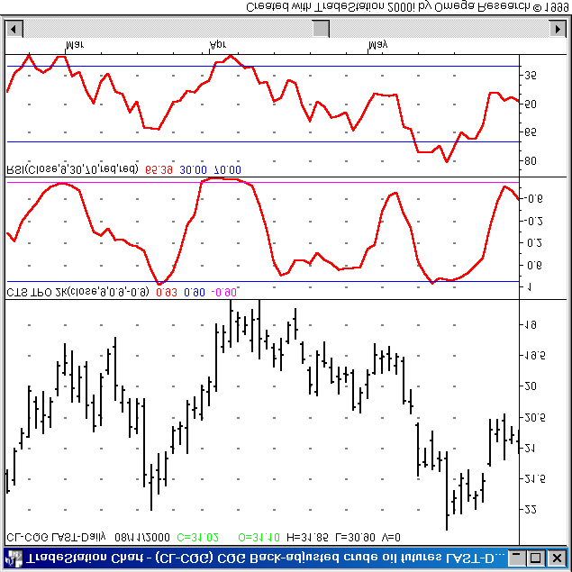

*Figure 1 — Comparing the Turning Point Oscillator to the fast stochastic indicator.*

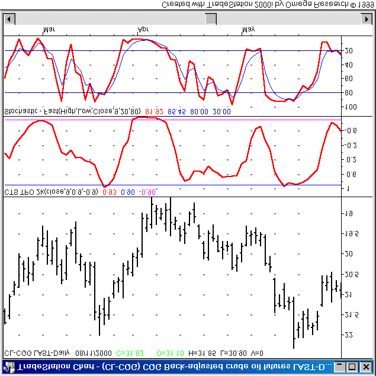

*Figure 2 — Comparing the Turning Point Oscillator to the RSI.*

Figure 1 shows both the TPO and the fast stochastic indicator applied to a daily chart of S&P futures. Both indicators are calculated using a period of 9 bars. Note how much smoother the TPO is, with little or no noticeable increase in lag over the stochastic.

Figure 2 shows the same chart, with the RSI replacing the fast stochastic. Both indicators are again calculated with a period of 9. Again, the TPO is much smoother with very little additional lag introduced.

### Using the Turning Point Oscillator

There are several effective ways to use the TPO.

First, at its core, the TPO is a momentum oscillator (a superior one, but still a momentum oscillator). Thus it can be used in the same way that any other momentum oscillator is used. This includes overbought/oversold analysis, divergences, and patterns.

I highly recommend Martin Pring's book *Martin Pring on Market Momentum* for a general treatment of how to use momentum indicators.

Since the TPO is a momentum oscillator, the trader has to be careful of some things when using it. **KNOW THE CONTEXT OF THE MARKET!** What is the larger picture? Is the market trending or consolidating? If it's trending, **DON'T TRADE AGAINST THE TREND.**

In a screaming bull market, any momentum oscillator used in the conventional way is going to tell you that the market is overbought and you should sell it. Ignore these signals!

Instead, when the market is strongly trending, use the TPO to detect when sharp pullbacks are ending, providing entry opportunities. This is how I often use the TPO. Look for cases where the TPO is coming up out of oversold in a bull trend, or coming down out of overbought in a bear trend.

Consider Figure 3, which shows a daily continuation chart of CL futures with the TPO (period = 9) in the lower pane. The blue dots on the price bars are points where the TPO crossed above -0.9, signaling entry opportunities in a bull market.

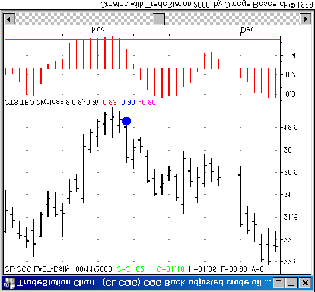

*Figure 3 — CL Futures, Daily Continuation. The TPO (period = 9) is shown in the lower pane. The blue dots are where the TPO crossed above -0.9, signaling entry opportunities in a bull market.*

Figure 4 shows the second of these signals. The secret to these trades is to wait until the TPO crosses out of oversold or overbought before initiating the trade. Then the stop can be placed under the previous bottom, giving the trader a known, logical, and manageable risk.

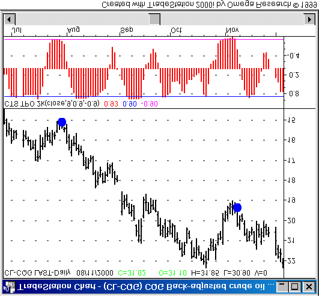

*Figure 4 — A close-up of the second signal shown in Figure 3. The secret to these trades is to wait until the TPO crosses out of oversold (or overbought) before making the entry. The stop can be placed just below the previous bottom, giving the trader a known risk on the trade.*

As the distance between the entry point and the stop point increases, I reduce the size of the trade, thus controlling the initial risk. There comes a point when that distance is large enough that I'll pass on the trade.

Now look at Figure 5. This shows the first signal from Figure 3. This is an even better signal than the later one.

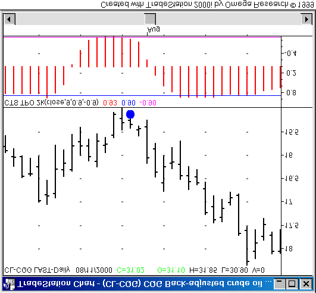

*Figure 5 — The first signal from Figure 3.*

These two instances show the real strength of the TPO:

I use other techniques to determine the context of the market, and then I use the TPO for timing entries both in trending markets and in cycling markets:

- If the market is trending up, take only buy signals from the TPO.
- If the market is trending down, take only sell signals from the TPO.
- If the market is cycling, take both buy and sell signals from the TPO.

Note that I've used the term *cycling* here, as opposed to *consolidating*. The key to trading a consolidating market is to determine whether it is cycling, providing profitable opportunities to both buy and sell, or simply wandering, in which case there is no reason to trade because technical analysis is simply not going to work.

Most of my trading with the TPO to date has been on daily stocks. I almost always use a period of 9 for the TPO, and levels of +/-0.9 to define overbought and oversold.

You should, of course, experiment with the parameters and determine the values that suit your unique trading style.

I run a nightly scan looking for stocks for which the TPO crossed out of either overbought or oversold as of the close of that trading day. I then analyze these cases further to determine if I want to trade any of them. Most days I don't find anything that I want to trade. I have become very particular about which trades I take.

### Strength and Weakness

When fading the TPO, the indicator should not remain in the overbought or oversold region for very long before giving the signal. Three to five bars is about the limit; one to two bars is better. Any more than that signals underlying strength or weakness in the market, rather than a move that has gone too far and can be faded.

For example, consider the signals shown above in Figure 4 and Figure 5. In both of these cases, the TPO remained oversold for only a few bars before crossing back above the OS line, triggering the signal.

In either of these cases, if the TPO had remained oversold for a long time it would have indicated underlying weakness in the market. I would not have heeded buy signals without a lot of other evidence in my favor.

Look at Figure 6, which shows a daily chart of DELL with a 13-bar TPO. I would have passed on the sell signals simply based on the fact that the TPO had remained strong for many bars before these signals. This indicates strength in this market.

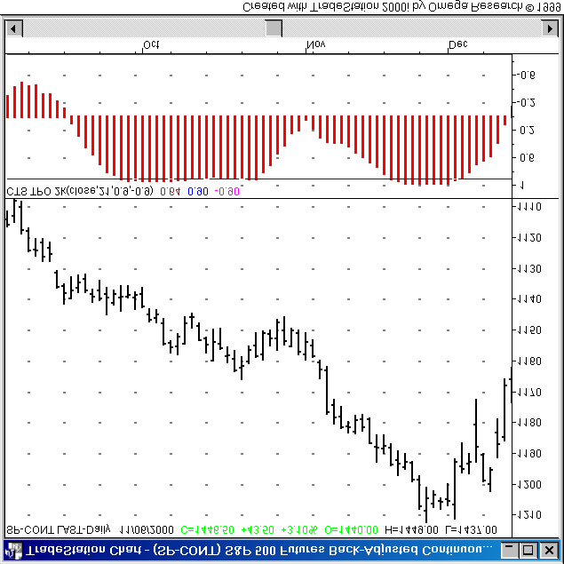

*Figure 6 — DELL daily bar chart with 13-bar TPO. The blue and red dots show where the TPO came out of oversold and overbought conditions.*

Both of the buy signals on this chart would have piqued my interest. The second one occurred in a strong uptrend. The first one, although it's not shown on the chart, occurred in a cycling market.

### Patterns — The TPO Failure and the X2

There are two patterns involving the TPO that I have found to be worth looking for.

#### The TPO Failure

The first is called the "TPO Failure" pattern. I haven't formalized it and I rarely trade off of it, but I do believe it is worth looking for. Particularly when the market is trending so strongly that the types of entry signals described earlier simply aren't occurring, the TPO Failure pattern can provide entry signals.

Figure 7 shows a TPO Failure pattern on a daily chart of S&P futures. The TPO Failure occurs when the TPO comes out of an overbought condition, comes to a level around 0, then reverses back to the upside (from around 0). [This is for the bullish pattern. The bearish pattern, of course, is simply reversed.] In this case the period of the TPO has been lengthened to 21.

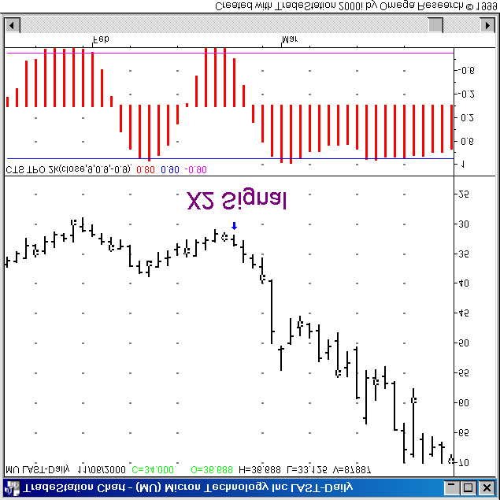

*Figure 7 — A TPO failure pattern on S&P futures.*

#### The X2 Pattern

The other pattern is the "X2 Pattern". I have formalized this one, and I trade it every chance I get (which isn't very often, since it doesn't occur very often).

Figure 8 shows an instance of a bullish X2 Pattern. The TPO is oversold, then quickly becomes overbought, then just as quickly becomes oversold again.

When it comes out of the oversold state the second time, if the price bottom associated with the second oversold condition is higher than the price bottom associated with the first oversold condition, that is an X2 Pattern.

[Again, this is a bullish X2. For the bearish X2 simply reverse everything.]

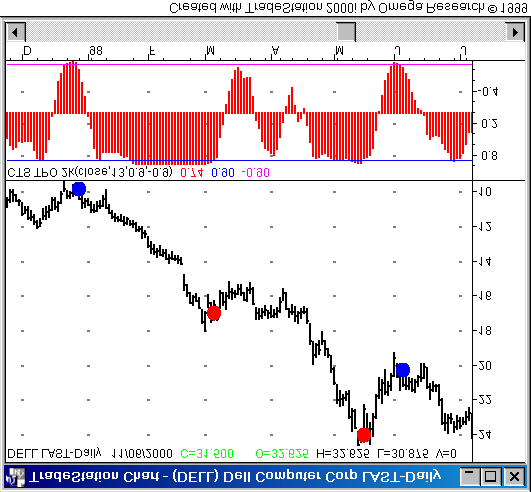

*Figure 8 — A bullish X2 Pattern on MU daily. The blue arrow shows where the pattern occurred.*

When I started noticing this pattern, I did some research on it. In the universe of stocks that I examined, I found approximately 160 instances of this pattern. Of those, 50% were profitable at the close of the 10th bar after the signal (assuming the entry was made at the close of the signal bar, no slippage, no commissions included.)

The important result was that, of the 80 or so profitable cases, less than 5% took out the second low before becoming profitable.

This is information we can use! Basically this says that if the second low gets taken out, there is a greater than 95% chance that the trade is a loser.

This means that we can make the entry and set a very tight stop just under the second bottom. If the stop gets taken out, that's ok, because there is a less than 5% chance that the trade would have been profitable anyway.

This research should be considered unscientific, for now. It included only bullish X2 patterns, and only on stocks. I was unable to test it on futures since I couldn't get a large enough sample size to make the testing meaningful.

### TPO and Price Bar Marking

Turning Point Oscillator for TradeStation comes with a number of ShowMe's and PaintBar's that can be used for price bar marking. These conditions are documented fully in the reference section of this document.

First, there are ShowMe's that allow marking points where the TPO comes out of an overbought or oversold condition. These ShowMe's are named `CTS_TPOXA` and `CTS_TPOXB`.

These ShowMe's are shown in Figure 9, applied to a daily chart of IBM. The red dots denote the TPO coming down out of overbought and the blue dots show where it came up out of oversold.

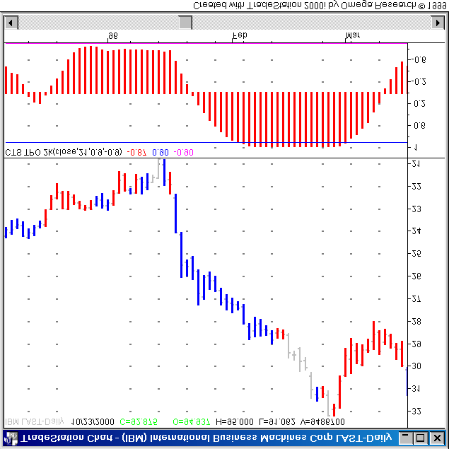

*Figure 9 — Daily IBM with CTS_TPOXA and CTS_TPOXB conditions applied.*

These ShowMe's allow the user to modify the period of the TPO and the threshold levels that defined overbought and oversold. In this case, it is using the standard values of period = 9, threshold = +/-0.9.

There are also PaintBar's that allow the user to color the bars differently when the TPO is going up and when it is going down. These PaintBar's are called `CTS_TPOGoingUp` and `CTS_TPOGoingDown`.

These PaintBar's have a **strength** parameter, which can filter out noise in the indicator.

When the strength is one, the bars will be colored every time the TPO is higher or lower than it was the previous bar.

If the strength is increased to 2, then the bars will be colored only when there are two consecutive rising or falling values of the TPO.

Figure 10 shows a daily IBM chart with a 21-bar TPO. The bars are colored red and blue, indicating whether the TPO is rising or falling (blue means rising, red means falling). In this case, the strength is set to 1, meaning that whenever the TPO is greater than the previous value of the TPO the price bar will be colored blue, and vice versa for a falling TPO.

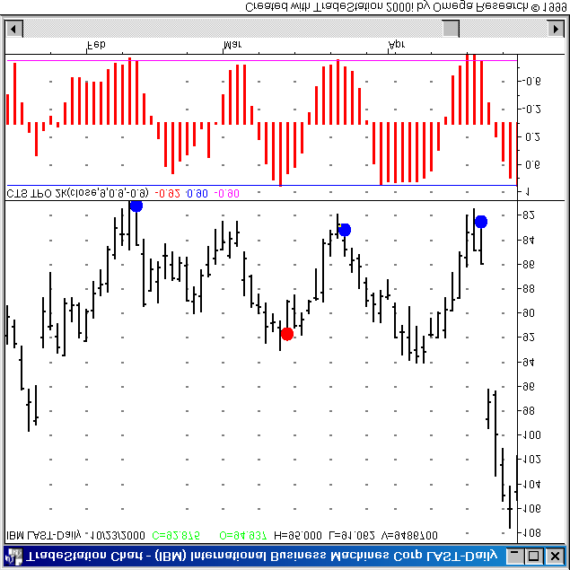

*Figure 10 — Daily IBM with 21-bar TPO. The blue bars indicate the TPO rising, the red bars indicate the TPO falling.*

Figure 11 shows the same chart, except that now the strength parameter has been increased to 4. Now the TPO must be rising for 4 consecutive bars before the price bar will be colored blue, and it must be falling for 4 consecutive bars before the price bar will be colored red.

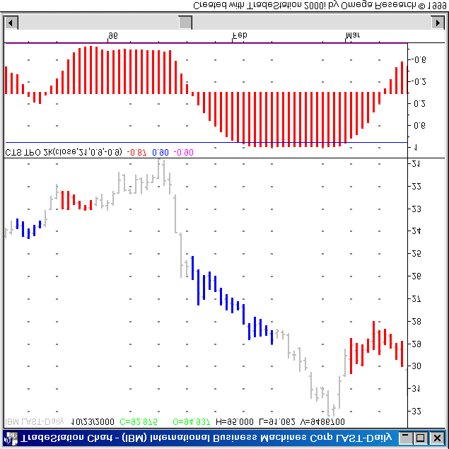

*Figure 11 — This is the same chart as Figure 10, except that now the strength parameter has been increased to 4.*

Increasing the strength parameter can help to filter out noise. In Figure 11, note how many of the bars in the right half of the chart are now colored neither blue nor red. This is because the TPO is not making significant moves, but merely wandering around 0.9.

There are also two ShowMe's that allow the user to mark points where the TPO changes direction from up to down or down to up. They are called `CTS_TPOTurnsUp` and `CTS_TPOTurnsDown`.

These ShowMe's also have a strength parameter that helps to filter out noise and false signals.

When the strength is set to 1, the TPO is defined to have turned down when there is a lower TPO value on each side of a higher TPO value.

When the strength is set to 2, there must be two lower TPO values on each side of a TPO peak.

Another way of looking at this would be to say that, when the strength is set to N, there must be N rising TPO values followed by N falling TPO values for the `CTS_TPOTurnsDown` ShowMe to mark a bar.

Figure 12 and Figure 13 show 5-minute charts of HWP, each with a 21-period TPO applied and marked with the TPO turning point ShowMe's.

In the first chart, the conditions are set to use a strength of 1, while in the second chart the strength is set to 4.

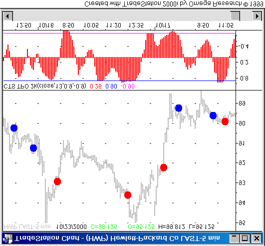

*Figure 12 — 5-minute chart of HWP with a 13-period TPO. The dots are TPO turning points using a strength of 1.*

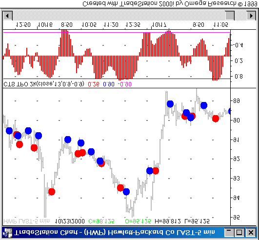

*Figure 13 — The same chart as Figure 12, except that the TPO turning points are now using a strength of 4.*

It is obvious to see how increasing the strength to 4 filtered out a lot of the noise and false signals.

### Summary

The Turning Point Oscillator is a momentum oscillator with excellent smoothing and turning characteristics. It is generally very smooth when compared to other oscillators, and has little or no detectable additional lag.

The TPO can be used with conventional momentum oscillator techniques. It excels when used for timing entries, particularly when the trader is looking for a low-risk entry into a trending market.

There are two patterns described here, the "TPO Failure" and the "X2" that can be useful. As traders use the TPO more and more, they will most assuredly find new ways to use the TPO.

---

## Reference

### The Indicator

#### CTS TPO

**Summary:** Displays the Turning Point Oscillator.

**Number of inputs:** 4

| Input | Description | Default |
|---|---|---|
| SERIES | The numerical series (i.e., closing prices) to analyze | `close` |
| LENGTH | The number of prices used in the calculation | 9 |
| OB | Value of the overbought line | 0.9 |
| OS | Value of the oversold line | -0.9 |

---

### The ShowMe's

#### CTS_TPOTurnsDown

**Summary:** Marks the bar when the TPO turns down.

**Number of parameters:** 3

| Parameter | Description | Default |
|---|---|---|
| SERIES | The numerical series to analyze | `close` |
| LENGTH | The number of prices used in the calculation | 9 |
| STRENGTH | The strength of the required turn | — |

**Remarks:** The `CTS_TPOTurnsDown` ShowMe marks a bar when the TPO turns down. When the STRENGTH is 1, a bar is marked whenever an increasing TPO value is followed by a decreasing TPO value. When the STRENGTH is greater than 1, a bar is marked wherever there are STRENGTH increasing TPO values followed by STRENGTH decreasing TPO values.

---

#### CTS_TPOTurnsUp

**Summary:** Marks the bar when the TPO turns up.

**Number of parameters:** 3

| Parameter | Description | Default |
|---|---|---|
| SERIES | The numerical series to analyze | `close` |
| LENGTH | The number of prices used in the calculation | 9 |
| STRENGTH | The strength of the required turn | — |

**Remarks:** The `CTS_TPOTurnsUp` ShowMe marks a bar when the TPO turns up. When the STRENGTH is 1, a bar is marked whenever a decreasing TPO value is followed by an increasing TPO value. When the STRENGTH is greater than 1, a bar is marked wherever there are STRENGTH decreasing TPO values followed by STRENGTH increasing TPO values.

---

#### CTS_TPOXA

**Summary:** Marks the bar when the TPO crosses above a specified threshold value.

**Number of parameters:** 3

| Parameter | Description | Default |
|---|---|---|
| SERIES | The numerical series to analyze | `close` |
| LENGTH | The number of prices used in the calculation | 9 |
| LEVEL | The threshold value | -0.9 |

**Remarks:** This ShowMe, along with the `CTS_TPOXB` ShowMe, forms the heart of my trading strategy (for entries). I look for this condition to be true, then I check my other indicators to see if I want to take the trade or not.

---

#### CTS_TPOXB

**Summary:** Marks the bar when the TPO crosses below a specified threshold value.

**Number of parameters:** 3

| Parameter | Description | Default |
|---|---|---|
| SERIES | The numerical series to analyze | `close` |
| LENGTH | The number of prices used in the calculation | 9 |
| LEVEL | The threshold value | 0.9 |

**Remarks:** This ShowMe, along with the `CTS_TPOXA` ShowMe, forms the heart of my trading strategy (for entries). I look for this condition to be true, then I check my other indicators to see if I want to take the trade or not.

---

### The PaintBar's

#### CTS_TPOGoingDown

**Summary:** Paints the bar when the TPO indicator is decreasing in value.

**Number of parameters:** 3

| Parameter | Description | Default |
|---|---|---|
| SERIES | The numerical series to analyze | `close` |
| LENGTH | The number of prices used in the calculation | 9 |
| STRENGTH | The strength of the decreasing values | — |

**Remarks:** The `CTS_TPOGoingDown` PaintBar paints a bar when the TPO is decreasing. When the STRENGTH is 1, a bar is painted whenever the current TPO value is less than the previous TPO value. When the STRENGTH is greater than 1, a bar is marked wherever there are STRENGTH consecutive decreasing TPO values.

---

#### CTS_TPOGoingUp

**Summary:** Paints the bar when the TPO indicator is increasing in value.

**Number of parameters:** 3

| Parameter | Description | Default |
|---|---|---|
| SERIES | The numerical series to analyze | `close` |
| LENGTH | The number of prices used in the calculation | 9 |
| STRENGTH | The strength of the increasing values | — |

**Remarks:** The `CTS_TPOGoingUp` PaintBar paints a bar when the TPO is increasing. When the STRENGTH is 1, a bar is painted whenever the current TPO value is greater than the previous TPO value. When the STRENGTH is greater than 1, a bar is marked wherever there are STRENGTH consecutive increasing TPO values.

---

### The Functions

#### CTS.TPO

**Summary:** Calculates the Turning Point Oscillator.

**Number of inputs:** 2

| Input | Description | Default |
|---|---|---|
| SERIES | The numerical series to analyze | `close` |
| LENGTH | The number of prices used in the calculation | 9 |

**Remarks:** There are two versions of this function:
- If you installed the TS 4.0 version of the indicator, you will have the function `CTS.TPO`.
- If you installed the TS 2000i version of the indicator, you will have the function `CTS.TPO.2k`.

---

#### CTS.TPO.flex

**Summary:** Calculates the Turning Point Oscillator on a calculated time series (not one of the standard OHLC values).

**Number of inputs:** 2

| Input | Description | Default |
|---|---|---|
| SERIES | The numerical series to analyze | `close` |
| LENGTH | The number of prices used in the calculation (may vary in time) | 9 |

**Remarks:** There are two versions of this function:
- If you installed the TS 4.0 version of the indicator, you will have the function `CTS.TPO.flex`.
- If you installed the TS 2000i version of the indicator, you will have the function `CTS.TPO.flex.2k`.

There may be times when you want to feed TPO your own calculated time series variable, instead of the standard open, high, low and close. For this purpose, we have a special version of TPO, called `CTS.TPO.flex`:

```easylanguage
series = close + 0.5 * stdev ( high , 10 ) ;
result = CTS.TPO.flex ( series , 14 ) ;
```

> **NOTE:** Although `CTS.TPO.flex` has this advantage over `CTS.TPO`, it also has two important disadvantages. Both are directly the result of the properties of type SIMPLE user functions in Easy Language.

**Disadvantage 1:** `CTS.TPO.flex` does not produce a time series. Consequently, you cannot reference past values of it directly. However, you can do so indirectly:

```easylanguage
{ INVALID: }
result = CTS.TPO.flex (series,length)[7] ;

{ VALID: }
value1 = CTS.TPO.flex (series,length) ;
result = value1[7] ;
```

> Note: This method of referencing past values of variables is not permitted inside type-SIMPLE functions.

**Disadvantage 2:** `CTS.TPO.flex` is not automatically evaluated on every bar. You must control when it gets evaluated:

```easylanguage
if (DateOfWeek(Date) = 2) then result = CTS.TPO.flex (close,length) ;
```
