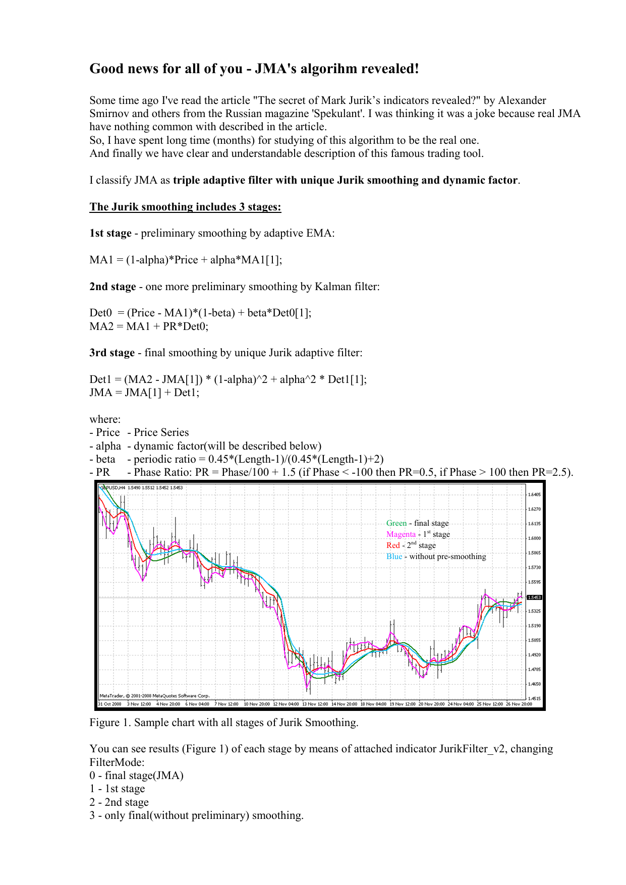
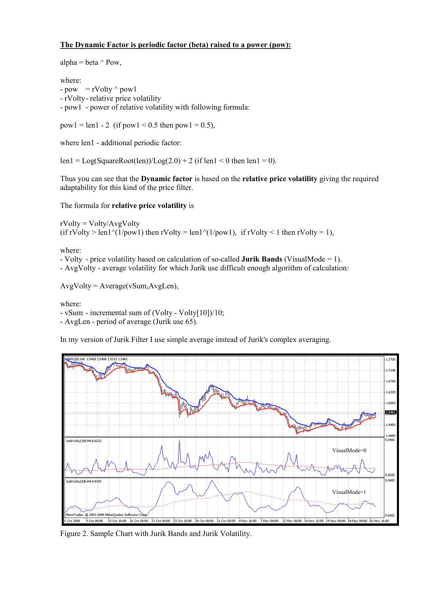

# JMA's Algorithm Revealed

**Author:** Igor (username "Weld" on MQL forums)
**Date:** 2008-11-27
**Source:** [jurik_1.pdf](https://c.mql5.com/forextsd/forum/164/jurik_1.pdf) — ForexTSD forum attachment

## BibTeX

```bibtex
@misc{weld2008jma,
  author       = {Igor {Weld}},
  title        = {Good news for all of you -- {JMA}'s algorithm revealed!},
  year         = {2008},
  month        = nov,
  day          = {27},
  howpublished = {ForexTSD forum post},
  url          = {https://c.mql5.com/forextsd/forum/164/jurik_1.pdf},
  note         = {PDF attachment describing full JMA decompilation}
}
```

---

## Background

Some time ago I read the article "The secret of Mark Jurik's indicators revealed?" by Alexander Smirnov and others from the Russian magazine *Spekulant*. I was thinking it was a joke because real JMA has nothing common with what was described in the article.

So, I have spent long time (months) studying this algorithm to be the real one. And finally we have a clear and understandable description of this famous trading tool.

I classify JMA as a **triple adaptive filter with unique Jurik smoothing and dynamic factor**.

---

## Jurik Smoothing (3 Stages)

### Stage 1 — Preliminary smoothing by adaptive EMA

```
MA1 = (1-alpha)*Price + alpha*MA1[1]
```

### Stage 2 — Secondary smoothing by Kalman filter

```
Det0 = (Price - MA1)*(1-beta) + beta*Det0[1]
MA2 = MA1 + PR*Det0
```

### Stage 3 — Final smoothing by unique Jurik adaptive filter

```
Det1 = (MA2 - JMA[1]) * (1-alpha)^2 + alpha^2 * Det1[1]
JMA = JMA[1] + Det1
```

### Parameters

| Symbol | Definition |
|--------|-----------|
| Price | Price series |
| alpha | Dynamic factor (see below) |
| beta | Periodic ratio: `0.45*(Length-1) / (0.45*(Length-1)+2)` |
| PR | Phase Ratio: `Phase/100 + 1.5` (clamped: if Phase < -100 then PR=0.5, if Phase > 100 then PR=2.5) |

---

## Figure 1 — Sample chart with all stages of Jurik Smoothing



*Chart legend:*

- Green — final stage (JMA output)
- Magenta — 1st stage
- Red — 2nd stage
- Blue — without pre-smoothing

The attached indicator `JurikFilter_v2` exposes each stage via `FilterMode`:

| FilterMode | Output |
|-----------|--------|
| 0 | Final stage (JMA) |
| 1 | 1st stage |
| 2 | 2nd stage |
| 3 | Only final (without preliminary) smoothing |

---

## The Dynamic Factor

The dynamic factor is the periodic factor (beta) raised to a power (pow):

```
alpha = beta ^ pow
```

Where:

```
pow = rVolty ^ pow1
```

- `rVolty` — relative price volatility
- `pow1` — power of relative volatility:

```
pow1 = len1 - 2       (if pow1 < 0.5 then pow1 = 0.5)
```

And `len1` is an additional periodic factor:

```
len1 = Log(Sqrt(Length)) / Log(2.0) + 2       (if len1 < 0 then len1 = 0)
```

Thus the dynamic factor is based on relative price volatility, giving the required adaptability for this kind of price filter.

---

## Relative Price Volatility

```
rVolty = Volty / AvgVolty
```

Clamped:
- if `rVolty > len1^(1/pow1)` then `rVolty = len1^(1/pow1)`
- if `rVolty < 1` then `rVolty = 1`

Where:

- **Volty** — price volatility based on "Jurik Bands" (see below)
- **AvgVolty** — average volatility:

```
AvgVolty = Average(vSum, AvgLen)
```

- `vSum` — incremental sum of `(Volty - Volty[10]) / 10`
- `AvgLen` — period of average (Jurik uses 65)

*Note: Igor states he uses a simple average instead of Jurik's complex averaging in his implementation.*

---

## Figure 2 — Sample chart with Jurik Bands and Jurik Volatility



*Two panels:*

- VisualMode=0: Volty values
- VisualMode=1: vSum values with AvgVolty (red dotted line)

The attached indicator `JurikVolty_v1` displays:
- Volty (VisualMode=0)
- vSum (VisualMode=1)
- AvgVolty (red dotted line)

---

## Price Volatility (Volty)

```
Volty = max(Abs(del1), Abs(del2))
if Abs(del1) == Abs(del2) then Volty = 0
```

Where:

- `del1` = distance between price and upper band: `Price - UpperBand`
- `del2` = distance between price and lower band: `Price - LowerBand`

---

## Jurik Bands

These bands are different from any known price bands (Bollinger, Keltner, Donchian, Fractal, etc.):

```
if del1 > 0 then UpperBand = Price
             else UpperBand = Price - Kv*del1

if del2 < 0 then LowerBand = Price
             else LowerBand = Price - Kv*del2
```

Where:

- `Kv` — volatility factor: `beta ^ Sqrt(pow2)`

Igor notes these bands can serve as a basis for a trend-following indicator like Wilder's Parabolic SAR.

---

## Conclusion

> So, you can see we practically don't have obscure places in the algorithm of Jurik Moving Average (JMA).

---

## Metadata

- **Companion indicators referenced:** `JurikFilter_v2`, `JurikVolty_v1`
- **Key insight:** The 128-element sorted list and 10-element ring buffer (mentioned in MQL source code) implement the adaptive volatility estimation — a running percentile filter that modulates the smoothing coefficient per bar. This document describes the mathematical framework; the MQL4 source code contains the full implementation details.
- **Relationship to other versions:** This is the "Tier 1" full-decompilation description. The simplified "everget" TradingView version strips out the adaptive volatility mechanism entirely, using static coefficients instead.

## Extracted Page Images

Full-page renders at 150 DPI:

- [Page 1](images/page-1.png) — Title, 3-stage algorithm, Figure 1 (smoothing stages chart)
- [Page 2](images/page-2.png) — Dynamic factor, relative volatility, Figure 2 (Jurik Bands/Volatility chart)
- [Page 3](images/page-3.png) — Jurik Bands formulas, conclusion, signature
